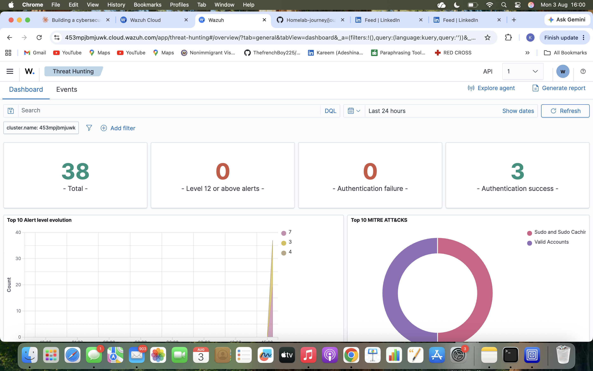
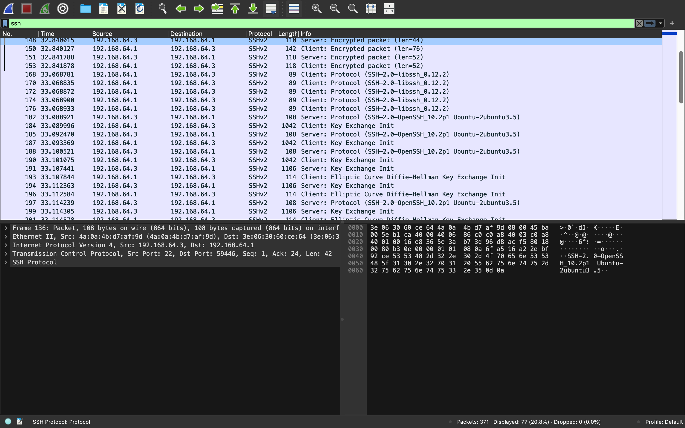
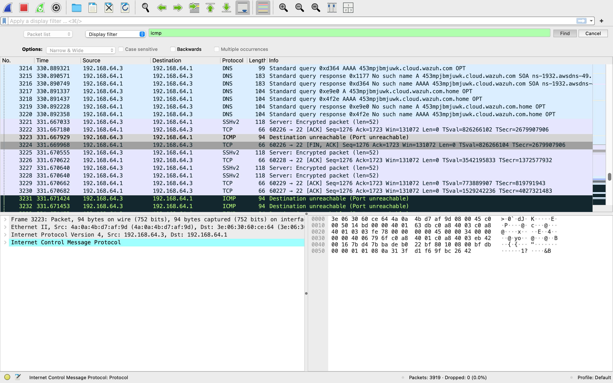
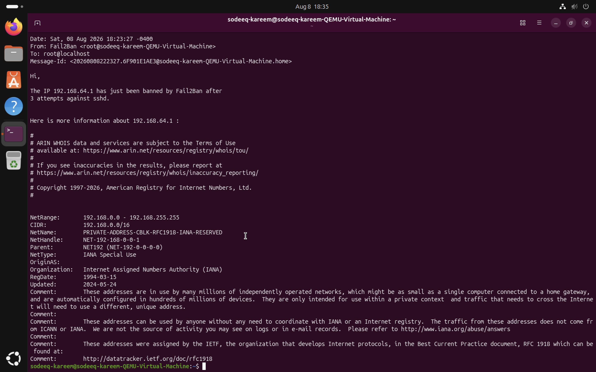
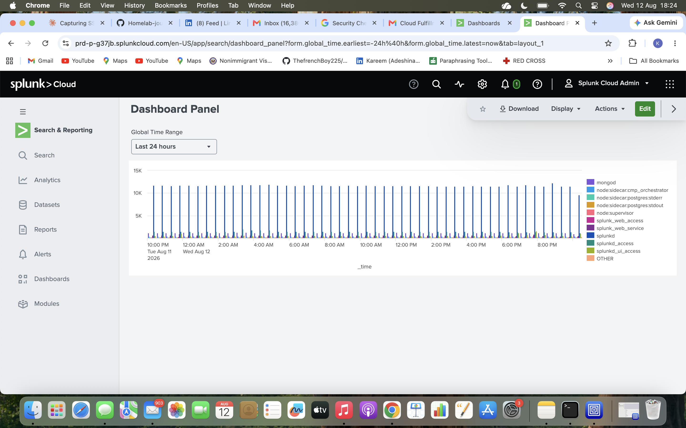
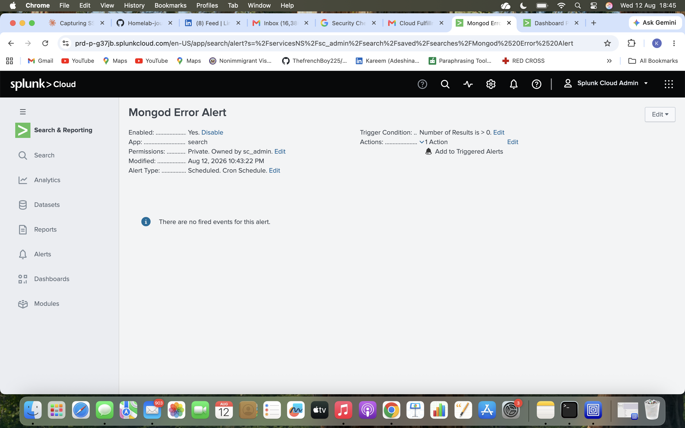
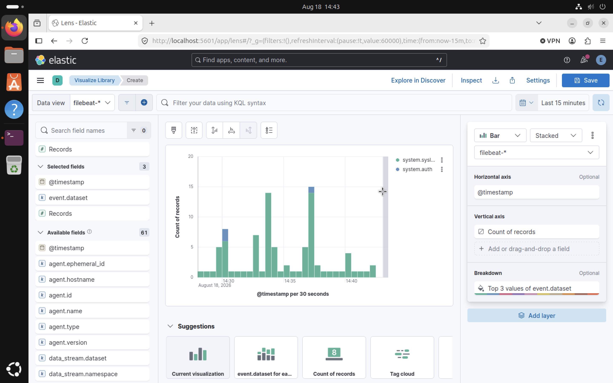
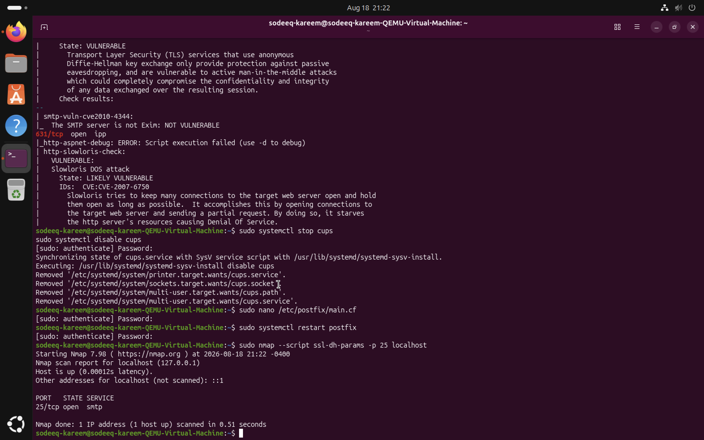

# 📓 Homelab Journal

A running log of what I've built, broken, and learned along the way.

---

## Entry 1 — July 29, 2026: Homelab Setup Begins

**Goal:** Set up my first virtual machine to start building hands-on IT/security skills.

### What I did
- Chose **UTM** as my hypervisor after discovering that VirtualBox has weak/unreliable support on Apple Silicon Macs (M1–M4). UTM uses Apple's native virtualization framework, making it a much better fit for my hardware.
- Downloaded Ubuntu Server to create my first VM.

### Issues encountered (and how I solved them)
1. **Architecture mismatch** — My first VM creation attempt failed because I had downloaded the `amd64` (Intel/x86) version of the Ubuntu ISO, but my Mac's Apple Silicon chip requires an `arm64` build. Fixed by re-downloading the correct ARM64 ISO.
2. **Torrent file instead of ISO** — On a later attempt, I discovered the file I'd downloaded was actually a `.iso.torrent` file, not the real disk image, which is why the VM showed almost no disk usage. Solved by finding the direct ISO download link instead of the torrent option.
3. **Boot loop after installation** — After installation completed, the VM kept booting back into the installer instead of the newly installed OS. This was because UTM didn't automatically eject the installation ISO. Fixed by manually detaching the ISO from the VM's virtual CD/DVD drive in settings before rebooting.

### Result
Successfully installed **Ubuntu 26.04 LTS** as my first working homelab VM.

### Skills practiced
- Basic Linux CLI navigation: `whoami`, `pwd`, `ls`, `cd`, `mkdir`, `touch`
- Package management: `sudo apt update`, `sudo apt upgrade`
- Using `sudo` and authenticating with a password in the terminal
- Reading and interpreting boot logs / systemd service output
- General VM troubleshooting: architecture compatibility, boot media, boot order

### Next steps
- Set up SSH access to the VM for remote practice
- Add a second VM (Kali Linux) for security tooling practice
- Start researching Active Directory lab setup (likely via a cloud VM, since Windows Server has limited support on Apple Silicon)

---

## Entry 2 — July 30, 2026: SSH Remote Access

**Goal:** Set up SSH so I can control my Ubuntu VM remotely from my Mac's terminal instead of the UTM window.

### What I did
- Installed the OpenSSH server on my Ubuntu VM: `sudo apt install openssh-server`
- Discovered the service was installed but disabled by default — started and enabled it with `sudo systemctl start ssh` and `sudo systemctl enable ssh`
- Verified it was running with `sudo systemctl status ssh` (confirmed `active (running)`)
- Found my VM's internal IP address using `ip addr` (identified the correct network interface, `enp0s1`, vs. the loopback interface `lo`)
- Successfully connected from my Mac's native Terminal using `ssh username@vm-ip-address`, accepted the host key fingerprint, and authenticated with my password

### Skills practiced
- Managing systemd services (`start`, `enable`, `status`)
- Reading network interface output to identify the correct IP address
- Understanding SSH host key verification and first-time connection warnings
- Remote login and authentication over SSH

### Next steps
- Try file transfer between Mac and VM using `scp`
- Consider setting up SSH key-based authentication (more secure than password-only)
- Add Kali Linux as a second VM

---

## Entry 3 — July 31, 2026: File Transfer, SSH Keys, and Kali Linux Troubleshooting

**Goal:** Practice secure file transfer over SSH, set up passwordless authentication, and add Kali Linux as a second VM.

### What I did
- Transferred a test file from my Mac to the Ubuntu VM using `scp`, confirmed successful transfer by checking file contents on the receiving end with `cat`
- Generated an SSH key pair on my Mac with `ssh-keygen -t ed25519`
- Installed my public key on the Ubuntu VM using `ssh-copy-id`
- Confirmed passwordless SSH login now works — no more typing a password for every connection
- Attempted to set up Kali Linux (ARM64 Installer) as a second VM in UTM

### Issues encountered
1. **Display/boot hang** — Kali VM hung on a black screen after selecting "Install" from the GRUB boot menu, showing "Guest has not initialized the display (yet)"
2. **Diagnosis** — Used Activity Monitor and found the QEMU process for the Kali VM running at 200%+ CPU, ruling out a simple freeze and suggesting the VM was actively working but not rendering
3. **Attempted fix** — Switched the emulated display card from a `virtio` option to VGA (a more universally compatible option) — issue persisted
4. **Ruled out corruption** — Verified the downloaded Kali ISO file size (3.97 GB) matched expectations, ruling out a corrupted/incomplete download
5. **Conclusion** — Likely a deeper UTM/QEMU + Kali ARM64 compatibility issue rather than a simple config fix — decided to continue troubleshooting next session, with options to try: NetInstaller image, explicit CPU core allocation, community forum research, or installing security tools directly on the existing Ubuntu VM as an alternative

### Skills practiced
- Secure file transfer with `scp`
- SSH key-based authentication (`ssh-keygen`, `ssh-copy-id`)
- Using Activity Monitor to diagnose VM resource usage
- Systematic troubleshooting: isolating variables (display driver, file integrity, CPU) one at a time rather than guessing

### Next steps
- Resolve Kali Linux VM display/boot issue
- Consider Active Directory lab setup (likely cloud VM)

---

## Entry 4 — August 3, 2026: Kali Troubleshooting Wrap-up & Wazuh Cloud SIEM Deployment

**Goal:** Resolve the Kali Linux VM display issue if possible, then pivot to building real security monitoring experience.

### What I did
- Attempted one more fix on the Kali VM issue from last session — increased CPU cores allocated to the VM — but the same "Guest has not initialized the display" error persisted
- Decided to stop troubleshooting Kali on this hardware and pivot to a more productive path: installing security tools directly on the existing Ubuntu VM instead of fighting a second VM's compatibility issues
- Installed core security tools on Ubuntu via `apt`: `nmap`, `netcat-traditional`, `john` (John the Ripper), `hydra`
- Researched SIEM concepts and Wazuh specifically, and decided to deploy Wazuh Cloud (free 14-day trial) rather than self-hosting, since my Mac's 8GB RAM wasn't enough to comfortably run Wazuh's all-in-one install locally
- Signed up for Wazuh Cloud using a school email (personal email domains were rejected by their signup form)
- Created a Wazuh Cloud trial environment ("Homelab - trial") in the Canada Central region
- Worked through a login issue with the auto-generated dashboard credentials — resolved itself after a short wait, likely an account provisioning delay
- Deployed a Wazuh agent onto my Ubuntu VM using the auto-generated install command (DEB aarch64 package), then started and enabled the `wazuh-agent` service
- Confirmed the agent connected successfully and is actively reporting to the dashboard

### Result
Ubuntu VM is now being actively monitored by a real, industry-standard SIEM/XDR platform. Within the first 24 hours, Wazuh detected and logged 38 total alerts, including MITRE ATT&CK-mapped events like "Sudo and Sudo Caching" and "Valid Accounts" — correctly identifying my own `sudo` usage and SSH logins from previous sessions.



### Skills practiced
- Systematic troubleshooting and knowing when to pivot away from a blocked approach rather than over-investing further
- Basic security tool installation (nmap, hydra, john)
- SIEM/XDR concepts: log aggregation, alert severity levels, MITRE ATT&CK framework mapping
- Deploying and configuring a Wazuh agent to report to a central manager
- Reading and interpreting a live security dashboard

### Next steps
- Explore the Threat Hunting and Events views in more depth to understand individual alerts
- Try Wireshark for network traffic analysis (lightweight, no VM required)
- Monitor the Wazuh trial expiration date and decide whether to document a teardown or continue exploring before it lapses
- Revisit Kali Linux later, possibly via a cloud VM or different hardware

---

## Entry 5 — August 4, 2026: Wireshark Traffic Capture & Simulated SSH Brute-Force Attack

**Goal:** Use Wireshark to capture and analyze network traffic from a simulated SSH brute-force attack against the Ubuntu VM, using `hydra`.

### What I did
- Installed **Wireshark** on my Mac via Homebrew, alongside `hydra` (already installed in Entry 4)
- Started a packet capture in Wireshark, initially on the Mac's Wi-Fi interface
- Ran `hydra` from the Mac terminal against the Ubuntu VM's SSH service (port 22) using a small password list, simulating a brute-force login attempt
- Filtered the capture on `ssh` to isolate relevant traffic — 371 total packets captured, 77 matching the SSH filter (~21%)
- Inspected an individual server response packet and found the raw SSH banner exposed in the hex/ASCII pane before encryption begins: `SSH-2.0-OpenSSH_10.2p1 Ubuntu-2ubuntu3.5`

### Issues encountered (and how I solved them)
1. **No VM traffic visible on Wi-Fi interface** — Capturing on the Mac's Wi-Fi adapter showed zero traffic between the host and the Ubuntu VM
2. **Diagnosis** — UTM VMs on Apple Silicon don't route traffic over the physical Wi-Fi radio; they run on a virtual/shared network backed by a bridge interface instead, so capturing on Wi-Fi only ever sees what actually leaves the Mac wirelessly
3. **Fix** — Switched the Wireshark capture interface to **`bridge100`**, the virtual bridge UTM uses to connect the host to its VMs — traffic between the host (192.168.64.1) and the Ubuntu VM (192.168.64.3) appeared immediately

### Result
Successfully captured and analyzed a full simulated SSH brute-force attack at the packet level. The capture showed two things clearly: a repeating handshake pattern (client protocol announcement → server response → key exchange init → repeat) consistent with `hydra` tearing down and rebuilding a full SSH handshake for every login attempt, and a clean banner grab confirming the exact OpenSSH version running on the target — the same kind of unencrypted fingerprinting information a real attacker would use for recon before selecting an exploit.



### Skills practiced
- Packet capture and traffic analysis with Wireshark
- Wireshark display filters (`ssh`)
- Diagnosing virtual network topology (physical vs. bridge interfaces) on a hypervisor
- Reading raw hex/ASCII payload data to identify protocol banners
- Recognizing the network-level signature of a brute-force attack (repeated handshakes in a short window)
- Simulated offensive tooling with `hydra`

### Next steps
- Re-run this exercise once Wazuh Cloud is available again (locked out until Nov 2026) to correlate the Wireshark capture with Wazuh's alerting/MITRE ATT&CK mapping side by side
- Explore Wireshark's "Follow TCP Stream" feature on other protocols for deeper traffic analysis practice
- Consider adding an `iptables` rate-limiting rule on the Ubuntu VM to see how it changes the traffic pattern for a brute-force attempt
- Revisit Kali Linux later, possibly via a cloud VM or different hardware

## Entry 6 — August 6, 2026: Defending Against the Brute-Force with fail2ban

**Goal:** Close the loop from Entry 5 by actually defending the Ubuntu VM against the SSH brute-force attack I simulated, and prove the defense works at the packet level.

### What I did
- Installed **fail2ban** on the Ubuntu VM: `sudo apt install fail2ban -y`
- Confirmed the service installed, enabled, and was running with `sudo systemctl status fail2ban`
- Created a custom jail configuration at `/etc/fail2ban/jail.local` (rather than editing the default `jail.conf`, which can be overwritten by updates) to enable and tune the `sshd` jail:
  ```
  [sshd]
  enabled = true
  port = ssh
  filter = sshd
  logpath = /var/log/auth.log
  maxretry = 3
  findtime = 300
  bantime = 600
  ```
  This bans an IP for 10 minutes after 3 failed SSH logins within a 5-minute window
- Restarted fail2ban and verified the `sshd` jail was active with `sudo fail2ban-client status` and `sudo fail2ban-client status sshd`
- Re-ran the same `hydra` brute-force attack from Entry 5 against the Ubuntu VM
- Confirmed the ban triggered: `fail2ban-client status sshd` showed **Total failed: 5**, **Currently banned: 1**, with my Mac's IP (192.168.64.1) listed under Banned IP list
- To make testing faster, temporarily lowered `bantime` to 120 seconds, then re-ran `hydra` and immediately attempted a manual `ssh` connection from the Mac within the ban window
- The manual SSH attempt returned **`ssh: connect to host 192.168.64.3 port 22: Connection refused`** — the ban actively rejected the connection
- Captured the whole sequence in Wireshark on the `bridge100` interface and found the exact rejection packets using an `icmp` display filter

### Issues encountered (and how I solved them)
1. **nano save prompt got stuck / filename field got mangled** — while editing `jail.local`, accidentally deleted part of the filename at the "Write to File" prompt and couldn't retype it cleanly. Fixed by pressing `Ctrl+C` to cancel the prompt, then `Ctrl+K` to clear the filename line and retyping `/etc/fail2ban/jail.local` from scratch before saving
2. **First attempt to catch the block in Wireshark showed a full successful SSH session instead** — by the time I tried a manual `ssh` connection, the original 10-minute ban had already expired (too much time passed while troubleshooting nano). Confirmed with `fail2ban-client status sshd` showing `Currently banned: 0`
3. **Fix** — temporarily shortened `bantime` to 120 seconds in `jail.local` and restarted fail2ban, then re-ran `hydra` immediately followed by a manual SSH attempt within that shorter window, successfully catching the live block this time
4. **hydra's 5 parallel connection attempts all succeeded at the TCP level** — during the first successful ban capture, filtering Wireshark for SYN/SYN-ACK pairs on the attack traffic showed all 5 hydra connections got answered normally. This was expected once I thought it through: fail2ban only bans *after* reading failed login entries from `/var/log/auth.log`, and hydra's parallel connections all opened before enough failures were logged and processed — the wordlist finished before a 6th (blockable) attempt could occur

### Result
Successfully defended the Ubuntu VM against a real brute-force attack and captured proof of it at both the service level and the packet level. `fail2ban` correctly identified 3+ failed SSH logins from the same IP and began actively rejecting further connection attempts. The Mac terminal showed a hard `Connection refused`, and Wireshark confirmed why: the VM responded with an **ICMP Type 3 (Destination Unreachable), Code 3 (Port Unreachable)** packet instead of the normal TCP SYN-ACK — the network-level signature of `iptables` rejecting the connection before it ever reached the SSH service. Multiple repeated ICMP rejection packets in the capture confirmed the block held for more than one attempt.



### Skills practiced
- Installing and configuring `fail2ban`, including writing a custom jail override file
- Reading and interpreting `fail2ban-client status` output (failed attempts, ban counts, banned IPs)
- Understanding the difference between a silently dropped connection and an actively rejected one (ICMP port-unreachable vs. no response at all)
- Using Wireshark's Find Packet (`Ctrl+F`) and display filters (`icmp`, `ip.addr`) to locate specific events inside a large capture
- Correlating application-layer log behavior (fail2ban reading `auth.log`) with what actually shows up on the wire
- Iterative testing under time pressure — adjusting `bantime` to make a race-condition-prone test reliably reproducible
- systemd service management and nano file editing under real troubleshooting conditions

### Next steps
- Re-run this exercise once Wazuh Cloud is available again (locked out until Nov 2026) to see the brute-force *and* the fail2ban response reflected in Wazuh's dashboard and MITRE ATT&CK mapping
- Restore `bantime` back to a production-realistic value (600s or higher) now that testing is done
- Explore fail2ban's email/alert notification options for a more complete "detect and respond" workflow
- Revisit Kali Linux later, possibly via a cloud VM or different hardware


## Entry 7 — August 8, 2026: Adding Email Alerts to fail2ban

**Goal:** Extend the fail2ban defense from Entry 6 with actual alerting — get notified automatically when an IP gets banned, instead of having to manually check `fail2ban-client status`.

### What I did
- Installed `mailutils` on the Ubuntu VM to enable local mail delivery: `sudo apt install mailutils -y`
- During install, configured Postfix for **"Local only"** delivery — no internet-facing mail server needed, mail just gets delivered to a local mailbox on the VM itself
- Verified local mail worked with a manual test: `echo "test message" | mail -s "Test Subject" root`, then confirmed it landed in `/var/mail/root`
- Updated `/etc/fail2ban/jail.local` to add alerting to the existing `[sshd]` jail:
  ```
  [sshd]
  enabled = true
  port = ssh
  filter = sshd
  logpath = /var/log/auth.log
  maxretry = 3
  findtime = 300
  bantime = 600
  destemail = root@localhost
  action = %(action_mwl)s
  ```
  `action_mwl` is a built-in fail2ban action template meaning **m**ail, with **w**hois lookup info and the matched **l**og lines included in the notification
- Restarted fail2ban and confirmed it automatically sent a "jail started" notification email on its own, proving the mail pipeline was wired up correctly before even triggering a ban
- Re-ran the `hydra` brute-force attack from Entries 5 and 6 against the VM to trigger a real ban
- Confirmed the ban email arrived by checking the mailbox on the VM: `sudo cat /var/mail/root`

### Issues encountered (and how I solved them)
1. **Checked the wrong machine's mailbox** — ran `sudo cat /var/mail/root` on my **Mac** terminal instead of the VM terminal, which understandably failed with "No such file or directory," since the mailbox only exists inside the VM where Postfix is actually installed. Fixed by switching to the correct terminal window
2. **`grep` failed with "Permission denied"** — tried filtering the mailbox for just the fail2ban subject lines without `sudo`, but `/var/mail/root` is only readable by root. Fixed by prefixing the command with `sudo`: `sudo grep -A 5 "Subject: \[Fail2Ban\]" /var/mail/root`

### Result
Successfully turned fail2ban's silent blocking into an active alerting system. Two automatic emails now confirm the whole pipeline works: a **jail-started notification** whenever fail2ban restarts, and a **ban notification** whenever an attacker gets blocked. The ban email included a clear summary ("The IP 192.168.64.1 has just been banned by Fail2Ban after 3 attempts against sshd") plus a full ARIN WHOIS lookup on the offending IP. Since this is homelab traffic, the WHOIS correctly identified 192.168.64.1 as an RFC1918 private address range rather than a real organization — in a production, internet-facing setup, this same email would show the actual ISP/organization behind a real attacking IP, which is genuinely useful threat-intel context to have delivered automatically.



### Skills practiced
- Configuring local mail delivery with Postfix and `mailutils`
- Extending a fail2ban jail configuration with built-in action templates (`action_mwl`)
- Reading and troubleshooting mailbox files (`/var/mail/root`) with `cat` and `grep`, including root-owned file permissions
- Understanding WHOIS lookups and recognizing RFC1918 private address ranges
- Connecting a detection mechanism (fail2ban) to an actual notification/response step — a basic version of the "alert" stage in a real detect-and-respond security workflow

### Next steps
- Explore forwarding these local alerts to a real external email address using an SMTP relay, for a more realistic "you'd actually get paged" setup
- Re-run this whole exercise once Wazuh Cloud is available again (locked out until Nov 2026) to compare fail2ban's lightweight alerting against a full SIEM's alerting/dashboard workflow
- Revisit Kali Linux later, possibly via a cloud VM or different hardware


## Entry 8 — August 12, 2026: Exploring Splunk Cloud (and Learning ARM64's Limits)

**Goal:** Gain hands-on experience with Splunk, one of the most widely requested SIEM tools in job postings, without waiting for Wazuh Cloud access to return in November.

### What I did
- Attempted to install **Splunk Enterprise** directly on the Ubuntu VM, following the same download process used for other tools so far
- Checked Splunk's official system requirements table and discovered **full Splunk Enterprise does not support ARM64 Linux** — every Linux distribution listed (Ubuntu, Debian, Rocky/Alma, SLES, Amazon Linux) is only available on x86 (64-bit); ARM (64-bit) rows only show support for the lightweight Universal Forwarder, not the actual Enterprise product
- Pivoted to a two-track plan instead: use the **Splunk Cloud Platform 14-day free trial** (hosted on Splunk's servers, so the ARM64 limitation doesn't apply) for hands-on SPL practice now, and install **ELK Stack** (Elasticsearch + Kibana) on the VM later, since it does support ARM64
- Signed up for the Splunk Cloud trial using my existing splunk.com account and logged into a live Splunk Cloud instance
- Practiced core SPL (Splunk's search language) directly against Splunk's own internal logs:
  - `index=_internal | stats count by sourcetype` — aggregated 819,000+ events across 22 sourcetypes to get an overview of the data
  - Drilled into raw `mongod` events to see actual structured JSON log content and Splunk's automatic field extraction (nested fields like `attr.connectionId`, `attr.remote` broken out automatically)
  - `index=_internal sourcetype=mongod msg="Error*"` — wildcard search that surfaced real error events, including specific connection IDs and remote IPs tied to each error
  - `index=_internal | timechart count by sourcetype` — built a stacked time-series visualization of event volume by sourcetype, then saved it as a dashboard panel
- Configured a **scheduled alert** ("Mongod Error Alert") on the error search: cron schedule `*/5 * * * *` (every 5 minutes), trigger condition "Number of Results is greater than 0," action set to log to Triggered Alerts

### Issues encountered (and how I solved them)
1. **Downloaded the wrong architecture repeatedly** — same lesson as Kali Linux back in Entry 1. First landed on Splunk AppDynamics/Universal Forwarder/On-Call pages by mistake (different products entirely), then on the main Linux download page which defaults to x86 without clearly labeling architecture
2. **Fix** — navigated to Splunk's official system requirements documentation instead of relying on the download page, which laid out every supported OS/architecture combination in a clear table — this is what confirmed ARM64 isn't supported for the actual Enterprise product, saving me from downloading and troubleshooting an install that was never going to work
3. **Cron field pre-filled with a leftover value** — when switching the alert schedule from "hourly" to a custom cron expression, the field carried over "15" from the previous hourly setting instead of resetting. Fixed by manually replacing it with `*/5 * * * *` for a faster testing cadence

### Result
Got genuine hands-on SPL experience without needing to wait for Wazuh, and learned a real architecture constraint that's worth knowing generally: not every enterprise tool supports ARM64 yet, even in 2026, which matters for anyone building a homelab on Apple Silicon. Ended the session with a working search, a saved dashboard visualization, and a correctly configured scheduled alert — a solid first look at how a widely-used commercial SIEM actually works day to day.





### Skills practiced
- Reading vendor system requirements documentation to verify platform compatibility before attempting an install
- Splunk Search Processing Language (SPL): `stats`, wildcard field matching, `timechart`
- Reading and interpreting structured JSON log events and automatic field extraction
- Building and saving a dashboard panel from a search
- Configuring a scheduled alert with cron syntax and trigger conditions
- Recognizing when to abandon one approach and pivot to a working alternative, rather than forcing an incompatible setup

### Next steps
- Install ELK Stack (Elasticsearch + Kibana) on the Ubuntu VM, since it supports ARM64 natively
- Let the Splunk alert run for a few cycles and check the Triggered Alerts history to confirm it's firing as expected
- Re-run this whole exercise once Wazuh Cloud is available again (locked out until Nov 2026) to compare all three tools — Wazuh, Splunk, and ELK — hands-on
- Revisit Kali Linux later, possibly via a cloud VM or different hardware

## Entry 9 — August 12, 2026: Installing ELK Stack (Elasticsearch + Kibana) on ARM64

**Goal:** Get a real SIEM-adjacent stack running natively on the Ubuntu VM, since Splunk Enterprise turned out not to support ARM64 (Entry 8).

### What I did
- Added Elastic's official APT repository to the Ubuntu VM: imported Elastic's GPG signing key with `gpg --dearmor`, then registered the repo via `/etc/apt/sources.list.d/elastic-8.x.list`
- Installed **Elasticsearch 8.19.20** with `sudo apt install elasticsearch` — confirmed the package pulled genuine ARM64 binaries from Elastic's repo, unlike Splunk
- Set a conservative JVM heap limit before first start, given the VM's 8GB RAM budget
- Enabled and started the service with `systemctl`, confirmed `active (running)` via `systemctl status`
- Saved the auto-generated `elastic` superuser password — modern Elasticsearch enables authentication and TLS by default, no manual security setup required
- Installed **Kibana 8.19.20** from the same Elastic repo, enabled and started it as a systemd service
- Generated an enrollment token on the Elasticsearch side (`elasticsearch-create-enrollment-token -s kibana`) and used it to connect Kibana to Elasticsearch via `kibana-setup`
- Restarted Kibana and logged into the web UI at `http://localhost:5601` using the `elastic` superuser credentials — landed on the "Welcome to Elastic" home screen

### Issues encountered (and how I solved them)
1. **Enrollment token expired before I could use it** — enrollment tokens only stay valid for a short window (roughly 30 minutes). My first token had already expired by the time I ran the setup command, resulting in "Invalid enrollment token provided"
2. **Copy-paste added stray angle brackets around the token** — on the second attempt, the token got pasted as `<eyJ2ZXIi...==>` instead of the raw string. Bash interpreted `<` as an input-redirect operator instead of literal text, throwing a `syntax error near unexpected token 'newline'`
3. **Fix** — generated a third, fresh token and ran the enrollment command immediately afterward in the same sitting, pasting only the raw token with no surrounding characters. This succeeded: "✔ Kibana configured successfully."

### Result
Successfully stood up a working Elasticsearch + Kibana stack entirely on ARM64 — the exact thing Splunk Enterprise couldn't do on this hardware. Both services are enabled to start automatically on boot, security (auth + TLS) is on by default out of the box, and the Kibana web interface is fully accessible and ready for real data. This closes the loop from Entry 8: instead of just documenting that Splunk was a dead end, I now have a genuinely comparable open-source alternative running hands-on in the homelab.

### Skills practiced
- Adding a third-party APT repository with GPG key verification
- Installing and managing systemd services (`daemon-reload`, `enable`, `start`, `status`)
- Configuring JVM memory limits for a resource-constrained VM
- Understanding and troubleshooting security enrollment tokens (expiration windows, exact-string requirements)
- Diagnosing a shell syntax error caused by special characters (`<`) in a pasted value
- Connecting two services together via a token-based trust handshake, rather than a plaintext password

### Next steps
- Add a real data source to Kibana (likely `/var/log/auth.log` or the fail2ban logs) so there's actual homelab data to search and visualize, rather than an empty instance
- Build a Kibana dashboard comparable to the Splunk timechart panel from Entry 8, to compare the two tools side by side
- Re-run this whole exercise once Wazuh Cloud is available again (locked out until Nov 2026) to compare Wazuh, Splunk, and ELK hands-on, all having now been used in this project
- Revisit Kali Linux later, possibly via a cloud VM or different hardware


## Entry 10 — August 18, 2026: Completing the ELK Pipeline with Filebeat

**Goal:** Feed real log data into the ELK Stack built in Entry 9, so Elasticsearch and Kibana had something actual to search and visualize instead of sitting empty.

### What I did
- Installed **Filebeat 8.19.20** from the same Elastic APT repo already configured for Elasticsearch/Kibana — no new GPG key or repo setup needed
- Enabled Filebeat's built-in **system module** (`filebeat modules enable system`), which is pre-built to read standard Linux logs like `/var/log/auth.log` and `/var/log/syslog`
- Configured Filebeat's Elasticsearch output in `/etc/filebeat/filebeat.yml`: pointed it at `localhost:9200` over HTTPS (Elasticsearch's default TLS), set `ssl.verification_mode: none` to accept the self-signed homelab certificate, and authenticated with the `elastic` superuser
- Ran `filebeat setup -e` to load Filebeat's index template into Elasticsearch and its pre-built dashboards into Kibana
- Started and enabled Filebeat as a persistent systemd service
- Verified data in Kibana's **Discover** view under a `filebeat-*` data view — confirmed real documents flowing in with fields like `event.dataset`, `agent.hostname`, and full timestamps
- Filtered specifically for `event.dataset: "system.auth"` and inspected individual events, finding genuine authentication activity — including a `pam_unix(sudo:session): session closed for user root` entry, confirming real sudo/privilege-escalation activity was being captured, not just noise
- Built a stacked bar chart in **Kibana Lens**: `@timestamp` on the horizontal axis, count of records on the vertical axis, broken down by `event.dataset` to visually separate `system.auth` from `system.syslog` activity over time — a direct parallel to the Splunk `timechart count by sourcetype` panel from Entry 8

### Issues encountered (and how I solved them)
1. **YAML indentation errors in `filebeat.yml`** — while adding `protocol`, `ssl.verification_mode`, and `username` under `output.elasticsearch:`, several lines ended up with inconsistent indentation (0 or 1 space instead of the required 2). Since YAML uses indentation to define structure, misaligned lines were being read as disconnected top-level keys rather than nested settings, which would have silently broken the config. Fixed by deleting and retyping each line with exactly 2 spaces to match `hosts:`
2. **401 Unauthorized connecting to Elasticsearch** — `filebeat setup -e` failed with a security exception because the password saved in `filebeat.yml` didn't match the actual `elastic` superuser password generated during the Entry 9 Elasticsearch install. Fixed by locating the correct saved password and updating the config
3. **No data appearing in Kibana Discover despite Filebeat running** — even with the module enabled and the service showing `active (running)`, Discover returned zero results. Investigating `/etc/filebeat/modules.d/system.yml` revealed the real cause: enabling a *module* only makes it available — the individual **filesets** inside it (`syslog` and `auth`) were still explicitly set to `enabled: false` by default. Fixed by manually setting both to `true` and restarting Filebeat, after which 93 real documents appeared immediately

### Result
The full log pipeline is now working end to end: **Ubuntu system logs → Filebeat → Elasticsearch → Kibana**. This closes the loop from Entry 9 — instead of an empty ELK install, there's now a genuine, queryable stream of real authentication and system activity from the homelab VM, browsable in Discover and visualized in a saved Lens chart. The fileset-vs-module distinction was a non-obvious gotcha that cost real troubleshooting time, and is worth remembering for any future Beats/Elastic work.



### Skills practiced
- Configuring a log-shipping agent (Filebeat) end to end: repo setup, module/fileset configuration, output authentication
- Diagnosing YAML indentation issues and understanding why whitespace is structurally significant in YAML
- Troubleshooting authentication failures by cross-referencing saved credentials rather than guessing
- Distinguishing between a module being "enabled" and its individual filesets being enabled — a real distinction in Elastic's Beats architecture
- Reading and interpreting real Linux auth log data (PAM session events) at the individual-event level
- Building a time-series visualization in Kibana Lens with a categorical breakdown, directly comparable to equivalent Splunk SPL work from Entry 8

### Next steps
- Add fail2ban's own log output as a second Filebeat data source, to visualize ban events alongside raw auth activity
- Re-run this whole exercise once Wazuh Cloud is available again (locked out until Nov 2026) to compare all three tools — Wazuh, Splunk, and ELK — hands-on, now that all three have real data flowing through them
- Revisit Kali Linux later, possibly via a cloud VM or different hardware


## Entry 11 — August 18, 2026: Vulnerability Assessment — Scan, Remediate, Verify

**Goal:** Start rounding out the project beyond blue-team/SIEM work by covering Security Assessments — running a real vulnerability scan against the Ubuntu VM, then actually fixing what it found, rather than just collecting scan output.

### What I did
- Ran a full port and service scan against the VM: `sudo nmap -sV -p- localhost`, scanning all 65,535 ports rather than just the common ones, to get a complete picture of the attack surface
- Identified six open services: SSH (OpenSSH 10.2p1), SMTP (Postfix), CUPS printing (631), and three Elasticsearch/Kibana-related ports from Entries 9–10
- Ran nmap's vulnerability-detection scripts (`sudo nmap --script vuln localhost`), saved via `tee` so the output was visible live and archived to a file at the same time — the full scan took just under 9 minutes
- As part of the same scan, nmap's `http-enum` script automatically brute-forced hundreds of common admin-panel paths against Kibana/Elasticsearch's web interface — every single one returned `401 Unauthorized`, confirming the authentication set up in Entry 9 was correctly blocking access under active scanning, not just sitting there unused
- Identified two real, actionable vulnerabilities:
  - **Port 25 (SMTP/Postfix):** flagged for an **Anonymous Diffie-Hellman Key Exchange MitM vulnerability** — the TLS configuration allowed a weak key-exchange mode vulnerable to active man-in-the-middle attacks
  - **Port 631 (CUPS):** flagged as **likely vulnerable to a Slowloris DoS attack** (CVE-2007-6750) — and notably, CUPS wasn't even needed on this VM at all, since printing isn't used
- Remediated both findings:
  - Disabled CUPS entirely with `systemctl stop cups` and `systemctl disable cups`, removing the vulnerable service (and the unnecessary attack surface) in one step
  - Hardened Postfix's TLS configuration in `/etc/postfix/main.cf` by adding `smtpd_tls_ciphers = high` and an explicit `smtpd_tls_exclude_ciphers` list excluding anonymous and weak cipher suites, then restarted Postfix
- Verified both fixes with follow-up scans: a targeted port scan confirmed CUPS was no longer listening, and re-running `nmap --script ssl-dh-params -p 25 localhost` returned a clean result with zero vulnerabilities flagged

### Issues encountered (and how I solved them)
1. **Accidentally killed a running scan with Ctrl+C** — while troubleshooting a separate stuck `sudo` password prompt, pressing Ctrl+C also terminated the nmap scan that was writing to a file in the same terminal, leaving a nearly-empty output file. Learned that Ctrl+C kills the entire foreground process chain in a terminal, not just a stuck sub-prompt — re-ran the scan from scratch afterward
2. **Repeated sudo authentication failures** — several password attempts failed in a row with no visible cause. Diagnosed by testing in isolation with `sudo whoami` (a fast way to confirm credentials without waiting through a long scan) rather than guessing blindly; turned out to be simple mistyping, since Linux's `sudo` prompt gives zero visual feedback (not even asterisks) while typing

### Result
Completed a full, realistic vulnerability assessment cycle — reconnaissance, vulnerability identification, remediation, and verification — rather than just collecting raw scan data. Both real findings were fixed and independently confirmed resolved through follow-up scans, and the Elasticsearch/Kibana authentication work from Entries 9–10 held up correctly under active, automated scanning pressure. This is the first entry in the project explicitly framed as a Security Assessment rather than blue-team monitoring, and the first domain checked off in a broader plan to cover Incident Response, GRC, Cloud Security, and Active Directory going forward.



### Skills practiced
- Full-range TCP port scanning and service/version fingerprinting with nmap
- Running and interpreting nmap's NSE vulnerability-detection scripts (`--script vuln`)
- Reading CVE references and vulnerability descriptions to assess real-world risk and severity
- Remediating findings directly: disabling unnecessary services, hardening TLS cipher configuration
- Verifying a fix actually worked via a targeted follow-up scan, rather than assuming a config change was sufficient
- Using `tee` to view command output live while simultaneously saving it to a file for later documentation
- Practical terminal troubleshooting: understanding what Ctrl+C actually terminates, and isolating a suspected password issue with a fast, low-stakes test command

### Next steps
- Consider installing OpenVAS/Greenbone for a deeper, more comprehensive vulnerability scan beyond what nmap's NSE scripts cover
- Move to the next domain in the roadmap: Incident Response — formalizing the hydra/fail2ban work from Entries 5–7 into a structured NIST IR lifecycle write-up
- Continue through the remaining planned domains: GRC, Cloud Security, and Active Directory
- Revisit Kali Linux later, possibly via a cloud VM or different hardware


## Entry 12 — August 2026: Incident Response — Formalizing the Attack Story

**Goal:** Move into the Incident Response domain by taking the SSH brute-force work from Entries 5–7 — which was documented as a series of separate technical experiments — and reframing it as a single, connected incident using the industry-standard NIST SP 800-61 lifecycle: Preparation, Detection & Analysis, Containment/Eradication/Recovery, and Post-Incident Activity.

### What I did
- Reviewed Entries 1–7 specifically through an incident-response lens rather than a "what did I build" lens, identifying which existing work mapped to each of the four NIST phases
- **Preparation:** SSH key-based authentication, Wireshark installed and ready for traffic capture, and fail2ban configured with tuned `maxretry`/`findtime` thresholds — all standing controls in place *before* any simulated attack occurred
- **Detection & Analysis:** the simulated `hydra` brute-force attack was identified two ways — at the network level, via the distinctive repeated SSH handshake pattern and exposed banner grab visible in Wireshark (Entry 5); and at the host level, via fail2ban actively monitoring `auth.log` and counting failed login attempts (Entry 6)
- **Containment, Eradication & Recovery:** fail2ban automatically banned the offending IP once the failure threshold was crossed, confirmed independently at the packet level by an ICMP Type 3 (Destination Unreachable), Code 3 (Port Unreachable) rejection — proof the block was actually enforced, not just logged (Entry 6). Recovery was automatic: the ban was time-limited and the service returned to normal operation without manual intervention
- **Post-Incident Activity:** wrote a genuine retrospective (new work, not previously documented) covering what worked well and what could be improved for next time
- Drafted a separate, formal Incident Response Report as a standalone document, written in the structure and tone of a real IR report rather than a casual dev-log entry — intended as its own portfolio artifact

### Post-Incident Review (Lessons Learned)
- **What worked well:** the combination of network-level (Wireshark) and host-level (fail2ban/auth.log) detection gave two independent ways to confirm the same incident, which is a stronger detection posture than relying on either alone. The response was also fully automated — no manual intervention was needed to contain the threat
- **What could improve:** the original `bantime` (600 seconds) meant a resourceful attacker could simply wait out the ban and retry; a production environment would likely want either a longer ban, an escalating ban duration for repeat offenders, or a permanent block after a certain number of bans. Alerting was email-only (Entry 7) — a real SOC would want this routed to a ticketing system or chat tool (Slack/Teams) for faster human visibility. There was also no formal "incident closed" step — the process detects and contains automatically, but nothing marks the incident as reviewed and closed the way a real IR process would
- **Follow-up actions identified:** implement escalating ban durations for repeat offenders; route alerts to a second channel beyond email; add a manual review/close step to the process even for automated responses, to build the habit of formal incident closure

### Result
Reframed three separate technical entries into a single, coherent incident response case study using an industry-standard framework, rather than leaving them as disconnected "I built this" posts. This is a genuinely different and valuable way to present the same underlying work — it demonstrates the ability to think in terms of a real IR lifecycle, not just individual tools, which is exactly how incident response is actually discussed and evaluated in a professional setting.

### Skills practiced
- Applying the NIST SP 800-61 incident response lifecycle to real technical work
- Distinguishing between detection, containment, and recovery as distinct phases with different goals
- Writing a genuine post-incident retrospective, including identifying real gaps rather than just describing successes
- Translating hands-on technical work into the structure and language expected in professional incident response documentation

### Next steps
- Move to the next domain in the roadmap: GRC — mapping existing homelab controls against a formal framework (NIST CSF or CIS Controls) and writing a short policy document
- Consider implementing the escalating-ban-duration improvement identified in the retrospective as a concrete follow-up technical task
- Continue through Cloud Security and Active Directory as planned
- Revisit Kali Linux later, possibly via a cloud VM or different hardware
