# 📓 Homelab Journal

A running log of what I've built, broken, and learned along the way.

---

## Entry 1 — July 29, 2026: Homelab Setup Begins

**Goal:** Set up my first virtual machine to start building hands-on IT/security skills.

### What I did
- Chose **UTM** as my hypervisor after discovering that VirtualBox has weak/unreliable support on Apple Silicon Macs (M1–M4). UTM uses Apple's native virtualization framework, making it a much better fit for my hardware.
- Downloaded Ubuntu Server to create my first VM.

### Issues encountered (and how I solved them)
1. **Architecture mismatch** — My first VM creation attempt failed because I had downloaded the `amd64` (Intel/x86) version of the Ubuntu ISO, but my Mac's Apple Silicon chip requires an `arm64` build. Fixed by re-downloading the correct ARM64 ISO.
2. **Torrent file instead of ISO** — On a later attempt, I discovered the file I'd downloaded was actually a `.iso.torrent` file, not the real disk image, which is why the VM showed almost no disk usage. Solved by finding the direct ISO download link instead of the torrent option.
3. **Boot loop after installation** — After installation completed, the VM kept booting back into the installer instead of the newly installed OS. This was because UTM didn't automatically eject the installation ISO. Fixed by manually detaching the ISO from the VM's virtual CD/DVD drive in settings before rebooting.

### Result
Successfully installed **Ubuntu 26.04 LTS** as my first working homelab VM.

### Skills practiced
- Basic Linux CLI navigation: `whoami`, `pwd`, `ls`, `cd`, `mkdir`, `touch`
- Package management: `sudo apt update`, `sudo apt upgrade`
- Using `sudo` and authenticating with a password in the terminal
- Reading and interpreting boot logs / systemd service output
- General VM troubleshooting: architecture compatibility, boot media, boot order

### Next steps
- Set up SSH access to the VM for remote practice
- Add a second VM (Kali Linux) for security tooling practice
- Start researching Active Directory lab setup (likely via a cloud VM, since Windows Server has limited support on Apple Silicon)

---

## Entry 2 — July 30, 2026: SSH Remote Access

**Goal:** Set up SSH so I can control my Ubuntu VM remotely from my Mac's terminal instead of the UTM window.

### What I did
- Installed the OpenSSH server on my Ubuntu VM: `sudo apt install openssh-server`
- Discovered the service was installed but disabled by default — started and enabled it with `sudo systemctl start ssh` and `sudo systemctl enable ssh`
- Verified it was running with `sudo systemctl status ssh` (confirmed `active (running)`)
- Found my VM's internal IP address using `ip addr` (identified the correct network interface, `enp0s1`, vs. the loopback interface `lo`)
- Successfully connected from my Mac's native Terminal using `ssh username@vm-ip-address`, accepted the host key fingerprint, and authenticated with my password

### Skills practiced
- Managing systemd services (`start`, `enable`, `status`)
- Reading network interface output to identify the correct IP address
- Understanding SSH host key verification and first-time connection warnings
- Remote login and authentication over SSH

### Next steps
- Try file transfer between Mac and VM using `scp`
- Consider setting up SSH key-based authentication (more secure than password-only)
- Add Kali Linux as a second VM

---

## Entry 3 — July 31, 2026: File Transfer, SSH Keys, and Kali Linux Troubleshooting

**Goal:** Practice secure file transfer over SSH, set up passwordless authentication, and add Kali Linux as a second VM.

### What I did
- Transferred a test file from my Mac to the Ubuntu VM using `scp`, confirmed successful transfer by checking file contents on the receiving end with `cat`
- Generated an SSH key pair on my Mac with `ssh-keygen -t ed25519`
- Installed my public key on the Ubuntu VM using `ssh-copy-id`
- Confirmed passwordless SSH login now works — no more typing a password for every connection
- Attempted to set up Kali Linux (ARM64 Installer) as a second VM in UTM

### Issues encountered
1. **Display/boot hang** — Kali VM hung on a black screen after selecting "Install" from the GRUB boot menu, showing "Guest has not initialized the display (yet)"
2. **Diagnosis** — Used Activity Monitor and found the QEMU process for the Kali VM running at 200%+ CPU, ruling out a simple freeze and suggesting the VM was actively working but not rendering
3. **Attempted fix** — Switched the emulated display card from a `virtio` option to VGA (a more universally compatible option) — issue persisted
4. **Ruled out corruption** — Verified the downloaded Kali ISO file size (3.97 GB) matched expectations, ruling out a corrupted/incomplete download
5. **Conclusion** — Likely a deeper UTM/QEMU + Kali ARM64 compatibility issue rather than a simple config fix — decided to continue troubleshooting next session, with options to try: NetInstaller image, explicit CPU core allocation, community forum research, or installing security tools directly on the existing Ubuntu VM as an alternative

### Skills practiced
- Secure file transfer with `scp`
- SSH key-based authentication (`ssh-keygen`, `ssh-copy-id`)
- Using Activity Monitor to diagnose VM resource usage
- Systematic troubleshooting: isolating variables (display driver, file integrity, CPU) one at a time rather than guessing

### Next steps
- Resolve Kali Linux VM display/boot issue
- Consider Active Directory lab setup (likely cloud VM)

---

## Entry 4 — August 3, 2026: Kali Troubleshooting Wrap-up & Wazuh Cloud SIEM Deployment

**Goal:** Resolve the Kali Linux VM display issue if possible, then pivot to building real security monitoring experience.

### What I did
- Attempted one more fix on the Kali VM issue from last session — increased CPU cores allocated to the VM — but the same "Guest has not initialized the display" error persisted
- Decided to stop troubleshooting Kali on this hardware and pivot to a more productive path: installing security tools directly on the existing Ubuntu VM instead of fighting a second VM's compatibility issues
- Installed core security tools on Ubuntu via `apt`: `nmap`, `netcat-traditional`, `john` (John the Ripper), `hydra`
- Researched SIEM concepts and Wazuh specifically, and decided to deploy Wazuh Cloud (free 14-day trial) rather than self-hosting, since my Mac's 8GB RAM wasn't enough to comfortably run Wazuh's all-in-one install locally
- Signed up for Wazuh Cloud using a school email (personal email domains were rejected by their signup form)
- Created a Wazuh Cloud trial environment ("Homelab - trial") in the Canada Central region
- Worked through a login issue with the auto-generated dashboard credentials — resolved itself after a short wait, likely an account provisioning delay
- Deployed a Wazuh agent onto my Ubuntu VM using the auto-generated install command (DEB aarch64 package), then started and enabled the `wazuh-agent` service
- Confirmed the agent connected successfully and is actively reporting to the dashboard

### Result
Ubuntu VM is now being actively monitored by a real, industry-standard SIEM/XDR platform. Within the first 24 hours, Wazuh detected and logged 38 total alerts, including MITRE ATT&CK-mapped events like "Sudo and Sudo Caching" and "Valid Accounts" — correctly identifying my own `sudo` usage and SSH logins from previous sessions.

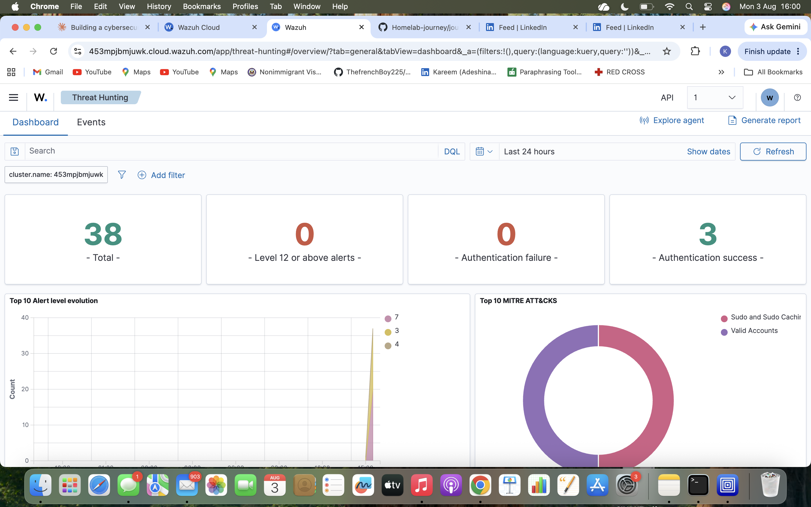

### Skills practiced
- Systematic troubleshooting and knowing when to pivot away from a blocked approach rather than over-investing further
- Basic security tool installation (nmap, hydra, john)
- SIEM/XDR concepts: log aggregation, alert severity levels, MITRE ATT&CK framework mapping
- Deploying and configuring a Wazuh agent to report to a central manager
- Reading and interpreting a live security dashboard

### Next steps
- Explore the Threat Hunting and Events views in more depth to understand individual alerts
- Try Wireshark for network traffic analysis (lightweight, no VM required)
- Monitor the Wazuh trial expiration date and decide whether to document a teardown or continue exploring before it lapses
- Revisit Kali Linux later, possibly via a cloud VM or different hardware

---

## Entry 5 — August 4, 2026: Wireshark Traffic Capture & Simulated SSH Brute-Force Attack

**Goal:** Use Wireshark to capture and analyze network traffic from a simulated SSH brute-force attack against the Ubuntu VM, using `hydra`.

### What I did
- Installed **Wireshark** on my Mac via Homebrew, alongside `hydra` (already installed in Entry 4)
- Started a packet capture in Wireshark, initially on the Mac's Wi-Fi interface
- Ran `hydra` from the Mac terminal against the Ubuntu VM's SSH service (port 22) using a small password list, simulating a brute-force login attempt
- Filtered the capture on `ssh` to isolate relevant traffic — 371 total packets captured, 77 matching the SSH filter (~21%)
- Inspected an individual server response packet and found the raw SSH banner exposed in the hex/ASCII pane before encryption begins: `SSH-2.0-OpenSSH_10.2p1 Ubuntu-2ubuntu3.5`

### Issues encountered (and how I solved them)
1. **No VM traffic visible on Wi-Fi interface** — Capturing on the Mac's Wi-Fi adapter showed zero traffic between the host and the Ubuntu VM
2. **Diagnosis** — UTM VMs on Apple Silicon don't route traffic over the physical Wi-Fi radio; they run on a virtual/shared network backed by a bridge interface instead, so capturing on Wi-Fi only ever sees what actually leaves the Mac wirelessly
3. **Fix** — Switched the Wireshark capture interface to **`bridge100`**, the virtual bridge UTM uses to connect the host to its VMs — traffic between the host (192.168.64.1) and the Ubuntu VM (192.168.64.3) appeared immediately

### Result
Successfully captured and analyzed a full simulated SSH brute-force attack at the packet level. The capture showed two things clearly: a repeating handshake pattern (client protocol announcement → server response → key exchange init → repeat) consistent with `hydra` tearing down and rebuilding a full SSH handshake for every login attempt, and a clean banner grab confirming the exact OpenSSH version running on the target — the same kind of unencrypted fingerprinting information a real attacker would use for recon before selecting an exploit.

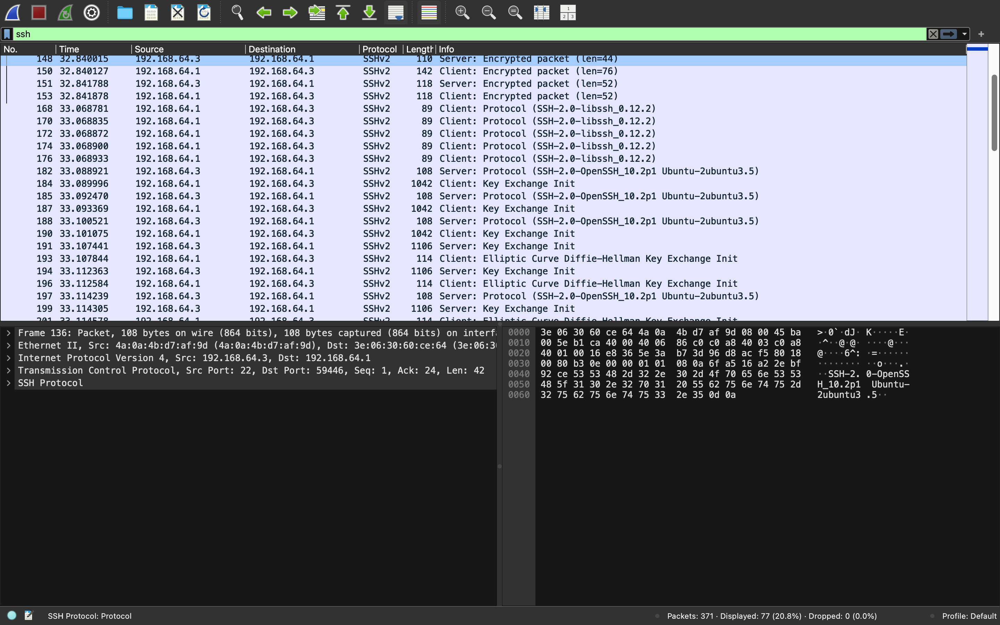

### Skills practiced
- Packet capture and traffic analysis with Wireshark
- Wireshark display filters (`ssh`)
- Diagnosing virtual network topology (physical vs. bridge interfaces) on a hypervisor
- Reading raw hex/ASCII payload data to identify protocol banners
- Recognizing the network-level signature of a brute-force attack (repeated handshakes in a short window)
- Simulated offensive tooling with `hydra`

### Next steps
- Re-run this exercise once Wazuh Cloud is available again (locked out until Nov 2026) to correlate the Wireshark capture with Wazuh's alerting/MITRE ATT&CK mapping side by side
- Explore Wireshark's "Follow TCP Stream" feature on other protocols for deeper traffic analysis practice
- Consider adding an `iptables` rate-limiting rule on the Ubuntu VM to see how it changes the traffic pattern for a brute-force attempt
- Revisit Kali Linux later, possibly via a cloud VM or different hardware

## Entry 6 — August 6, 2026: Defending Against the Brute-Force with fail2ban

**Goal:** Close the loop from Entry 5 by actually defending the Ubuntu VM against the SSH brute-force attack I simulated, and prove the defense works at the packet level.

### What I did
- Installed **fail2ban** on the Ubuntu VM: `sudo apt install fail2ban -y`
- Confirmed the service installed, enabled, and was running with `sudo systemctl status fail2ban`
- Created a custom jail configuration at `/etc/fail2ban/jail.local` (rather than editing the default `jail.conf`, which can be overwritten by updates) to enable and tune the `sshd` jail:
  ```
  [sshd]
  enabled = true
  port = ssh
  filter = sshd
  logpath = /var/log/auth.log
  maxretry = 3
  findtime = 300
  bantime = 600
  ```
  This bans an IP for 10 minutes after 3 failed SSH logins within a 5-minute window
- Restarted fail2ban and verified the `sshd` jail was active with `sudo fail2ban-client status` and `sudo fail2ban-client status sshd`
- Re-ran the same `hydra` brute-force attack from Entry 5 against the Ubuntu VM
- Confirmed the ban triggered: `fail2ban-client status sshd` showed **Total failed: 5**, **Currently banned: 1**, with my Mac's IP (192.168.64.1) listed under Banned IP list
- To make testing faster, temporarily lowered `bantime` to 120 seconds, then re-ran `hydra` and immediately attempted a manual `ssh` connection from the Mac within the ban window
- The manual SSH attempt returned **`ssh: connect to host 192.168.64.3 port 22: Connection refused`** — the ban actively rejected the connection
- Captured the whole sequence in Wireshark on the `bridge100` interface and found the exact rejection packets using an `icmp` display filter

### Issues encountered (and how I solved them)
1. **nano save prompt got stuck / filename field got mangled** — while editing `jail.local`, accidentally deleted part of the filename at the "Write to File" prompt and couldn't retype it cleanly. Fixed by pressing `Ctrl+C` to cancel the prompt, then `Ctrl+K` to clear the filename line and retyping `/etc/fail2ban/jail.local` from scratch before saving
2. **First attempt to catch the block in Wireshark showed a full successful SSH session instead** — by the time I tried a manual `ssh` connection, the original 10-minute ban had already expired (too much time passed while troubleshooting nano). Confirmed with `fail2ban-client status sshd` showing `Currently banned: 0`
3. **Fix** — temporarily shortened `bantime` to 120 seconds in `jail.local` and restarted fail2ban, then re-ran `hydra` immediately followed by a manual SSH attempt within that shorter window, successfully catching the live block this time
4. **hydra's 5 parallel connection attempts all succeeded at the TCP level** — during the first successful ban capture, filtering Wireshark for SYN/SYN-ACK pairs on the attack traffic showed all 5 hydra connections got answered normally. This was expected once I thought it through: fail2ban only bans *after* reading failed login entries from `/var/log/auth.log`, and hydra's parallel connections all opened before enough failures were logged and processed — the wordlist finished before a 6th (blockable) attempt could occur

### Result
Successfully defended the Ubuntu VM against a real brute-force attack and captured proof of it at both the service level and the packet level. `fail2ban` correctly identified 3+ failed SSH logins from the same IP and began actively rejecting further connection attempts. The Mac terminal showed a hard `Connection refused`, and Wireshark confirmed why: the VM responded with an **ICMP Type 3 (Destination Unreachable), Code 3 (Port Unreachable)** packet instead of the normal TCP SYN-ACK — the network-level signature of `iptables` rejecting the connection before it ever reached the SSH service. Multiple repeated ICMP rejection packets in the capture confirmed the block held for more than one attempt.

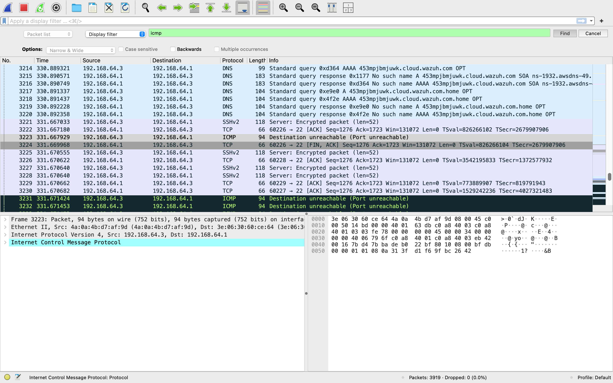

### Skills practiced
- Installing and configuring `fail2ban`, including writing a custom jail override file
- Reading and interpreting `fail2ban-client status` output (failed attempts, ban counts, banned IPs)
- Understanding the difference between a silently dropped connection and an actively rejected one (ICMP port-unreachable vs. no response at all)
- Using Wireshark's Find Packet (`Ctrl+F`) and display filters (`icmp`, `ip.addr`) to locate specific events inside a large capture
- Correlating application-layer log behavior (fail2ban reading `auth.log`) with what actually shows up on the wire
- Iterative testing under time pressure — adjusting `bantime` to make a race-condition-prone test reliably reproducible
- systemd service management and nano file editing under real troubleshooting conditions

### Next steps
- Re-run this exercise once Wazuh Cloud is available again (locked out until Nov 2026) to see the brute-force *and* the fail2ban response reflected in Wazuh's dashboard and MITRE ATT&CK mapping
- Restore `bantime` back to a production-realistic value (600s or higher) now that testing is done
- Explore fail2ban's email/alert notification options for a more complete "detect and respond" workflow
- Revisit Kali Linux later, possibly via a cloud VM or different hardware


## Entry 7 — August 8, 2026: Adding Email Alerts to fail2ban

**Goal:** Extend the fail2ban defense from Entry 6 with actual alerting — get notified automatically when an IP gets banned, instead of having to manually check `fail2ban-client status`.

### What I did
- Installed `mailutils` on the Ubuntu VM to enable local mail delivery: `sudo apt install mailutils -y`
- During install, configured Postfix for **"Local only"** delivery — no internet-facing mail server needed, mail just gets delivered to a local mailbox on the VM itself
- Verified local mail worked with a manual test: `echo "test message" | mail -s "Test Subject" root`, then confirmed it landed in `/var/mail/root`
- Updated `/etc/fail2ban/jail.local` to add alerting to the existing `[sshd]` jail:
  ```
  [sshd]
  enabled = true
  port = ssh
  filter = sshd
  logpath = /var/log/auth.log
  maxretry = 3
  findtime = 300
  bantime = 600
  destemail = root@localhost
  action = %(action_mwl)s
  ```
  `action_mwl` is a built-in fail2ban action template meaning **m**ail, with **w**hois lookup info and the matched **l**og lines included in the notification
- Restarted fail2ban and confirmed it automatically sent a "jail started" notification email on its own, proving the mail pipeline was wired up correctly before even triggering a ban
- Re-ran the `hydra` brute-force attack from Entries 5 and 6 against the VM to trigger a real ban
- Confirmed the ban email arrived by checking the mailbox on the VM: `sudo cat /var/mail/root`

### Issues encountered (and how I solved them)
1. **Checked the wrong machine's mailbox** — ran `sudo cat /var/mail/root` on my **Mac** terminal instead of the VM terminal, which understandably failed with "No such file or directory," since the mailbox only exists inside the VM where Postfix is actually installed. Fixed by switching to the correct terminal window
2. **`grep` failed with "Permission denied"** — tried filtering the mailbox for just the fail2ban subject lines without `sudo`, but `/var/mail/root` is only readable by root. Fixed by prefixing the command with `sudo`: `sudo grep -A 5 "Subject: \[Fail2Ban\]" /var/mail/root`

### Result
Successfully turned fail2ban's silent blocking into an active alerting system. Two automatic emails now confirm the whole pipeline works: a **jail-started notification** whenever fail2ban restarts, and a **ban notification** whenever an attacker gets blocked. The ban email included a clear summary ("The IP 192.168.64.1 has just been banned by Fail2Ban after 3 attempts against sshd") plus a full ARIN WHOIS lookup on the offending IP. Since this is homelab traffic, the WHOIS correctly identified 192.168.64.1 as an RFC1918 private address range rather than a real organization — in a production, internet-facing setup, this same email would show the actual ISP/organization behind a real attacking IP, which is genuinely useful threat-intel context to have delivered automatically.

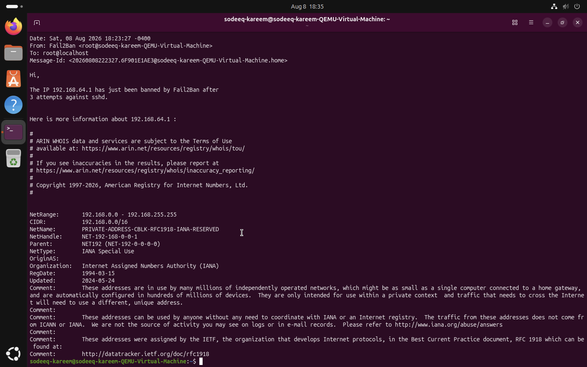

### Skills practiced
- Configuring local mail delivery with Postfix and `mailutils`
- Extending a fail2ban jail configuration with built-in action templates (`action_mwl`)
- Reading and troubleshooting mailbox files (`/var/mail/root`) with `cat` and `grep`, including root-owned file permissions
- Understanding WHOIS lookups and recognizing RFC1918 private address ranges
- Connecting a detection mechanism (fail2ban) to an actual notification/response step — a basic version of the "alert" stage in a real detect-and-respond security workflow

### Next steps
- Explore forwarding these local alerts to a real external email address using an SMTP relay, for a more realistic "you'd actually get paged" setup
- Re-run this whole exercise once Wazuh Cloud is available again (locked out until Nov 2026) to compare fail2ban's lightweight alerting against a full SIEM's alerting/dashboard workflow
- Revisit Kali Linux later, possibly via a cloud VM or different hardware


## Entry 8 — August 12, 2026: Exploring Splunk Cloud (and Learning ARM64's Limits)

**Goal:** Gain hands-on experience with Splunk, one of the most widely requested SIEM tools in job postings, without waiting for Wazuh Cloud access to return in November.

### What I did
- Attempted to install **Splunk Enterprise** directly on the Ubuntu VM, following the same download process used for other tools so far
- Checked Splunk's official system requirements table and discovered **full Splunk Enterprise does not support ARM64 Linux** — every Linux distribution listed (Ubuntu, Debian, Rocky/Alma, SLES, Amazon Linux) is only available on x86 (64-bit); ARM (64-bit) rows only show support for the lightweight Universal Forwarder, not the actual Enterprise product
- Pivoted to a two-track plan instead: use the **Splunk Cloud Platform 14-day free trial** (hosted on Splunk's servers, so the ARM64 limitation doesn't apply) for hands-on SPL practice now, and install **ELK Stack** (Elasticsearch + Kibana) on the VM later, since it does support ARM64
- Signed up for the Splunk Cloud trial using my existing splunk.com account and logged into a live Splunk Cloud instance
- Practiced core SPL (Splunk's search language) directly against Splunk's own internal logs:
  - `index=_internal | stats count by sourcetype` — aggregated 819,000+ events across 22 sourcetypes to get an overview of the data
  - Drilled into raw `mongod` events to see actual structured JSON log content and Splunk's automatic field extraction (nested fields like `attr.connectionId`, `attr.remote` broken out automatically)
  - `index=_internal sourcetype=mongod msg="Error*"` — wildcard search that surfaced real error events, including specific connection IDs and remote IPs tied to each error
  - `index=_internal | timechart count by sourcetype` — built a stacked time-series visualization of event volume by sourcetype, then saved it as a dashboard panel
- Configured a **scheduled alert** ("Mongod Error Alert") on the error search: cron schedule `*/5 * * * *` (every 5 minutes), trigger condition "Number of Results is greater than 0," action set to log to Triggered Alerts

### Issues encountered (and how I solved them)
1. **Downloaded the wrong architecture repeatedly** — same lesson as Kali Linux back in Entry 1. First landed on Splunk AppDynamics/Universal Forwarder/On-Call pages by mistake (different products entirely), then on the main Linux download page which defaults to x86 without clearly labeling architecture
2. **Fix** — navigated to Splunk's official system requirements documentation instead of relying on the download page, which laid out every supported OS/architecture combination in a clear table — this is what confirmed ARM64 isn't supported for the actual Enterprise product, saving me from downloading and troubleshooting an install that was never going to work
3. **Cron field pre-filled with a leftover value** — when switching the alert schedule from "hourly" to a custom cron expression, the field carried over "15" from the previous hourly setting instead of resetting. Fixed by manually replacing it with `*/5 * * * *` for a faster testing cadence

### Result
Got genuine hands-on SPL experience without needing to wait for Wazuh, and learned a real architecture constraint that's worth knowing generally: not every enterprise tool supports ARM64 yet, even in 2026, which matters for anyone building a homelab on Apple Silicon. Ended the session with a working search, a saved dashboard visualization, and a correctly configured scheduled alert — a solid first look at how a widely-used commercial SIEM actually works day to day.

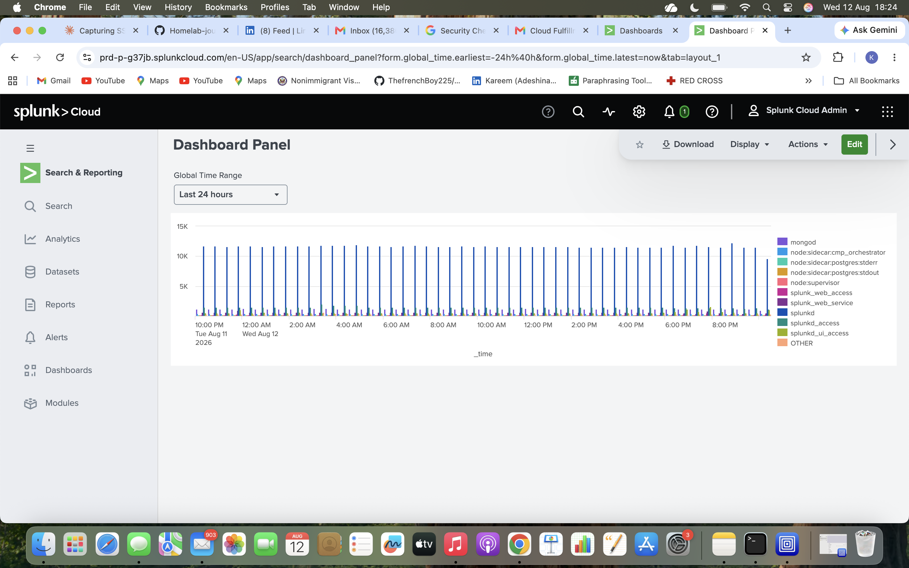

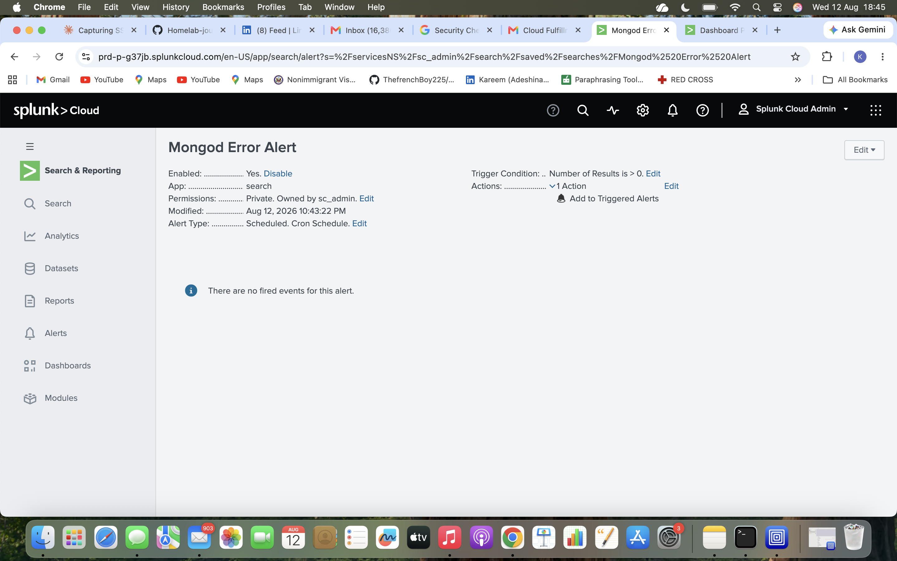

### Skills practiced
- Reading vendor system requirements documentation to verify platform compatibility before attempting an install
- Splunk Search Processing Language (SPL): `stats`, wildcard field matching, `timechart`
- Reading and interpreting structured JSON log events and automatic field extraction
- Building and saving a dashboard panel from a search
- Configuring a scheduled alert with cron syntax and trigger conditions
- Recognizing when to abandon one approach and pivot to a working alternative, rather than forcing an incompatible setup

### Next steps
- Install ELK Stack (Elasticsearch + Kibana) on the Ubuntu VM, since it supports ARM64 natively
- Let the Splunk alert run for a few cycles and check the Triggered Alerts history to confirm it's firing as expected
- Re-run this whole exercise once Wazuh Cloud is available again (locked out until Nov 2026) to compare all three tools — Wazuh, Splunk, and ELK — hands-on
- Revisit Kali Linux later, possibly via a cloud VM or different hardware

## Entry 9 — August 12, 2026: Installing ELK Stack (Elasticsearch + Kibana) on ARM64

**Goal:** Get a real SIEM-adjacent stack running natively on the Ubuntu VM, since Splunk Enterprise turned out not to support ARM64 (Entry 8).

### What I did
- Added Elastic's official APT repository to the Ubuntu VM: imported Elastic's GPG signing key with `gpg --dearmor`, then registered the repo via `/etc/apt/sources.list.d/elastic-8.x.list`
- Installed **Elasticsearch 8.19.20** with `sudo apt install elasticsearch` — confirmed the package pulled genuine ARM64 binaries from Elastic's repo, unlike Splunk
- Set a conservative JVM heap limit before first start, given the VM's 8GB RAM budget
- Enabled and started the service with `systemctl`, confirmed `active (running)` via `systemctl status`
- Saved the auto-generated `elastic` superuser password — modern Elasticsearch enables authentication and TLS by default, no manual security setup required
- Installed **Kibana 8.19.20** from the same Elastic repo, enabled and started it as a systemd service
- Generated an enrollment token on the Elasticsearch side (`elasticsearch-create-enrollment-token -s kibana`) and used it to connect Kibana to Elasticsearch via `kibana-setup`
- Restarted Kibana and logged into the web UI at `http://localhost:5601` using the `elastic` superuser credentials — landed on the "Welcome to Elastic" home screen

### Issues encountered (and how I solved them)
1. **Enrollment token expired before I could use it** — enrollment tokens only stay valid for a short window (roughly 30 minutes). My first token had already expired by the time I ran the setup command, resulting in "Invalid enrollment token provided"
2. **Copy-paste added stray angle brackets around the token** — on the second attempt, the token got pasted as `<eyJ2ZXIi...==>` instead of the raw string. Bash interpreted `<` as an input-redirect operator instead of literal text, throwing a `syntax error near unexpected token 'newline'`
3. **Fix** — generated a third, fresh token and ran the enrollment command immediately afterward in the same sitting, pasting only the raw token with no surrounding characters. This succeeded: "✔ Kibana configured successfully."

### Result
Successfully stood up a working Elasticsearch + Kibana stack entirely on ARM64 — the exact thing Splunk Enterprise couldn't do on this hardware. Both services are enabled to start automatically on boot, security (auth + TLS) is on by default out of the box, and the Kibana web interface is fully accessible and ready for real data. This closes the loop from Entry 8: instead of just documenting that Splunk was a dead end, I now have a genuinely comparable open-source alternative running hands-on in the homelab.

### Skills practiced
- Adding a third-party APT repository with GPG key verification
- Installing and managing systemd services (`daemon-reload`, `enable`, `start`, `status`)
- Configuring JVM memory limits for a resource-constrained VM
- Understanding and troubleshooting security enrollment tokens (expiration windows, exact-string requirements)
- Diagnosing a shell syntax error caused by special characters (`<`) in a pasted value
- Connecting two services together via a token-based trust handshake, rather than a plaintext password

### Next steps
- Add a real data source to Kibana (likely `/var/log/auth.log` or the fail2ban logs) so there's actual homelab data to search and visualize, rather than an empty instance
- Build a Kibana dashboard comparable to the Splunk timechart panel from Entry 8, to compare the two tools side by side
- Re-run this whole exercise once Wazuh Cloud is available again (locked out until Nov 2026) to compare Wazuh, Splunk, and ELK hands-on, all having now been used in this project
- Revisit Kali Linux later, possibly via a cloud VM or different hardware


## Entry 10 — August 18, 2026: Completing the ELK Pipeline with Filebeat

**Goal:** Feed real log data into the ELK Stack built in Entry 9, so Elasticsearch and Kibana had something actual to search and visualize instead of sitting empty.

### What I did
- Installed **Filebeat 8.19.20** from the same Elastic APT repo already configured for Elasticsearch/Kibana — no new GPG key or repo setup needed
- Enabled Filebeat's built-in **system module** (`filebeat modules enable system`), which is pre-built to read standard Linux logs like `/var/log/auth.log` and `/var/log/syslog`
- Configured Filebeat's Elasticsearch output in `/etc/filebeat/filebeat.yml`: pointed it at `localhost:9200` over HTTPS (Elasticsearch's default TLS), set `ssl.verification_mode: none` to accept the self-signed homelab certificate, and authenticated with the `elastic` superuser
- Ran `filebeat setup -e` to load Filebeat's index template into Elasticsearch and its pre-built dashboards into Kibana
- Started and enabled Filebeat as a persistent systemd service
- Verified data in Kibana's **Discover** view under a `filebeat-*` data view — confirmed real documents flowing in with fields like `event.dataset`, `agent.hostname`, and full timestamps
- Filtered specifically for `event.dataset: "system.auth"` and inspected individual events, finding genuine authentication activity — including a `pam_unix(sudo:session): session closed for user root` entry, confirming real sudo/privilege-escalation activity was being captured, not just noise
- Built a stacked bar chart in **Kibana Lens**: `@timestamp` on the horizontal axis, count of records on the vertical axis, broken down by `event.dataset` to visually separate `system.auth` from `system.syslog` activity over time — a direct parallel to the Splunk `timechart count by sourcetype` panel from Entry 8

### Issues encountered (and how I solved them)
1. **YAML indentation errors in `filebeat.yml`** — while adding `protocol`, `ssl.verification_mode`, and `username` under `output.elasticsearch:`, several lines ended up with inconsistent indentation (0 or 1 space instead of the required 2). Since YAML uses indentation to define structure, misaligned lines were being read as disconnected top-level keys rather than nested settings, which would have silently broken the config. Fixed by deleting and retyping each line with exactly 2 spaces to match `hosts:`
2. **401 Unauthorized connecting to Elasticsearch** — `filebeat setup -e` failed with a security exception because the password saved in `filebeat.yml` didn't match the actual `elastic` superuser password generated during the Entry 9 Elasticsearch install. Fixed by locating the correct saved password and updating the config
3. **No data appearing in Kibana Discover despite Filebeat running** — even with the module enabled and the service showing `active (running)`, Discover returned zero results. Investigating `/etc/filebeat/modules.d/system.yml` revealed the real cause: enabling a *module* only makes it available — the individual **filesets** inside it (`syslog` and `auth`) were still explicitly set to `enabled: false` by default. Fixed by manually setting both to `true` and restarting Filebeat, after which 93 real documents appeared immediately

### Result
The full log pipeline is now working end to end: **Ubuntu system logs → Filebeat → Elasticsearch → Kibana**. This closes the loop from Entry 9 — instead of an empty ELK install, there's now a genuine, queryable stream of real authentication and system activity from the homelab VM, browsable in Discover and visualized in a saved Lens chart. The fileset-vs-module distinction was a non-obvious gotcha that cost real troubleshooting time, and is worth remembering for any future Beats/Elastic work.

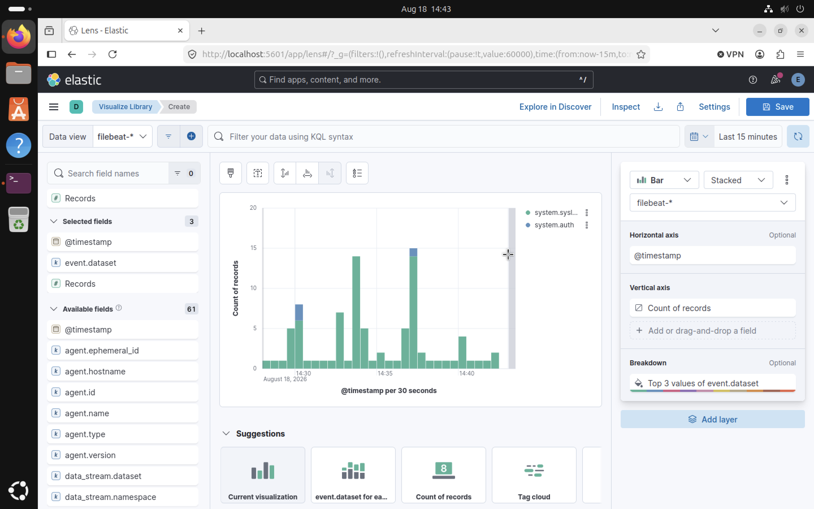

### Skills practiced
- Configuring a log-shipping agent (Filebeat) end to end: repo setup, module/fileset configuration, output authentication
- Diagnosing YAML indentation issues and understanding why whitespace is structurally significant in YAML
- Troubleshooting authentication failures by cross-referencing saved credentials rather than guessing
- Distinguishing between a module being "enabled" and its individual filesets being enabled — a real distinction in Elastic's Beats architecture
- Reading and interpreting real Linux auth log data (PAM session events) at the individual-event level
- Building a time-series visualization in Kibana Lens with a categorical breakdown, directly comparable to equivalent Splunk SPL work from Entry 8

### Next steps
- Add fail2ban's own log output as a second Filebeat data source, to visualize ban events alongside raw auth activity
- Re-run this whole exercise once Wazuh Cloud is available again (locked out until Nov 2026) to compare all three tools — Wazuh, Splunk, and ELK — hands-on, now that all three have real data flowing through them
- Revisit Kali Linux later, possibly via a cloud VM or different hardware


## Entry 11 — August 18, 2026: Vulnerability Assessment — Scan, Remediate, Verify

**Goal:** Start rounding out the project beyond blue-team/SIEM work by covering Security Assessments — running a real vulnerability scan against the Ubuntu VM, then actually fixing what it found, rather than just collecting scan output.

### What I did
- Ran a full port and service scan against the VM: `sudo nmap -sV -p- localhost`, scanning all 65,535 ports rather than just the common ones, to get a complete picture of the attack surface
- Identified six open services: SSH (OpenSSH 10.2p1), SMTP (Postfix), CUPS printing (631), and three Elasticsearch/Kibana-related ports from Entries 9–10
- Ran nmap's vulnerability-detection scripts (`sudo nmap --script vuln localhost`), saved via `tee` so the output was visible live and archived to a file at the same time — the full scan took just under 9 minutes
- As part of the same scan, nmap's `http-enum` script automatically brute-forced hundreds of common admin-panel paths against Kibana/Elasticsearch's web interface — every single one returned `401 Unauthorized`, confirming the authentication set up in Entry 9 was correctly blocking access under active scanning, not just sitting there unused
- Identified two real, actionable vulnerabilities:
  - **Port 25 (SMTP/Postfix):** flagged for an **Anonymous Diffie-Hellman Key Exchange MitM vulnerability** — the TLS configuration allowed a weak key-exchange mode vulnerable to active man-in-the-middle attacks
  - **Port 631 (CUPS):** flagged as **likely vulnerable to a Slowloris DoS attack** (CVE-2007-6750) — and notably, CUPS wasn't even needed on this VM at all, since printing isn't used
- Remediated both findings:
  - Disabled CUPS entirely with `systemctl stop cups` and `systemctl disable cups`, removing the vulnerable service (and the unnecessary attack surface) in one step
  - Hardened Postfix's TLS configuration in `/etc/postfix/main.cf` by adding `smtpd_tls_ciphers = high` and an explicit `smtpd_tls_exclude_ciphers` list excluding anonymous and weak cipher suites, then restarted Postfix
- Verified both fixes with follow-up scans: a targeted port scan confirmed CUPS was no longer listening, and re-running `nmap --script ssl-dh-params -p 25 localhost` returned a clean result with zero vulnerabilities flagged

### Issues encountered (and how I solved them)
1. **Accidentally killed a running scan with Ctrl+C** — while troubleshooting a separate stuck `sudo` password prompt, pressing Ctrl+C also terminated the nmap scan that was writing to a file in the same terminal, leaving a nearly-empty output file. Learned that Ctrl+C kills the entire foreground process chain in a terminal, not just a stuck sub-prompt — re-ran the scan from scratch afterward
2. **Repeated sudo authentication failures** — several password attempts failed in a row with no visible cause. Diagnosed by testing in isolation with `sudo whoami` (a fast way to confirm credentials without waiting through a long scan) rather than guessing blindly; turned out to be simple mistyping, since Linux's `sudo` prompt gives zero visual feedback (not even asterisks) while typing

### Result
Completed a full, realistic vulnerability assessment cycle — reconnaissance, vulnerability identification, remediation, and verification — rather than just collecting raw scan data. Both real findings were fixed and independently confirmed resolved through follow-up scans, and the Elasticsearch/Kibana authentication work from Entries 9–10 held up correctly under active, automated scanning pressure. This is the first entry in the project explicitly framed as a Security Assessment rather than blue-team monitoring, and the first domain checked off in a broader plan to cover Incident Response, GRC, Cloud Security, and Active Directory going forward.

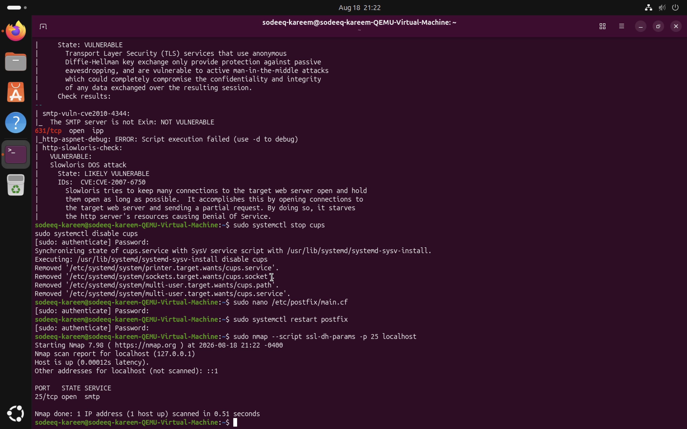

### Skills practiced
- Full-range TCP port scanning and service/version fingerprinting with nmap
- Running and interpreting nmap's NSE vulnerability-detection scripts (`--script vuln`)
- Reading CVE references and vulnerability descriptions to assess real-world risk and severity
- Remediating findings directly: disabling unnecessary services, hardening TLS cipher configuration
- Verifying a fix actually worked via a targeted follow-up scan, rather than assuming a config change was sufficient
- Using `tee` to view command output live while simultaneously saving it to a file for later documentation
- Practical terminal troubleshooting: understanding what Ctrl+C actually terminates, and isolating a suspected password issue with a fast, low-stakes test command

### Next steps
- Consider installing OpenVAS/Greenbone for a deeper, more comprehensive vulnerability scan beyond what nmap's NSE scripts cover
- Move to the next domain in the roadmap: Incident Response — formalizing the hydra/fail2ban work from Entries 5–7 into a structured NIST IR lifecycle write-up
- Continue through the remaining planned domains: GRC, Cloud Security, and Active Directory
- Revisit Kali Linux later, possibly via a cloud VM or different hardware


## Entry 12 — August 2026: Incident Response — Formalizing the Attack Story

**Goal:** Move into the Incident Response domain by taking the SSH brute-force work from Entries 5–7 — which was documented as a series of separate technical experiments — and reframing it as a single, connected incident using the industry-standard NIST SP 800-61 lifecycle: Preparation, Detection & Analysis, Containment/Eradication/Recovery, and Post-Incident Activity.

### What I did
- Reviewed Entries 1–7 specifically through an incident-response lens rather than a "what did I build" lens, identifying which existing work mapped to each of the four NIST phases
- **Preparation:** SSH key-based authentication, Wireshark installed and ready for traffic capture, and fail2ban configured with tuned `maxretry`/`findtime` thresholds — all standing controls in place *before* any simulated attack occurred
- **Detection & Analysis:** the simulated `hydra` brute-force attack was identified two ways — at the network level, via the distinctive repeated SSH handshake pattern and exposed banner grab visible in Wireshark (Entry 5); and at the host level, via fail2ban actively monitoring `auth.log` and counting failed login attempts (Entry 6)
- **Containment, Eradication & Recovery:** fail2ban automatically banned the offending IP once the failure threshold was crossed, confirmed independently at the packet level by an ICMP Type 3 (Destination Unreachable), Code 3 (Port Unreachable) rejection — proof the block was actually enforced, not just logged (Entry 6). Recovery was automatic: the ban was time-limited and the service returned to normal operation without manual intervention
- **Post-Incident Activity:** wrote a genuine retrospective (new work, not previously documented) covering what worked well and what could be improved for next time
- Drafted a separate, formal Incident Response Report as a standalone document, written in the structure and tone of a real IR report rather than a casual dev-log entry — intended as its own portfolio artifact

### Post-Incident Review (Lessons Learned)
- **What worked well:** the combination of network-level (Wireshark) and host-level (fail2ban/auth.log) detection gave two independent ways to confirm the same incident, which is a stronger detection posture than relying on either alone. The response was also fully automated — no manual intervention was needed to contain the threat
- **What could improve:** the original `bantime` (600 seconds) meant a resourceful attacker could simply wait out the ban and retry; a production environment would likely want either a longer ban, an escalating ban duration for repeat offenders, or a permanent block after a certain number of bans. Alerting was email-only (Entry 7) — a real SOC would want this routed to a ticketing system or chat tool (Slack/Teams) for faster human visibility. There was also no formal "incident closed" step — the process detects and contains automatically, but nothing marks the incident as reviewed and closed the way a real IR process would
- **Follow-up actions identified:** implement escalating ban durations for repeat offenders; route alerts to a second channel beyond email; add a manual review/close step to the process even for automated responses, to build the habit of formal incident closure

### Result
Reframed three separate technical entries into a single, coherent incident response case study using an industry-standard framework, rather than leaving them as disconnected "I built this" posts. This is a genuinely different and valuable way to present the same underlying work — it demonstrates the ability to think in terms of a real IR lifecycle, not just individual tools, which is exactly how incident response is actually discussed and evaluated in a professional setting.

### Skills practiced
- Applying the NIST SP 800-61 incident response lifecycle to real technical work
- Distinguishing between detection, containment, and recovery as distinct phases with different goals
- Writing a genuine post-incident retrospective, including identifying real gaps rather than just describing successes
- Translating hands-on technical work into the structure and language expected in professional incident response documentation

### Next steps
- Move to the next domain in the roadmap: GRC — mapping existing homelab controls against a formal framework (NIST CSF or CIS Controls) and writing a short policy document
- Consider implementing the escalating-ban-duration improvement identified in the retrospective as a concrete follow-up technical task
- Continue through Cloud Security and Active Directory as planned
- Revisit Kali Linux later, possibly via a cloud VM or different hardware


## Entry 13 — August 2026: GRC — Mapping Controls to NIST CSF and Writing an Actual Policy

**Goal:** Move into Governance, Risk, and Compliance (GRC) — the third domain in the plan — by mapping the technical work from Entries 1–12 against a formal cybersecurity framework, and writing a real policy document rather than just describing tools and configurations.

### What I did
- Reviewed the entire project so far specifically through a governance lens, mapping existing work against all six functions of the **NIST Cybersecurity Framework (CSF) 2.0**: Govern, Identify, Protect, Detect, Respond, and Recover
- Confirmed genuine coverage across every function — not just the technical ones (Protect/Detect/Respond) that come naturally from hands-on work, but also Govern (structured documentation across every entry) and Identify (asset inventory and vulnerability scanning from Entry 11)
- Instead of writing three separate, disconnected policy documents, consolidated the work into a single **Information Security Policy Suite** — a standalone formal document containing three internally-linked sections: Access Control, Vulnerability Management, and Incident Response
- Each section follows a consistent structure: Objective, Requirements (the actual policy statements), and Applied Evidence (directly citing the real technical work from earlier entries that satisfies each requirement)
- Included a NIST CSF 2.0 alignment table summarizing which applied control maps to which framework function, as a quick-reference summary
- Produced the document in both `.docx` and `.pdf` formats for the GitHub repo and LinkedIn Featured section respectively

### Result
Produced a genuinely professional-looking governance artifact that connects individual technical decisions (SSH key auth, vulnerability remediation, automated incident containment) to a documented policy framework — the way security work is actually evaluated and communicated in a real organization, rather than as a list of disconnected tools. Choosing to consolidate into one policy suite rather than three separate documents was itself a small but genuine GRC decision: real organizations typically maintain a unified policy structure rather than scattered standalone documents, and reflecting that in the deliverable is part of demonstrating the skill, not just the writing.

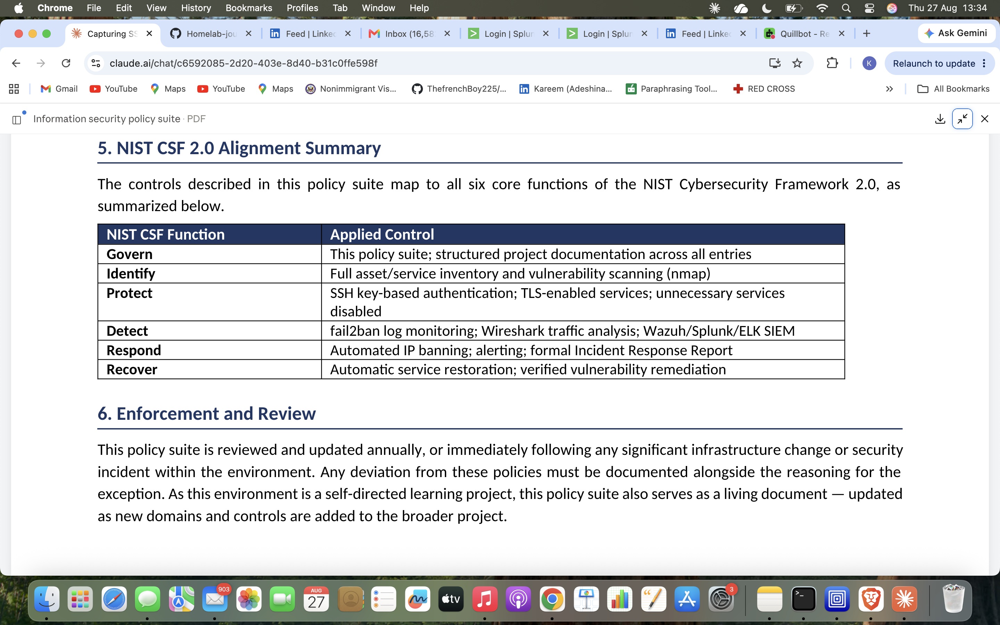

### Skills practiced
- Applying the NIST Cybersecurity Framework (CSF) 2.0 to real, previously-completed technical work
- Writing formal security policy language (Objective / Requirements / Applied Evidence structure)
- Making a structural GRC decision — one consolidated policy suite versus multiple standalone documents — and justifying it
- Connecting hands-on technical evidence directly to specific policy requirements, rather than treating documentation and technical work as separate activities

### Next steps
- Move to the next domain in the roadmap: Cloud Security — using an AWS or Azure free tier to cover IAM, security groups, and basic cloud logging
- Continue toward Active Directory as the final planned domain, likely via a cloud-hosted Windows Server VM
- Consider revisiting this policy suite as a living document as new domains are added, per its own stated review cycle
- Revisit Kali Linux later, possibly via a cloud VM or different hardware


## Entry 14 — September 1, 2026: Cloud Security — Azure IAM, RBAC, and Logging

**Goal:** Move into the Cloud Security domain — the fourth in the plan — by standing up a real Azure environment and demonstrating core identity, access, and logging concepts using Microsoft Entra ID, chosen specifically because it connects directly to the upcoming Active Directory domain and my existing Windows/M365 experience.

### What I did
- Signed up for the **Azure free tier** ($200 in trial credits, 12 months of free core services), using an actual identity-verification signup rather than any third-party "pre-made account" offer (a scam pattern I ran into and avoided while researching the free tier)
- In **Microsoft Entra ID**, created a test user account ("John Doe") simulating a new employee being onboarded — the same conceptual task as account provisioning in my day-to-day Admin Security Analyst role, just performed in Azure instead of an on-prem environment
- Created a **Security group** ("IT-Support-Team") and added John Doe as a direct member, simulating role-based departmental grouping
- Assigned John Doe the built-in **"Reader" role** at the subscription level via Access Control (IAM) — a deliberate least-privilege choice, giving read-only visibility into resources with no ability to create, modify, or delete anything
- Reviewed **sign-in logs**, confirming successful authentication events for my own account (Status: Success, Application: Azure Portal / Microsoft Azure sign-up) — the cloud-native equivalent of reading `/var/log/auth.log` on the homelab VM, just delivered as a managed service with a structured UI instead of raw text
- Checked **Network Security Groups (NSGs)** — Azure's equivalent of a local firewall ruleset, conceptually similar to the `iptables` rules fail2ban manages on the Ubuntu VM. None existed yet, which was expected and correct, since NSGs are typically created alongside deployed networked resources (like a VM), and none had been deployed in this environment

### Result
Completed a full, realistic Identity and Access Management workflow in a genuine cloud environment: **user provisioning → group membership → least-privilege role assignment → activity logging**. This is conceptually the same pattern demonstrated throughout the homelab (account administration in Entry 6-7, access control policy in Entry 13), just applied to cloud infrastructure instead of a self-hosted Linux VM — showing the underlying security thinking transfers directly between environments, which is exactly the point of covering multiple domains rather than going deep on only one.

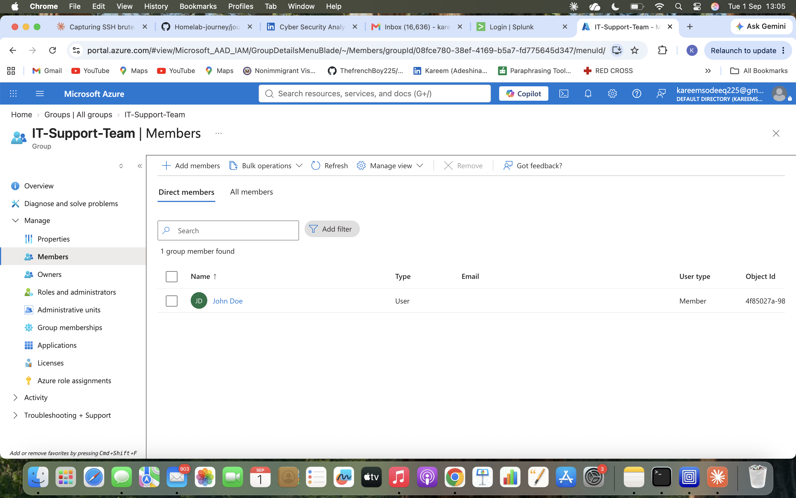

### Skills practiced
- Navigating and provisioning identities in Microsoft Entra ID
- Creating security groups and managing group membership for access control
- Applying least-privilege principles through Azure RBAC (built-in "Reader" role)
- Reading and interpreting cloud-native authentication/sign-in logs
- Understanding Network Security Groups conceptually, even without a deployed resource to attach one to
- Recognizing and avoiding a scam pattern (fake "pre-made account" sellers) encountered while researching legitimate free-tier signup

### Next steps
- Deploy a free-tier Azure VM to generate an actual NSG and observe real network security rule configuration
- Move to the final domain in the roadmap: Active Directory — likely via a cloud-hosted Windows Server VM, since Apple Silicon doesn't support running Windows Server well locally
- Consider connecting Entra ID conditional access concepts to the Access Control Policy written in Entry 13, since both cover the same underlying control area
- Revisit Kali Linux later, possibly via a cloud VM or different hardware


### Entry 15 — September 2026: Active Directory — Azure Provisioning Troubleshooting

**Goal**: Begin the final domain in the plan, Active Directory, by provisioning a cloud-hosted Windows Server VM to serve as a domain controller — necessary since Apple Silicon doesn't support running Windows Server well locally. What followed was less about AD itself and more a real lesson in diagnosing cloud provisioning failures layer by layer.

### What I did

Started creating a Windows Server 2022 Datacenter (Desktop Experience) VM named ad-dc-01 on Azure's free tier, initially targeting the Standard_B2ats_v2 size
Discovered Standard_B2ats_v2 is hard-capped at 1 GiB of memory across every Azure region — below Windows Server 2022's minimum requirements for a Desktop Experience install, ruling it out for running AD DS
Upgraded the subscription from Free Trial to Pay-As-You-Go to unlock properly-sized VM options like Standard_B2s (2 vCPU, 4 GiB), while planning to deallocate the VM between work sessions to minimize ongoing storage costs
Hit a second, less obvious blocker post-upgrade: VM creation failed in every region tried (East US, East US 2, Canada Central) with a generic "subscription doesn't support VM creation" error
Diagnosed this down to two distinct root causes rather than a single regional issue:
The Microsoft.Compute resource provider hadn't auto-registered on the new subscription, which was silently blocking quota data from loading at all — fixed by manually registering it under Subscription → Resource providers
Even after registering the provider, the actual Standard Bsv2 Family vCPU quota was sitting at a hard 0 limit in every region — a known fraud-prevention hold applied to newly-upgraded Pay-As-You-Go accounts, which doesn't always self-resolve through the standard in-portal quota request tool
Filed a formal support ticket (Basic/free support tier, no cost) requesting an increase to 8 vCPUs for the Bsv2 family in Canada Central — chosen deliberately for lower latency going forward rather than continuing to guess across US regions
Set up a Cost Management budget alert ($20 CAD threshold) as a safety net before doing any further paid provisioning

### Result

No domain controller yet — this entry documents the provisioning path, not the destination. The core finding: a generic "region doesn't support VM creation" error masked two separate, unrelated account-level issues (an unregistered resource provider and a zero-quota hold) that only surfaced by going directly into Azure's Resource Providers and Quotas blades rather than trusting the Create VM wizard's surface-level messaging. Support ticket submitted; AD DS deployment to follow once the quota increase is approved.
Show Image

### Skills practiced

Diagnosing Azure VM creation failures beyond the wizard's displayed error message
Understanding Azure resource provider registration and its role in gating subscription functionality
Navigating Azure Quotas to identify and request compute quota increases
Recognizing fraud-prevention holds common to newly-upgraded Pay-As-You-Go subscriptions
Filing a structured Azure support ticket (Basic/free tier) with correct scoping (deployment model, request type, region, quota, and target limit)
Proactive cost management via Azure budget alerts before provisioning paid resources

### Next steps

Await quota approval, then deploy the Windows Server 2022 VM (ad-dc-01) in Canada Central on Standard_B2s
RDP into the VM and promote it to a domain controller via Add Roles and Features → Active Directory Domain Services
Cover core AD concepts: forest/domain creation, OU structure, user and group management, and basic Group Policy


### Entry 16 — September 2026: Active Directory — Domain Controller Deployment

**Goal** : Pick up where Entry 15 left off — resolve the outstanding Azure quota approval, complete the Windows Server 2022 VM deployment, and promote it to a working Active Directory domain controller.

### What I did

Confirmed the Azure support ticket (support request #2609040040008907) was approved, increasing the Bsv2 Family vCPU quota to 8 in Canada Central
Rebuilt the VM through Azure's full (non-free-tier) Virtual Machines creation flow, since the "Free services" wizard is hardcoded to only offer 1 GiB memory sizes regardless of quota — selected Standard_B2s_v2 (2 vCPU, 8 GiB memory) after also switching Availability options to "No infrastructure redundancy required" to clear an unrelated zone-support conflict
Deployed ad-dc-01 successfully in Canada Central running Windows Server 2022 Datacenter: Azure Edition, then connected via RDP using Microsoft's Windows App (formerly Remote Desktop)
Installed the Active Directory Domain Services (AD DS) role through Server Manager — on the first attempt, mistakenly installed Active Directory Certificate Services (AD CS) instead due to the similarly-named roles sitting next to each other in the checklist
Diagnosed the resulting failure during domain controller promotion: Windows blocks promotion outright when AD CS is present on the same server, since the two roles conflict
Removed AD CS via the Remove Roles and Features wizard, restarted the server, then correctly installed AD DS (along with its automatically-bundled DNS Server and Group Policy Management tools)
Successfully promoted the server via the Active Directory Domain Services Configuration Wizard: created a new forest with root domain homelab.local, set a DSRM password, and let the server reboot to complete promotion
Verified success directly in Server Manager → Local Server, confirming Domain: homelab.local and the presence of a new DNS role (auto-installed alongside AD DS, since a domain controller must resolve its own domain)

### Result
ad-dc-01 is now a fully functioning Active Directory domain controller for the homelab.local forest, running in Azure. The path here included a genuine mid-process error (installing the wrong role) that had to be diagnosed and reversed rather than a clean first-try execution — consistent with the troubleshooting theme carried over from Entry 15.

   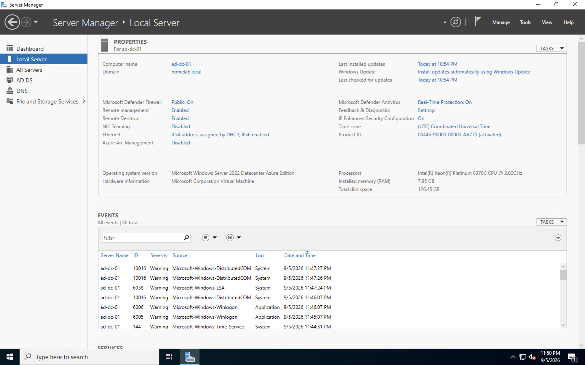

### Skills practiced

Navigating Azure's full VM creation flow versus its restricted free-tier flow, and matching VM size to actual workload requirements (memory minimums for Windows Server Desktop Experience)
Installing and removing Windows Server roles via Server Manager, including diagnosing a role conflict (AD CS vs. AD DS) from a failed prerequisites check rather than a vague error message
Promoting a Windows Server to a domain controller: forest creation, DSRM password configuration, and understanding why DNS Server installs automatically alongside AD DS
Verifying domain identity and DC status directly through Server Manager properties rather than assuming success from the installer alone

### Next steps

Build out an Organizational Unit (OU) structure in Active Directory Users and Computers (e.g., IT, Sales, HR) to mirror a real company hierarchy
Create test user accounts within those OUs, extending the same account-provisioning pattern demonstrated in Entry 14 (Entra ID) to on-prem AD
Create security groups and assign users to them
Apply a basic Group Policy Object (GPO) linked to an OU — e.g., a password policy or desktop restriction — to demonstrate policy enforcement
Set up Azure auto-shutdown on ad-dc-01 to control costs between work sessions


### Entry 17 — September 2026: Active Directory — OU Structure, Users, Groups, and Group Policy

**Goal**: Build out a realistic organizational structure inside homelab.local — Organizational Units, test user accounts, security groups, and a working Group Policy Object — to demonstrate core AD administration beyond just standing up the domain controller.

### What I did

Created three Organizational Units under homelab.local in Active Directory Users and Computers: IT, Sales, and HR, mirroring a simple company department structure
Created one test user in each OU (John Doe in IT, Jane Smith in Sales, and a third user in HR), following the same account-provisioning pattern used for the Entra ID test user in Entry 14, now applied on-prem
Created a matching security group in each OU (IT-Team, Sales-Team, HR-Team) and added each OU's respective test user as a member, validating names via "Check Names" before applying
Opened Group Policy Management and created a new GPO, Sales-Password-Policy, linked directly to the Sales OU only — not the domain root — to keep its effect scoped rather than domain-wide
Edited the GPO under Computer Configuration → Policies → Windows Settings → Security Settings → Account Policies → Password Policy, and configured Minimum password length to require 10 characters
Verified the GPO was correctly scoped by checking the Linked Group Policy Objects tab on the Sales OU (showing the policy active) versus IT and HR (showing no linked policies)


### Result
homelab.local now has a working, mini organizational structure: three OUs, three users, three matching security groups, and a real enforced password policy scoped to just one department. This demonstrates the full identity lifecycle on-prem — the same conceptual pattern as the cloud-based IAM work in Entry 14, but through native AD tooling (Active Directory Users and Computers and Group Policy Management) instead of Entra ID.

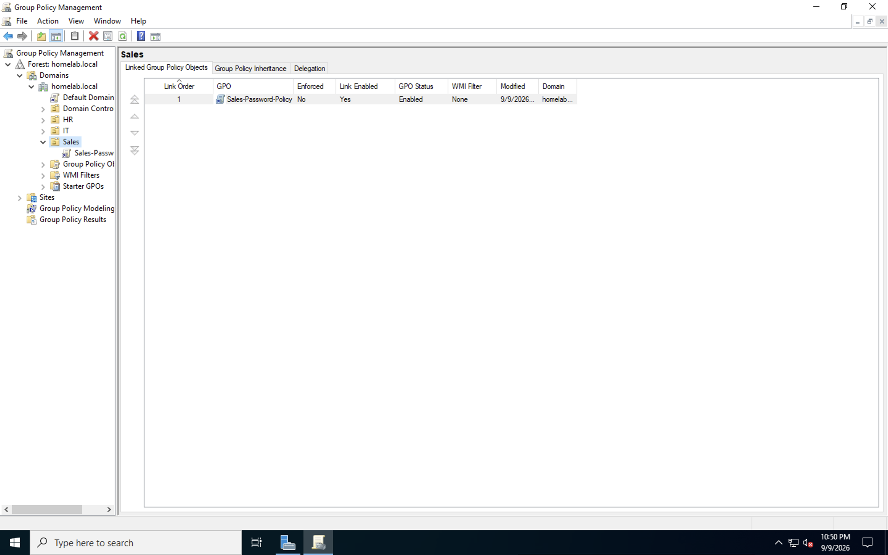

### Skills practiced

Structuring Active Directory with Organizational Units to reflect departmental boundaries
Creating and managing AD user accounts and security groups, including group membership assignment
Building and linking a Group Policy Object to a specific OU rather than the domain root, to control policy scope precisely
Navigating the Group Policy Management Editor to configure Account Policies (Password Policy)
Verifying policy scope directly through the Group Policy Management console rather than assuming a link applied correctly

### Next steps

Extend Group Policy practice with a second policy type (e.g., a desktop/UI restriction) applied to a different OU, to contrast account policies vs. user-experience policies
Explore Group Policy Modeling or Group Policy Results to simulate/verify policy application before deploying
Consider nesting security groups (e.g., a broader "All-Staff" group containing the three department groups) to practice group nesting strategies


### Entry 18 — September 2026: Active Directory — Second GPO and Group Policy Modeling

**Goal**: Build a second Group Policy Object covering a different policy category than Entry 17's password policy, then use Group Policy Modeling to simulate and verify its effect before trusting it based on the link alone.

### What I did

Created a new GPO, HR-Restrict-ControlPanel, linked directly to the HR OU
Configured it under User Configuration → Policies → Administrative Templates → Control Panel → Prohibit access to Control Panel and PC settings, set to Enabled — a User Configuration/Administrative Template setting, in contrast to Entry 17's Computer Configuration/Account Policy setting
Verified correct linking in Group Policy Management: the HR OU's Linked Group Policy Objects tab shows HR-Restrict-ControlPanel (Link Enabled: Yes, GPO Status: Enabled), while Sales shows only its own Sales-Password-Policy — confirming no cross-department bleed
Ran the Group Policy Modeling Wizard, simulating policy application for the HR OU container (OU=HR,DC=homelab,DC=local) against the domain
Reviewed the generated simulation report and confirmed under Applied GPOs that only HR-Restrict-ControlPanel applies to HR, with an empty Denied GPOs section and the Control Panel policy showing "Winning GPO: HR-Restrict-ControlPanel"

### Result
Two GPOs are now active in homelab.local, each correctly isolated to its own department: a password policy on Sales, and a Control Panel restriction on HR. Rather than relying solely on the Linked Group Policy Objects view to confirm scope, I used Group Policy Modeling to simulate actual policy application — a more rigorous verification step that mirrors how a real admin would test a policy's effect before rolling it out, not just trust that a link was created correctly.


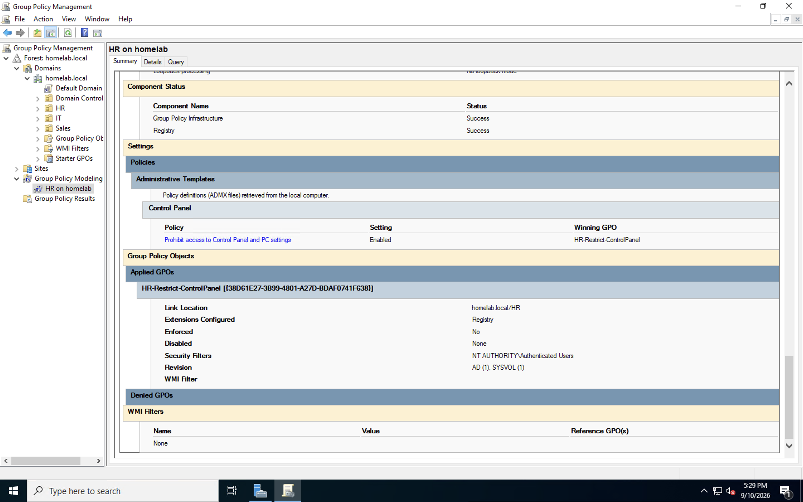

### Skills practiced

Configuring a User Configuration / Administrative Templates policy, distinct from the Account Policies used in Entry 17
Verifying GPO scope two ways: statically (Linked Group Policy Objects) and dynamically (Group Policy Modeling simulation)
Reading a Group Policy Modeling report — Applied GPOs, Denied GPOs, and per-setting "Winning GPO" attribution
Understanding why simulating a policy's effect is a stronger verification step than trusting a link alone

### Next steps

Consider nesting security groups (e.g., an "All-Staff" group containing IT-Team, Sales-Team, HR-Team) to practice group nesting strategies
Explore Group Policy Results (as opposed to Modeling) to check actual applied policy on a live logged-in session, rather than a simulation


### Entry 19 — September 2026: Active Directory — Group Policy Results and Nested Security Groups

**Goal**: Round out the AD administration work by using Group Policy Results to check real (not simulated) policy application, and by building a nested security group structure across the existing departments.

### What I did

Ran the Group Policy Results Wizard against labadmin on ad-dc-01 — unlike Group Policy Modeling (which simulates), this tool reports what has actually been applied to a real, logged-on session
Confirmed both the last computer policy refresh and user policy refresh completed with No Errors Detected, and reviewed Component Status showing successful Group Policy Infrastructure, Registry, and Security processing
Noted that labadmin sits in the homelab.local/Domain Controllers OU, so neither Sales-Password-Policy nor HR-Restrict-ControlPanel appear in this report — correctly reflecting that neither GPO targets that OU
Created a new security group, All-Staff, intended as a nested parent group over the three department groups
Hit a naming issue when adding members by typing names directly — a stray space in "IT-Team" (auto-inserted while typing) caused a "Name Not Found" error that a straight retype didn't resolve
Worked around it using the Advanced → Find Now search interface instead of typing names manually, then Ctrl-selecting all three groups at once — added IT-Team, Sales-Team, and HR-Team as members of All-Staff without further issues

### Result
homelab.local now has a two-level group structure: three department-level security groups (IT-Team, Sales-Team, HR-Team) nested inside a single umbrella group (All-Staff). This mirrors a common real-world pattern — granting a permission or applying a policy to All-Staff would cascade to every user across all three departments without needing to manage them individually. Group Policy Results also confirmed, using live session data rather than simulation, that GPOs are applying exactly where expected and nowhere else.

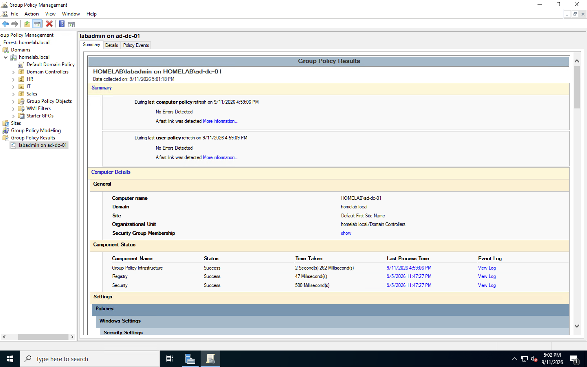

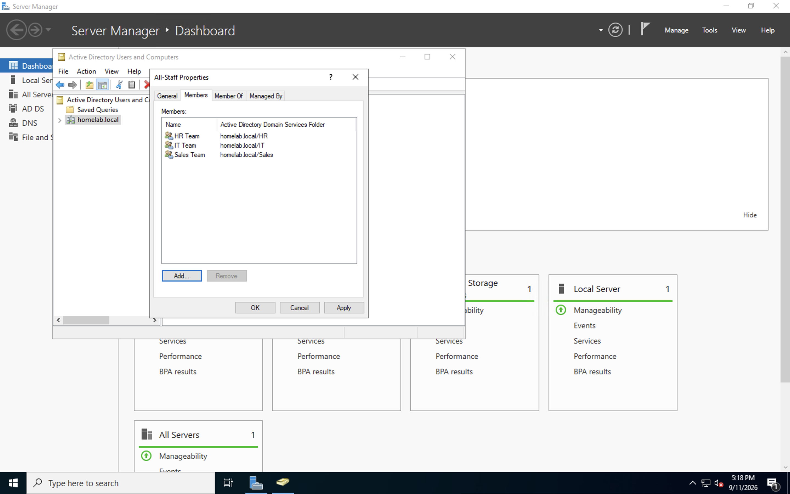

### Skills practiced

Running and interpreting Group Policy Results (RSoP) as a live-session verification tool, distinct from the simulation-based Group Policy Modeling used in Entry 18.
Understanding why a given OU's policy report may correctly show no department GPOs, based on OU membership rather than assuming something is broken.
Building nested security groups to reflect a departmental hierarchy.
Troubleshooting an AD object lookup failure caused by a hidden extra character, and resolving it with a more reliable method (Advanced search) rather than repeatedly retyping the same failing input.

### Next steps

Apply a permission or policy scoped to the All-Staff group to demonstrate the nesting actually cascades as expected
Consider documenting the full homelab.local structure (OUs, groups, GPOs) as a single reference diagram to accompany the write-ups


Entry 20 — September 2026: Active Directory — Verifying Nested Group Permissions

**Goal**: Prove that the nested security group structure built in Entry 19 (All-Staff containing IT-Team, Sales-Team, HR-Team) actually cascades permissions down to individual users, rather than just existing as an organizational structure on paper.

### What I did

Created a shared folder, C:\CompanyShare, on ad-dc-01 as a test target for permission inheritance.
Opened the folder's Security properties and granted the All-Staff group Full Control — a single permission grant at the top of the nesting hierarchy, rather than assigning access to each department group individually.
Worked around an unresponsive checkbox in the basic Security tab by using Advanced Security Settings instead, confirming All-Staff's Full Control entry was correctly applied there.
Used the Effective Access tab under Advanced Security Settings to check what John Doe (a member of IT-Team, nested inside All-Staff) actually has on the folder — without granting him anything directly.
Confirmed the Effective Access report shows John Doe with Full Control, along with Traverse folder/execute file, List folder/read data, and Read attributes — inherited entirely through the IT-Team → All-Staff → CompanyShare chain

### Result

The nested group structure from Entry 19 isn't just organizational scaffolding — it functionally cascades real permissions. 
Granting Full Control to All-Staff once was sufficient to give every user across IT, Sales, and HR access to the shared folder, verified concretely through Windows' own Effective Access calculator rather than assumed from the group membership alone. 
This is the same underlying principle behind managing access at scale in a real organization: grant permissions to groups, not individuals, and let nesting handle the rest.

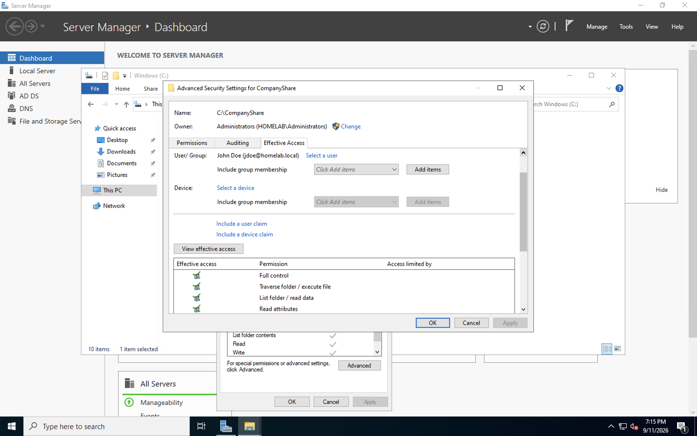


### Skills practiced

Applying folder-level NTFS permissions to a security group rather than individual users.
Navigating Advanced Security Settings when the basic Security tab's permission checkboxes become unresponsive.
Using the Effective Access tool to verify actual, inherited permissions for a specific user — a genuine diagnostic step rather than trusting the group hierarchy by inspection alone.
Understanding permission inheritance through nested security groups in a real, testable scenario.

### Next steps

Repeat the Effective Access check for a user in a different department (e.g., Jane Smith via Sales-Team) to confirm the same inheritance holds across all three nested groups.
Consider documenting the full homelab.local structure (OUs, groups, GPOs, and now folder permissions) as a single reference diagram
Deallocate ad-dc-01 between sessions to continue managing Azure costs 


### Entry 21 — September 2026: Active Directory — Confirming Nested Permissions Across All Departments

**Goal**: Complete the verification started in Entry 20 by checking Effective Access for a user in each of the three department groups, not just IT, to confirm the nested permission structure holds consistently across the entire organization.

### What I did

Returned to C:\CompanyShare → Advanced Security Settings → Effective Access tab
Checked effective access for Jane Smith (jsmith@homelab.local), a member of Sales-Team, and confirmed Full Control — inherited via Sales-Team → All-Staff, with no permission granted to her account directly
Repeated the same check for the HR test user (member of HR-Team) and confirmed the identical result: Full Control inherited via HR-Team → All-Staff
Combined with the John Doe (IT-Team) result from Entry 20, this covers all three department groups nested under All-Staff


### Result

All three departments — IT, Sales, and HR — correctly inherit Full Control on the shared folder purely through their nested group membership. This closes out the verification loop started in Entry 20: rather than checking one example and assuming the pattern holds, each branch of the nested structure was individually confirmed using Windows' Effective Access tool. The full identity and access chain — OUs, users, department groups, a nested umbrella group, and folder-level permission inheritance — is now built and verified end-to-end in homelab.local.

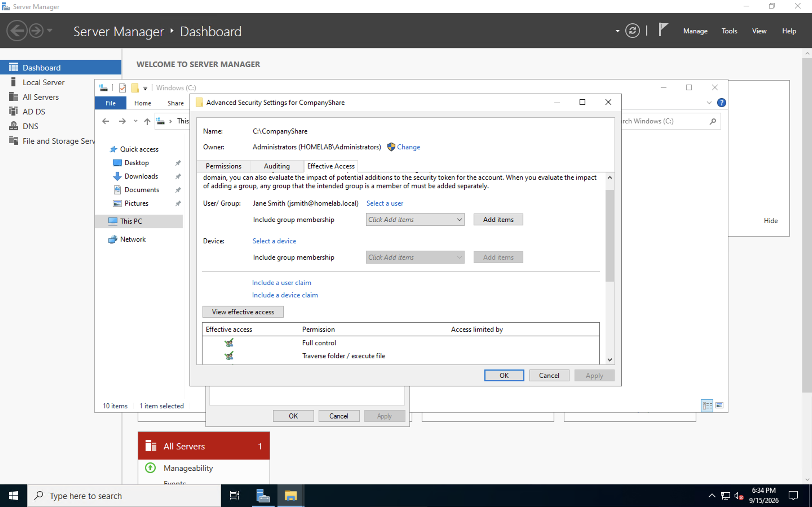


### Next steps

Document the full homelab.local structure (OUs, users, groups, GPOs, and folder permissions) as a single reference diagram to tie together Entries 16–21
Consider a final AD entry covering account lockout policy or auditing (e.g., enabling and reviewing security event logs for a simulated failed logon)
Deallocate ad-dc-01 between sessions to continue managing Azure costs


### Entry 22 — September 2026: Active Directory — Account Lockout Policy and Security Auditing

**Goal**: Close out the Active Directory series with a security-monitoring scenario — configure an account lockout policy, trigger a real lockout event, and verify it through Windows Security Event Log analysis, tying the AD work back to the log-analysis and incident-response skills built earlier in this homelab.

### What I did

Edited the Default Domain Policy under Computer Configuration → Policies → Windows Settings → Security Settings → Account Policies → Account Lockout Policy, setting Account lockout threshold to 3 invalid attempts (accepting Windows' auto-suggested lockout duration and reset counter defaults).
Opened a second, separate RDP connection to ad-dc-01 (same IP, distinct from my existing admin session) and deliberately attempted to log in as John Doe (HOMELAB\jdoe) using an incorrect password multiple times.
Switched to my original admin session and opened Event Viewer → Windows Logs → Security to review the resulting audit trail
Located Event ID 4625 ("An account failed to log on"), Task Category: Account Lockout, confirming the failed authentication attempts were logged.
Located Event ID 4740 ("A user account was locked out"), Task Category: User Account Management, Keywords: Audit Success, timestamped a few seconds before the 4625 entry I'd found first — confirming the lockout itself was recorded the moment the threshold was crossed, with 4625 entries continuing to log as further attempts hit the now-locked account.


### Result

The full loop — configure a policy, trigger a real security event through an actual failed-authentication scenario, then verify it via log analysis rather than trusting the policy "worked" by assumption — is now demonstrated in homelab.local. 
This closes out the Active Directory portion of the homelab on a security-monitoring note rather than a purely structural one, connecting directly back to the SIEM and incident-response work from earlier entries in this project.


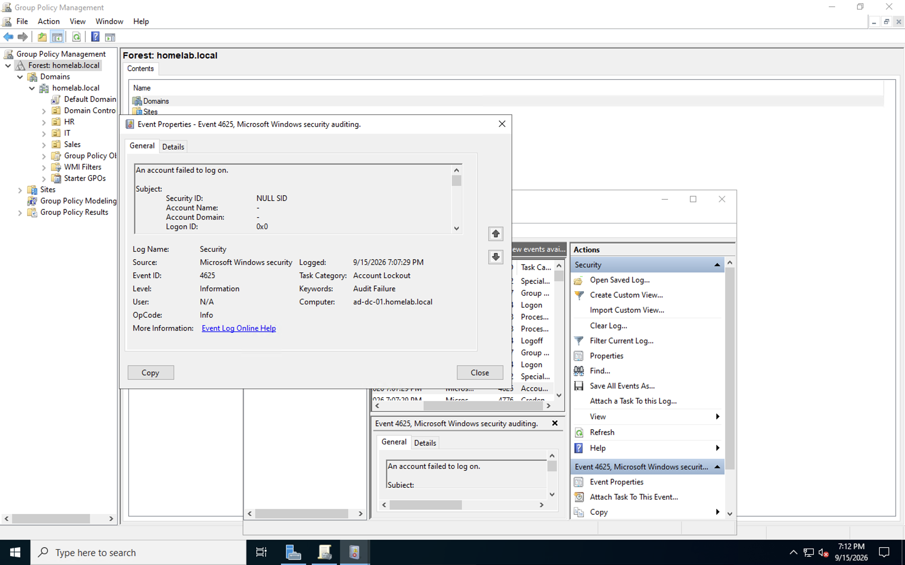

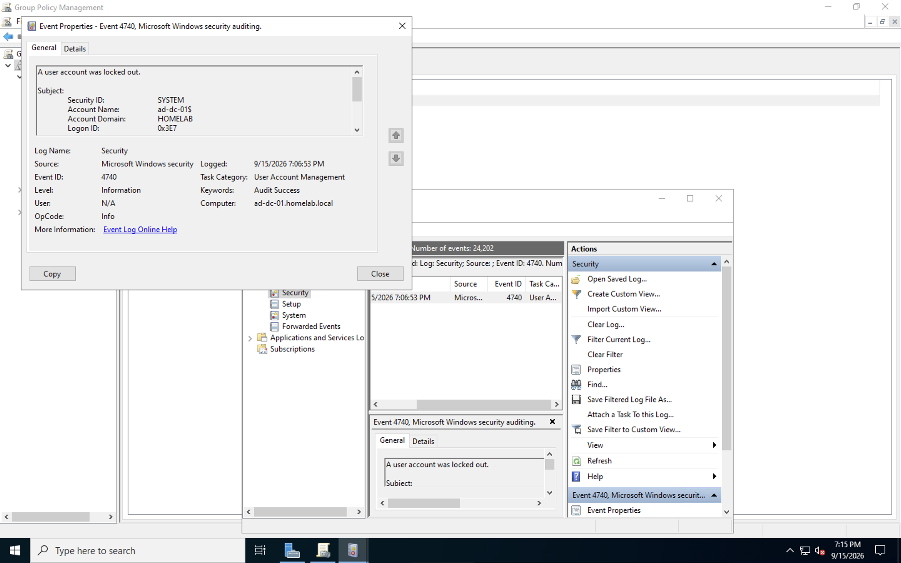

### Skills practiced

Configuring Account Lockout Policy via Default Domain Policy
Deliberately triggering a security event to test policy enforcement, rather than only configuring settings and assuming correctness
Navigating Windows Event Viewer's Security log to locate and interpret specific Event IDs (4625, 4740)


### Next steps

Consider forwarding these Security events to the SIEM stack (Wazuh/Splunk/ELK) built earlier in the homelab, to unify cloud AD auditing with the existing on-prem log monitoring
Document the complete homelab.local structure (OUs, groups, GPOs, folder permissions, and now auditing) as a capstone reference for the Active Directory domain
Deallocate ad-dc-01 between sessions to continue managing Azure costs


### Entry 23 — September 2026: Live SIEM Integration — Forwarding Active Directory Security Events to Splunk Cloud

**Goal**: Follow through on the SIEM integration idea from Entry 22's next steps — get ad-dc-01's Windows Security event log genuinely flowing into a SIEM platform, rather than settling for a documented architecture alone.

### What I did

- Started by attempting to reconnect to the Wazuh Cloud environment used earlier in this homelab, but found the trial had expired with no new trial available until November — ruled that path out for now.
- Considered forwarding to the local ELK VM instead, but concluded it likely isn't reachable from Azure without extra networking (port forwarding or a VPN), and decided against standing up a second paid Azure VM just to self-host Wazuh.
- Opened a fresh Splunk Cloud free trial (prd-p-n6vxx.splunkcloud.com) as a more practical path, since Azure can reach Splunk Cloud's public endpoint directly with no extra networking.
- Downloaded the Splunk Universal Forwarder (64-bit, Windows Server 2019/2022/2025) and the environment's customized forwarder credentials package (splunkclouduf.spl) — both downloaded from inside the ad-dc-01 RDP session itself to avoid a cross-machine file transfer, working around an Edge SmartScreen block on the unfamiliar .spl file type.
- Installed the Universal Forwarder via its MSI installer, then applied the credentials package through the Splunk CLI (splunk install app "...\splunkclouduf.spl" -auth admin:<password>), which configures the forwarder's connection to Splunk Cloud.
- Verified the connection succeeded with splunk list forward-server, confirming an active forward to inputs.prd-p-n6vxx.splunkcloud.com:9997 (ssl).
- Diagnosed why no Security log data was arriving despite a working connection: a manually created inputs.conf file (needed to tell the forwarder to monitor the Windows Security event channel) had been saved with a truncated filename by Notepad, and a second attempt produced a malformed single-line file due to a multi-line echo syntax error.
- Rebuilt inputs.conf correctly using individual echo commands (> to create, >> to append) to produce a valid [WinEventLog://Security] stanza, then restarted the forwarder.
- Confirmed success in Splunk Cloud's Search & Reporting app: a broad search (index=* host="ad-dc-01*") returned 33,615 events, including EventCodes 4688, 4702, and others, sourced from WinEventLog:Security.
- Narrowed the search to the specific events generated in Entry 22 (EventCode=4625 OR EventCode=4740) and confirmed 14 matching events, including entries timestamped back to the original account lockout test — meaning the forwarder picked up existing Windows Event Log history, not just newly generated events.


### Result

ad-dc-01's Windows Security event log is now live-forwarding to Splunk Cloud, closing the loop originally planned back in Entry 22: a security control was configured, a real event was generated, and now that event is verifiably searchable inside an actual SIEM platform — not a simulated or documented pipeline, but a working one, complete with the original historical account lockout events retrieved alongside ongoing data. Getting here required troubleshooting a real infrastructure decision (which SIEM was actually reachable from Azure) and a handful of genuinely fiddly CLI and file-encoding issues along the way, rather than a clean first-try setup.


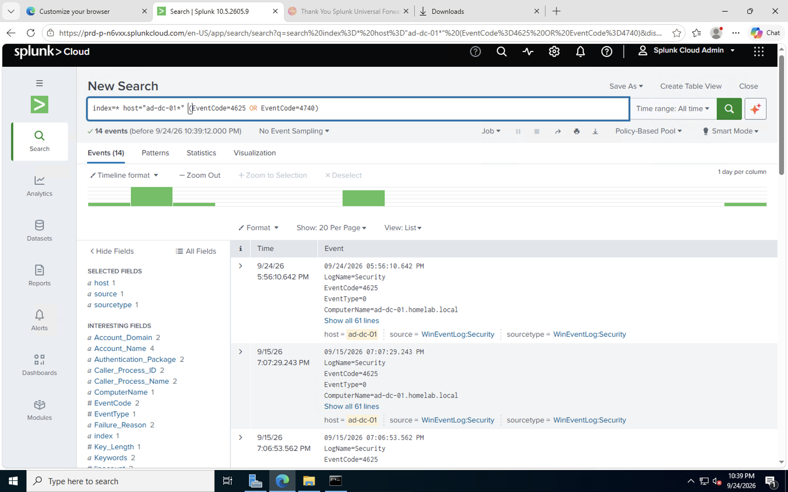


### Skills practiced

- Evaluating SIEM platform reachability from cloud infrastructure (Azure) and choosing a practical path over a blocked one, rather than forcing a workaround with unnecessary cost or complexity.
- Installing and configuring the Splunk Universal Forwarder on Windows, including applying a Splunk Cloud credentials package via the CLI.
- Diagnosing a forwarder connectivity issue by isolating it into two separate questions — is the destination configured correctly, and is the right data source being monitored — rather than treating "no data arriving" as one undifferentiated problem.
- Troubleshooting Windows file-handling quirks (Notepad filename truncation, Command Prompt multi-line redirection syntax) that silently produced invalid configuration files.
- Verifying a SIEM integration end-to-end: connection status, broad data ingestion, and a targeted search for specific, previously-known events

## Next steps

- Explore building a basic Splunk dashboard or saved search/alert around Account Lockout events (EventCode 4740), turning this raw data into an actual monitoring use case.
- Consider forwarding additional event channels beyond Security (e.g., System or Application logs) for broader visibility.
- Deallocate ad-dc-01 between sessions to continue managing Azure costs.


## Entry 24: Building a Detection Use Case in Splunk Cloud: Lockouts, Brute Force, and a Disproven Assumption

### Overview

In Entry 23, I connected my Active Directory domain controller (ad-dc-01, Windows Server 2022 in Azure) to Splunk Cloud using the Universal Forwarder, and confirmed that Windows Security logs were flowing in. Collecting logs is only half of a SIEM's job, though. The goal of this entry was to turn that raw data into a working monitoring use case: saved reports, a dashboard, and a scheduled alert that detects brute-force attempts against domain accounts.

Along the way, I triaged historical failed logons, formed a hypothesis about how Windows protects the built-in Administrator account, tested that hypothesis live, watched it fail, recovered the locked account through an out-of-band management channel, and confirmed that my detections caught every step.

### Step 1: Verifying the Pipeline After a Restart

I deallocate ad-dc-01 between sessions to control Azure costs, so the first check was whether the forwarder would reconnect on its own after the VM restarted. Running `splunk list forward-server` from the forwarder's bin directory showed an active SSL forward to my Splunk Cloud input on port 9997, with nothing listed as inactive. A search over the last 15 minutes returned more than 1,700 Security events, the newest arriving within seconds of the search, which confirmed the pipeline survived the deallocation without any manual intervention.

### Step 2: Account Lockout Report (EventCode 4740)

My first saved report tracks account lockouts:

```spl
host=ad-dc-01* source="WinEventLog:Security" EventCode=4740
| eval Locked_Account=mvindex(Account_Name,1), Locked_SID=mvindex(Security_ID,1)
| table _time, Locked_Account, Locked_SID
| sort -_time
```

A 4740 event contains two accounts. The first, under "Subject," is the account that performed the lockout, which on a domain controller is the DC's own computer account (`ad-dc-01$`) running as SYSTEM. The second, under "Account That Was Locked Out," is the victim. Splunk extracts both into a multivalue field, so `mvindex(..., 1)` pulls out the locked account and its SID specifically.

I originally included the Caller Computer Name field, but it came back empty. Rather than assuming the search was broken, I expanded the raw event and confirmed the field was blank in the original Windows log itself, so I removed it from the report. The failed logons behind the lockout had originated directly against the DC rather than from another workstation, which is a common reason for that field to be empty.

### Step 3: Failed Logons by Source (EventCode 4625)

My second report groups failed logons by target account and source IP:

```spl
host=ad-dc-01* source="WinEventLog:Security" EventCode=4625
| eval Target_Account=mvindex(Account_Name,1)
| stats count AS Failed_Logons, latest(_time) AS Last_Attempt by Target_Account, Source_Network_Address
| convert ctime(Last_Attempt)
| sort -Failed_Logons
```

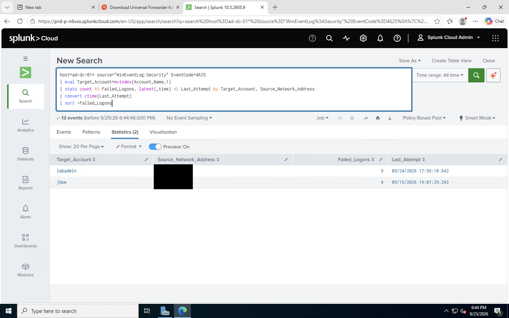

The results showed 13 historical failures: 4 against jdoe (my deliberate lockout test from Entry 22) and 9 against labadmin. Because ad-dc-01 is an Azure VM reachable over RDP, I checked whether any of these came from unknown internet sources. All 13 came from a single IP, which I verified was my own home public IP. I triaged the activity as benign: jdoe's failures were the planned test, and labadmin's were my own mistyped passwords over RDP. (My public IP is redacted in all screenshots.)

### Step 4: Investigating Why labadmin Was Never Locked Out

The triage raised a question: jdoe was locked out after 4 failures, but labadmin had 9 failures and was never locked out. I suspected labadmin had become the domain's built-in Administrator when the VM was promoted to a domain controller, and I knew that account has historically been exempt from lockout so that an attacker can't lock the only admin out of a domain.

My first attempt to confirm the SID through Splunk returned `S-1-0-0` for every failed logon. That is the NULL SID, which Windows writes into 4625 events because the logon fails before the account is resolved to its real SID. This was a useful lesson: not every field in an event contains what its name suggests. Running `whoami /user` directly on the DC gave the real answer:

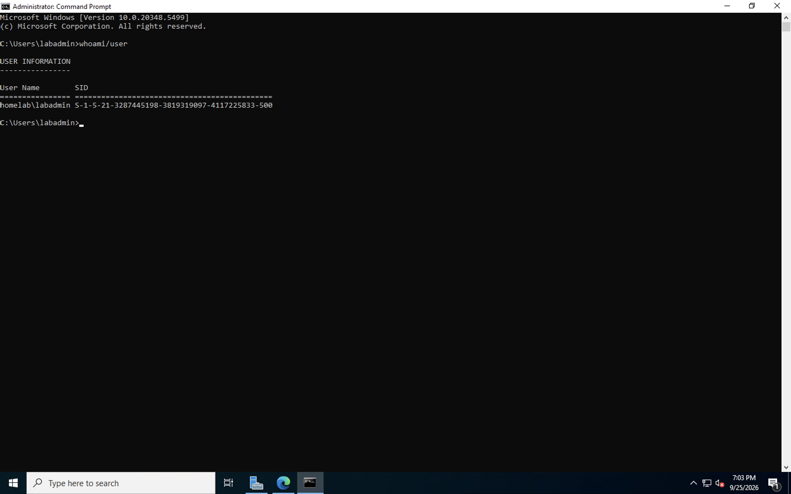

The SID ends in **-500**, confirming labadmin is the domain's built-in Administrator. The part before the final number is the domain identifier, shared with jdoe's SID (which ends in -1601). The final number, the RID, identifies the specific account.

### Step 5: The Brute-Force Alert

If the built-in Administrator can't be locked out, detection has to fill that gap. I built a scheduled alert that fires when any account records 5 or more failed logons in a 15-minute window:

```spl
host=ad-dc-01* source="WinEventLog:Security" EventCode=4625
| eval Target_Account=mvindex(Account_Name,1)
| stats count AS Failed_Logons, values(Source_Network_Address) AS Source_IPs by Target_Account
| where Failed_Logons >= 5
```

The alert runs every 15 minutes (cron `*/15 * * * *`) over the last 15 minutes, triggers when the number of results is greater than zero, and adds a High-severity entry to Triggered Alerts. Because the search window matches the schedule, consecutive runs cover back-to-back windows without overlap, so throttling isn't needed to prevent duplicate alerts.

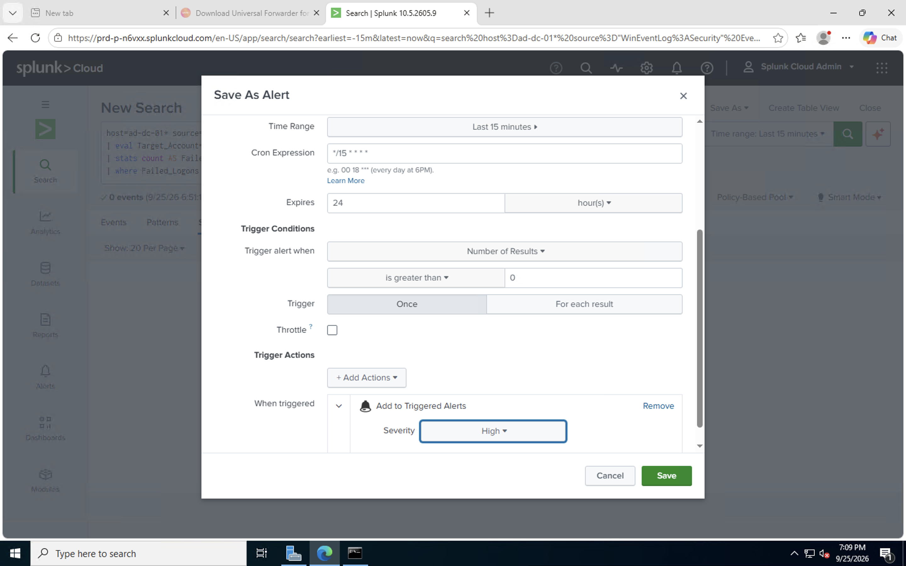

### Step 6: Testing the Alert, and Disproving My Hypothesis

Since I believed labadmin couldn't be locked out, it seemed like the safe account to test with. I signed out of RDP and entered the wrong password several times. On the next connection attempt, I got this:

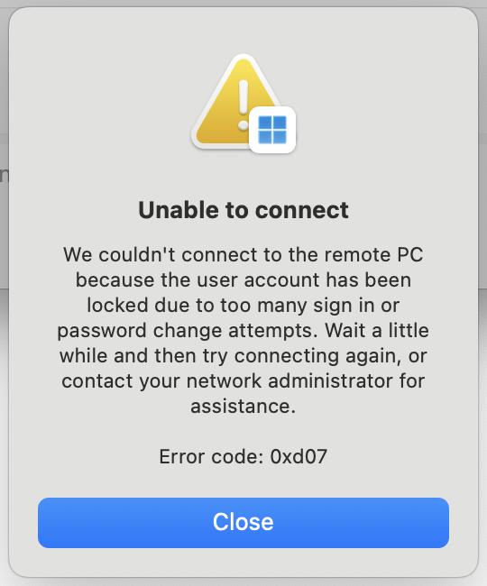

Error 0xd07 means the account is locked. My hypothesis was wrong: in this environment, the built-in Administrator **can** be locked out. Microsoft has changed built-in Administrator lockout behavior in recent Windows versions, so the long-standing assumption that it is exempt doesn't hold everywhere. The more likely reason the earlier 9 failures didn't trigger a lockout is that they were spread out enough for the lockout counter to reset between attempts. I've noted that as a hypothesis for future verification rather than a confirmed conclusion.

Splunk confirmed the lockout, with the labadmin account (-500) appearing directly above jdoe's lockout from Entry 22:

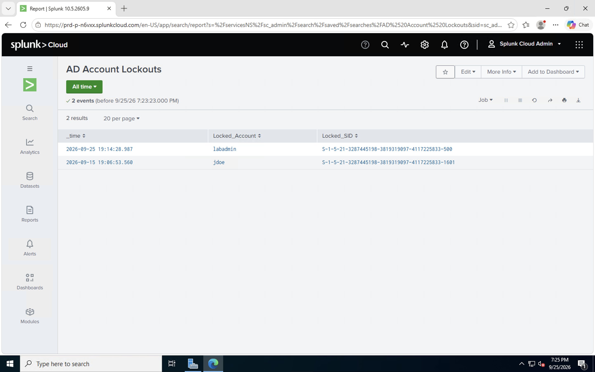

The key lesson is that I treated a widely repeated rule as fact, and a controlled test proved otherwise. Testing assumptions in a lab, rather than in production, is exactly what a lab is for.

### Step 7: Recovering Through an Out-of-Band Channel

With the only domain admin account locked, I couldn't sign in over RDP. Instead of waiting out the lockout duration, I used Azure's Run Command feature (Operations → Run command → RunPowerShellScript), which executes scripts on the VM through the Azure VM agent without needing any login:

```powershell
Unlock-ADAccount -Identity labadmin
Get-ADUser labadmin -Properties LockedOut | Select Name, LockedOut
```

The output confirmed `LockedOut: False`, and I was able to reconnect normally. Recovering a locked-out administrator through an out-of-band management path is a real-world sysadmin skill, and it's why cloud and on-premises environments keep a management channel that doesn't depend on normal authentication.

The unlock itself was recorded in the domain controller's Security log as EventCode 4767 ("A user account was unlocked"). By the time I wrote this up, my Splunk Cloud trial had ended, so I retrieved the event directly from the DC, again through Run Command and without logging in:

```powershell
Get-WinEvent -FilterHashtable @{LogName='Security'; Id=4767} -MaxEvents 5 |
  Format-List TimeCreated, Message
Get-ADUser labadmin -Properties LockedOut | Select Name, LockedOut
```

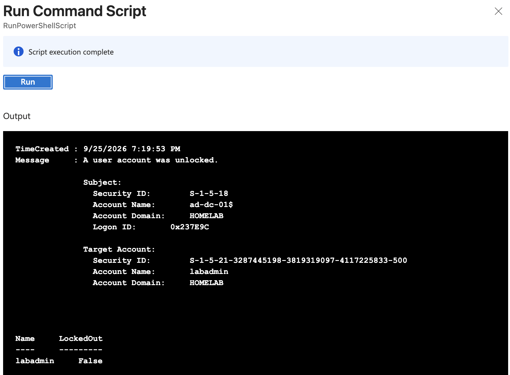

The event shows labadmin (SID ending in -500) unlocked at 19:19:53 UTC, and the account still shows `LockedOut: False`. The Subject is the DC's own computer account (`ad-dc-01$`, SID S-1-5-18, which is SYSTEM) rather than a named user, because Run Command executes scripts as SYSTEM through the Azure VM agent. That is an important detail for an analyst: an unlock performed through an out-of-band management tool doesn't show a person's name in the audit trail, so it has to be correlated with the cloud platform's own activity logs to know who initiated it.

### Step 8: Confirming the Alert Fired

The scheduled alert triggered at 19:19:06 UTC, a few minutes after the lockout at 19:14:28 and 47 seconds before I unlocked the account at 19:19:53. In other words, the detection fired while the account was still locked, before recovery:

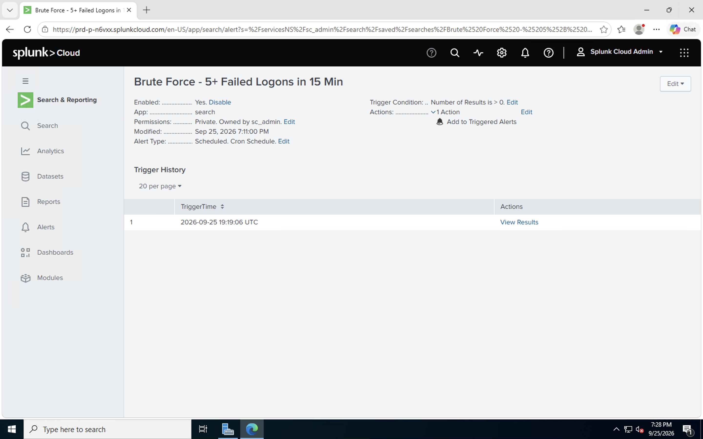

The alert results showed labadmin with exactly 5 failed logons from a single source IP:

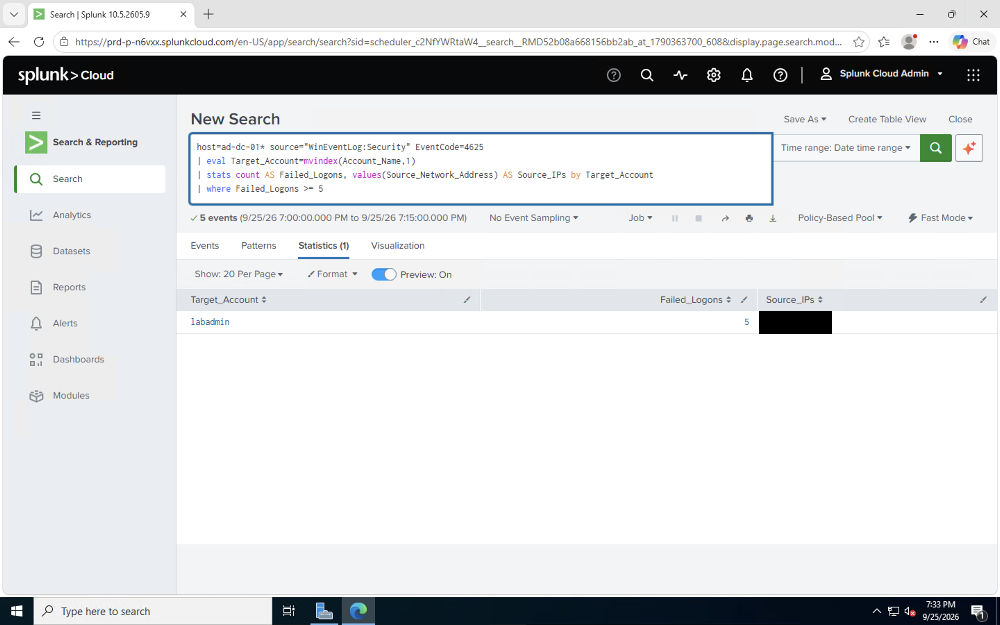

One detail stood out: the search window was exactly **19:00:00 to 19:15:00**, even though the scheduler dispatched the search at 19:19. Splunk calculates the relative time range from the scheduled time rather than the actual run time, so a delayed run doesn't create gaps between windows. The remaining edge case is indexing lag. An event generated seconds before a run might reach Splunk after that run has already searched, which is why production alerts often search a slightly wider window and use throttling to avoid double-counting.

### Step 9: The AD Security Monitoring Dashboard

I combined both reports into a single dashboard:

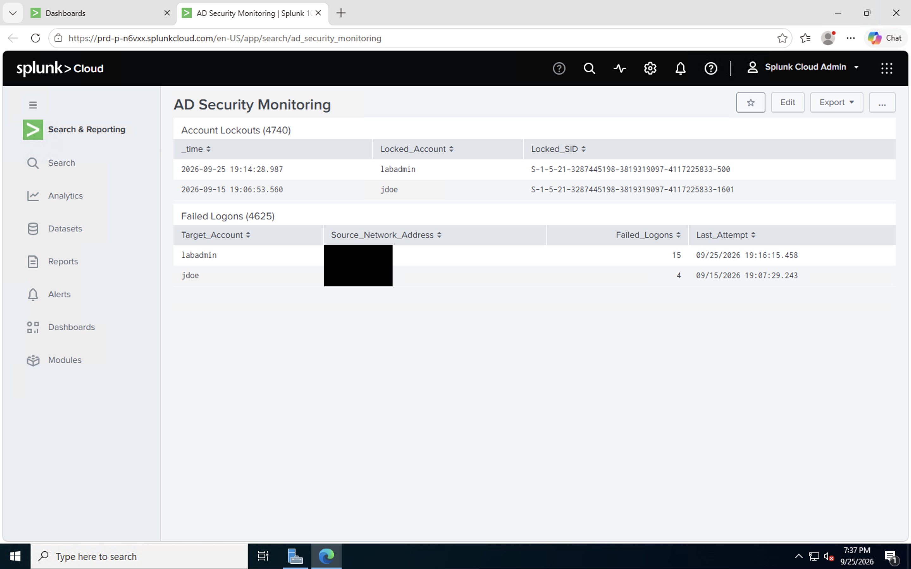

The dashboard shows labadmin with 15 failed logons in total: the 9 historical failures, the 5 from my test, and 1 more at 19:16:15, about two minutes after the lockout. That last one is an attempt made while the account was already locked. Windows still logs those as 4625 events, with a failure reason indicating the account is locked, which lets an analyst distinguish between active password guessing and repeated attempts against an account that's already locked.

### Lessons Learned

The most important lesson from this entry is to verify assumptions instead of trusting them. Three times, a field or rule behaved differently than expected: the Caller Computer Name was genuinely blank, the 4625 SID field held the NULL SID rather than the real account SID, and the built-in Administrator could be locked out despite the common belief that it can't. Each time, checking the raw data or running a controlled test gave the real answer.

I also practiced a complete triage workflow on real data. I identified repeated failures, traced them to a source IP, attributed that IP to a known legitimate source, and closed the activity as benign before building detections for the future.

Finally, the full detection chain now works end to end: an attack on the domain controller is logged by Windows, forwarded to Splunk Cloud, detected by a scheduled search, raised as a High-severity alert, and visible on a dashboard, and the recovery action is captured in the same audit trail.

### Next Steps

For future entries, I plan to forward additional Windows event channels (System and Application) beyond Security, investigate the lockout counter reset window to confirm why the earlier labadmin failures didn't cause a lockout, and consider hardening the built-in Administrator account by creating a separate named admin account for daily use.


## Entry 25: Auditing My Own Domain: Lockout History, a Password Policy That Never Worked, and a Proper Admin Account

### Overview

Entry 24 ended with two loose ends. I still didn't know for certain why my admin account (labadmin) had failed to log on 9 times without ever being locked out, and the test that disproved my first theory revealed a bigger problem: I was doing all my daily work with the domain's built-in Administrator account. This entry closes both loops. Along the way, I found that a password policy I configured back in Entry 17 had never actually applied to anyone, fixed it the correct way, created a separate named admin account, and troubleshot a sign-in failure that turned out to be a classic help desk problem.

Before starting, I also made one change to keep the lab affordable.

### Step 1: Cutting Cloud Costs Before Touching Anything

With my Splunk trial ended, I checked Azure Cost Management to see what the lab was actually costing me.

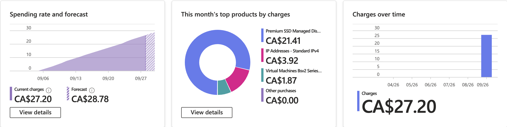

The result surprised me. Of the CA$27.20 spent in September, the virtual machine's compute cost was only CA$1.87, because I deallocate ad-dc-01 between sessions. Almost all of the cost came from resources that bill around the clock whether the VM is running or not: the Premium SSD OS disk (CA$21.41) and the static public IP address (CA$3.92). Deallocating the VM had already done everything it could; the disk was the real lever.

Azure had created the OS disk as Premium SSD, which is designed for production workloads. With the VM deallocated, I changed it to Standard SSD under the disk's Size + performance settings. The disk kept its 127 GiB size and all of its data, including the entire domain.

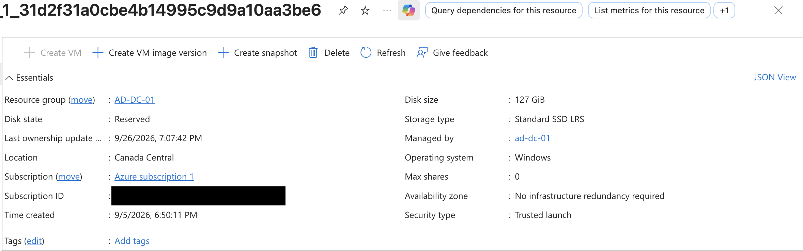

The lesson: stopping a VM isn't the same as stopping its costs. Storage and reserved IPs keep billing, so right-sizing those matters more for an intermittently used lab than compute does.

### Step 2: Reading the Actual Lockout Policy

To explain labadmin's history, I first needed the exact lockout settings rather than my memory of them.

```powershell
Get-ADDefaultDomainPasswordPolicy
```

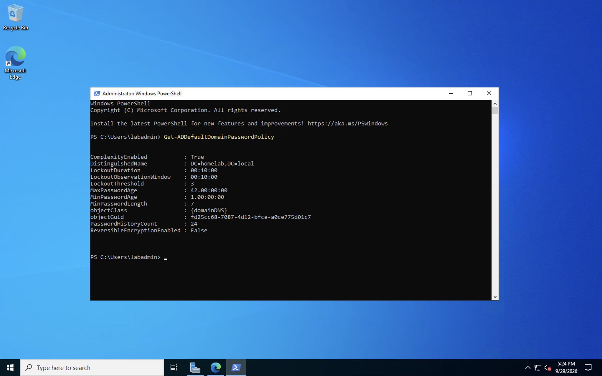

The domain locks accounts after **3** failed attempts within a **10-minute** observation window, for a **10-minute** duration. This also explained the Entry 24 numbers: with a threshold of 3, accounts were actually locked on their third failure, and any further attempts against the already-locked account were still logged as 4625 events, which is why the logged failure counts were higher than 3.

### Step 3: Testing My Theory Against the Logs

My working theory was that labadmin's 9 failures had been spread out enough for the counter to reset between them. Instead of assuming, I pulled every labadmin failure from the domain controller's own Security log, stopping just before the Entry 24 test:

```powershell
Get-WinEvent -FilterHashtable @{LogName='Security'; Id=4625; EndTime=[datetime]'2026-09-25 19:00'} |
  Where-Object { $_.Properties[5].Value -eq 'labadmin' } |
  Sort-Object TimeCreated | Select-Object TimeCreated
```

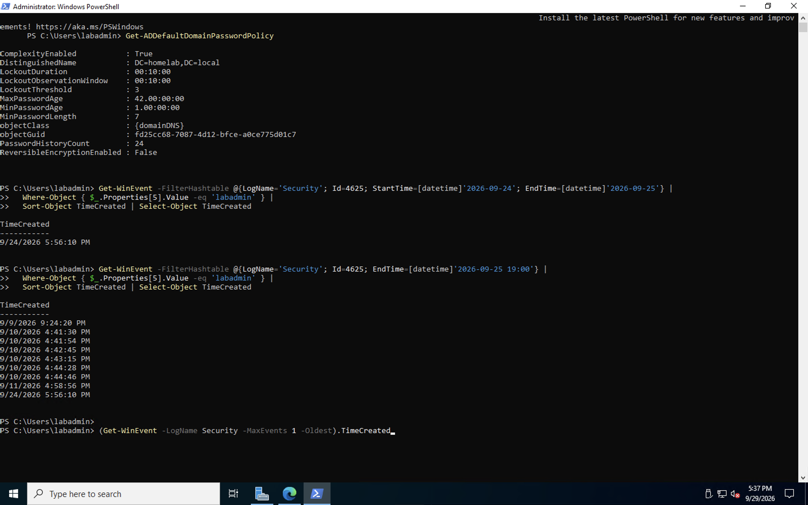

The theory didn't hold. Six of the failures happened on September 10 between 4:41 and 4:44 PM, six failures in about three minutes. Under the current policy, that would have locked the account twice over. I also confirmed the Security log's oldest entry predated the lab entirely, so no events had been overwritten.

That pointed to a different explanation: maybe the lockout policy didn't exist yet on September 10. Domain controllers record policy changes as EventCode 4739, so I checked:

```powershell
Get-WinEvent -FilterHashtable @{LogName='Security'; Id=4739} |
  Sort-Object TimeCreated | Format-List TimeCreated, Message
```

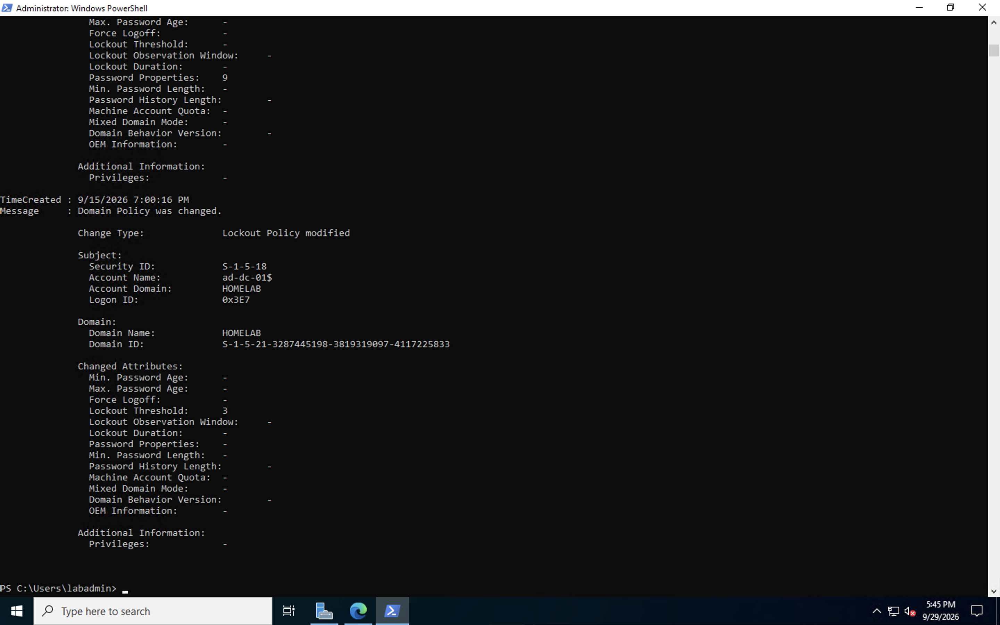

The event shows "Lockout Policy modified" on September 15 at 7:00:16 PM, setting the threshold to 3. That's about six and a half minutes before the jdoe lockout test from Entry 22, which matches my Entry 22 workflow exactly. Before that moment, the domain used the Windows default threshold of 0, meaning accounts never lock. Every one of labadmin's earlier failures happened before the policy existed, and the single failure on September 24 was below the threshold.

It took two disproven theories to reach the real answer. The change is attributed to `ad-dc-01$` (SYSTEM) rather than to me, because I edited a Group Policy Object and it was the domain controller's Group Policy engine that applied the setting to the domain.

### Step 4: Discovering a Password Policy That Never Applied

The same policy output contained a second finding: **MinPasswordLength: 7**. In Entry 17, I created a Sales-Password-Policy GPO requiring 10 characters and linked it to the Sales OU, and Group Policy Modeling showed it as applied. It never affected domain users.

In Active Directory, password and lockout policies for domain accounts come only from a GPO linked at the domain level. Password settings in an OU-linked GPO only affect local accounts on computers in that OU. This is a very common misconception, and I had documented it as working. The correct tool for giving one group a different password policy is a **Fine-Grained Password Policy** (a Password Settings Object, or PSO), which applies directly to users or groups.

### Step 5: Creating a Fine-Grained Password Policy

One detail matters when creating a PSO: it **replaces** the entire domain password and lockout policy for the users it applies to, rather than adding to it. If I had set only the minimum length, Sales users would have received default values for everything else, including a lockout threshold of 0, silently removing their lockout protection. So I set every value explicitly, matching the domain policy except for the 10-character minimum:

```powershell
New-ADFineGrainedPasswordPolicy -Name "Sales-PSO" -Precedence 10 -MinPasswordLength 10 -ComplexityEnabled $true -PasswordHistoryCount 24 -MaxPasswordAge "42.00:00:00" -MinPasswordAge "1.00:00:00" -LockoutThreshold 3 -LockoutObservationWindow "00:10:00" -LockoutDuration "00:10:00" -ReversibleEncryptionEnabled $false
```

The policy was created, but attaching it to the group failed because no object named "Sales-Team" existed:

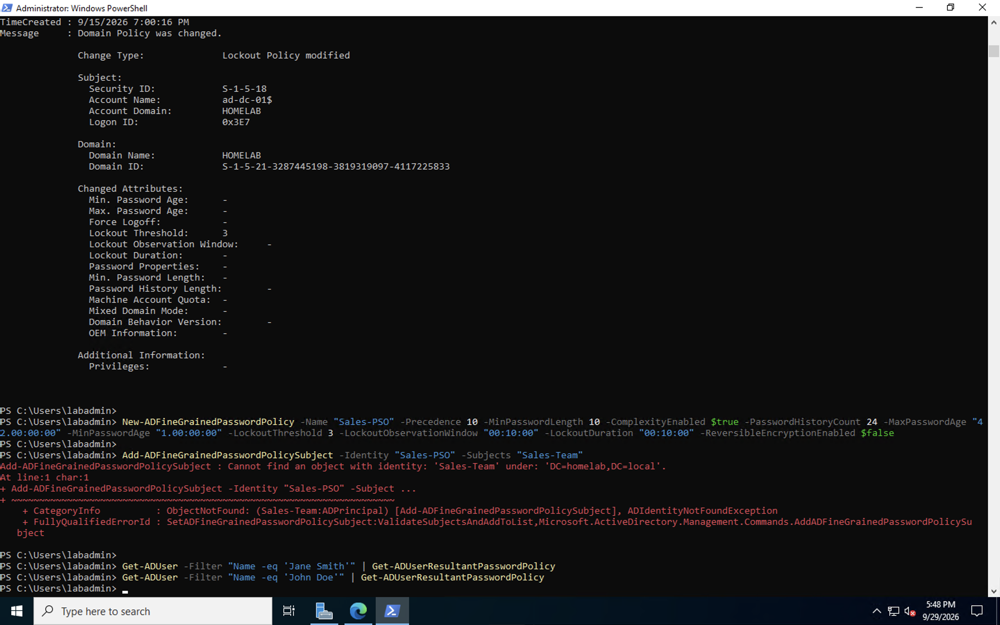

Rather than guess at the name, I looked it up. The group is actually named "Sales Team," with a space. I also confirmed both test users exist before relying on them, since a filter that matches nothing returns nothing silently:

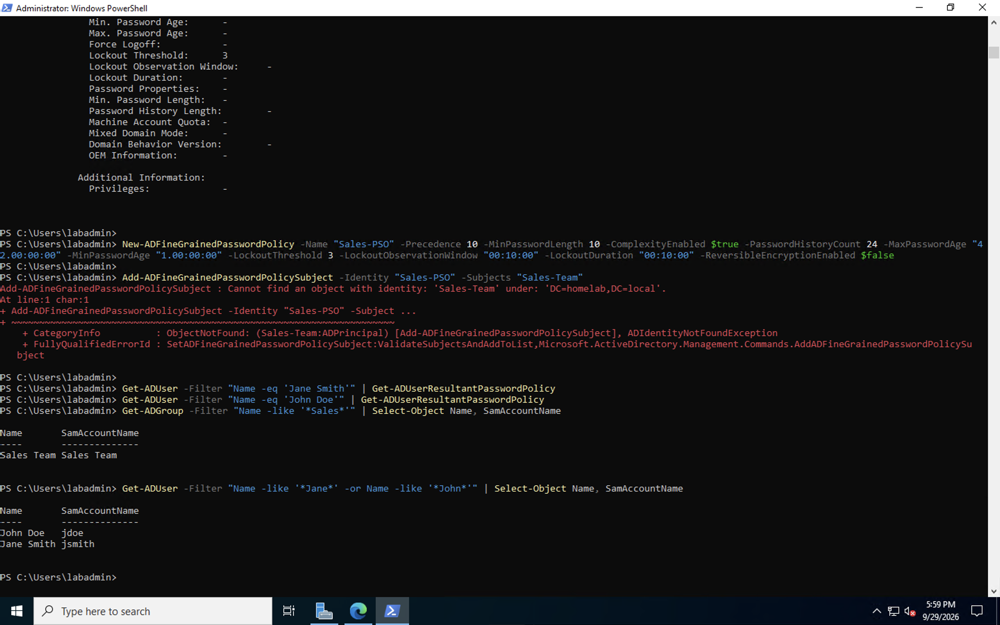

```powershell
Add-ADFineGrainedPasswordPolicySubject -Identity "Sales-PSO" -Subjects "Sales Team"
Get-ADUserResultantPasswordPolicy -Identity jsmith
Get-ADUserResultantPasswordPolicy -Identity jdoe
```

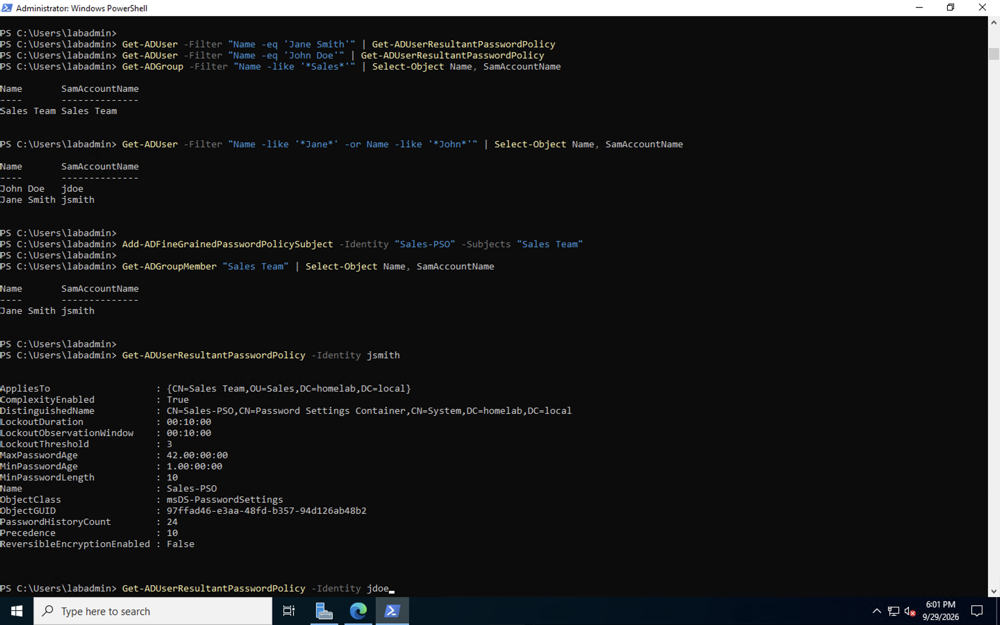

Jane Smith (Sales) now receives Sales-PSO with a 10-character minimum and the lockout values carried over correctly, applied through her membership in Sales Team. John Doe (IT) returns nothing, meaning he still falls back to the domain policy.

### Step 6: Proving the Policy Is Enforced

Showing that a policy is applied isn't the same as showing it's enforced, so I tested it with real password resets:

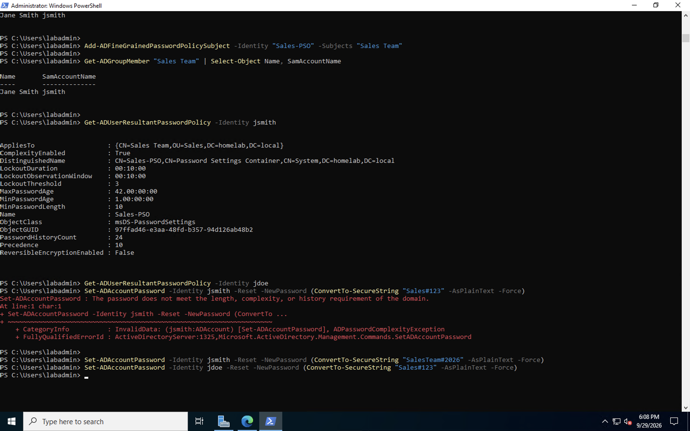

A 9-character password that meets complexity rules was **rejected** for Jane Smith, a 14-character password was accepted for her, and the same 9-character password was **accepted** for John Doe. The Sales group now genuinely requires 10 characters, and no one else is affected.

With the correct mechanism in place, I unlinked the Entry 17 GPO from the Sales OU. I unlinked rather than deleted it, so the history stays intact without leaving a misleading configuration behind.

```powershell
Remove-GPLink -Name "Sales-Password-Policy" -Target "OU=Sales,DC=homelab,DC=local"
```

### Step 7: Creating a Named Admin Account

Entry 24 showed that relying on the built-in Administrator for daily work is risky. Standard practice is to use a personal admin account for everyday administration and keep the built-in account as a **break-glass** account for emergencies. I created an Admin Accounts OU and a new account in it, prompting for the password with `Read-Host -AsSecureString` so it never appeared in the command or its history, then added the account to Domain Admins:

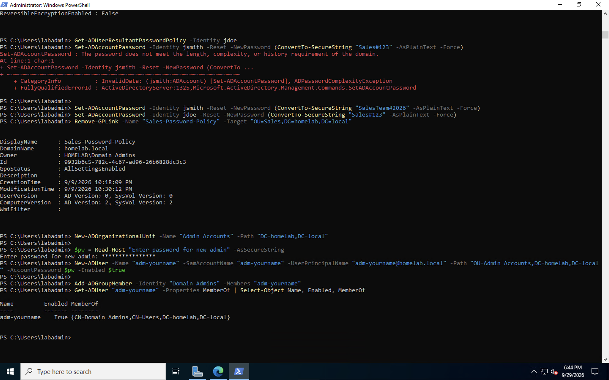

I initially created the account with a placeholder name, so I renamed it. Renaming an account is a real help desk task (for example, after an employee's name change), and it involves three separate names: the logon name (SamAccountName), the sign-in name (UserPrincipalName), and the directory object's own name. The account keeps its password, SID, and group memberships.

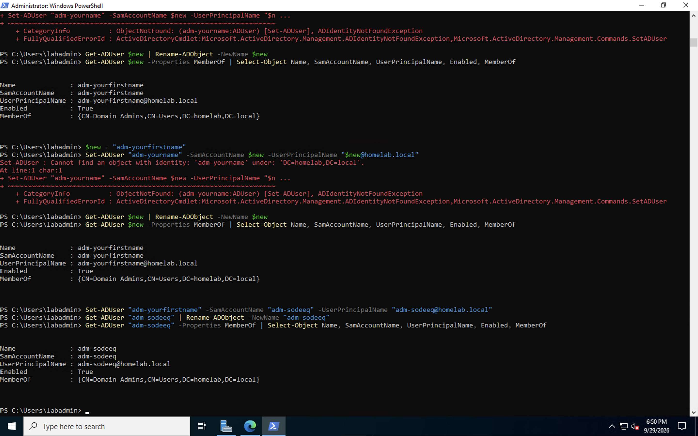

### Step 8: Troubleshooting a Sign-In Failure

My first RDP sign-in as `HOMELAB\adm-sodeeq` failed:

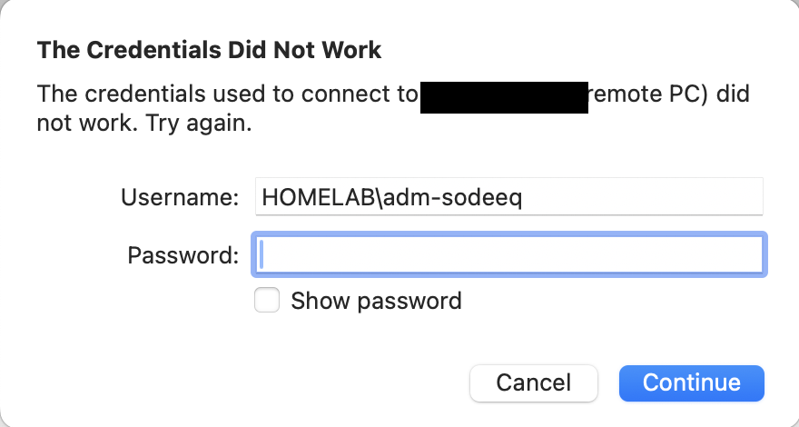

With a lockout threshold of 3, guessing wasn't an option, so I signed in with labadmin (the break-glass account proved its value on the first day) and checked the evidence. The failed attempt had produced a 4625 event:

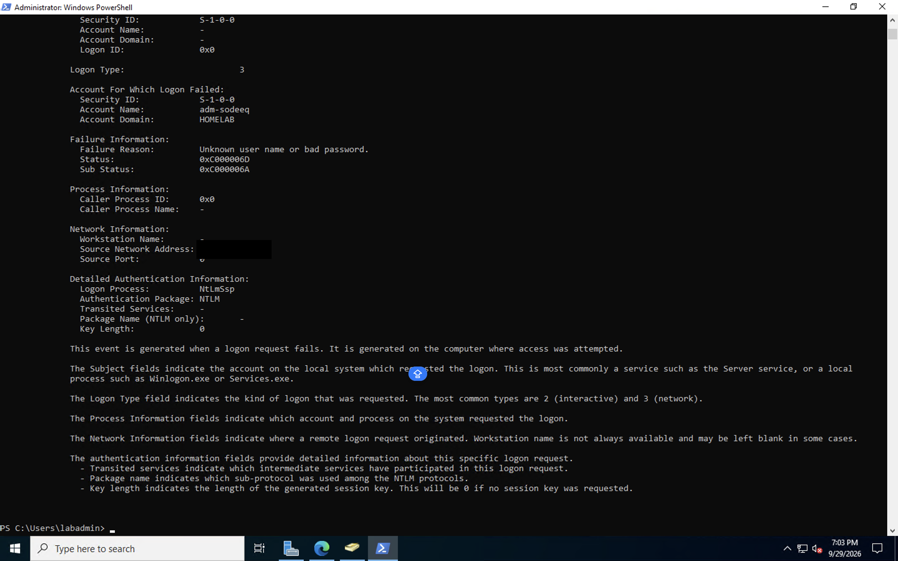

Sub Status **0xC000006A** means the account name was valid but the password was wrong. Logon Type 3 over NTLM is how an RDP sign-in first appears when Network Level Authentication is enabled: the client authenticates over the network before the desktop session starts. I also noticed the source IP had changed from the one I attributed to myself in Entry 24, because my internet provider had assigned a new address, a reminder that IP attribution has to be rechecked, not assumed.

After resetting the password, sign-in still failed. I checked the account's state before trying again:


The account wasn't locked and the password wasn't expired, which ruled out the "User must change password at next logon" option that Active Directory Users and Computers enables by default. BadLogonCount was 2, so the domain controller was receiving and rejecting the password, and I had one attempt left.

To isolate the problem, I tested the password from inside the VM with `runas /user:HOMELAB\adm-sodeeq cmd`. A new command prompt opened, proving the password on the account was correct and the problem was on my Mac's side. Using the Windows App's "Show password" option, I found it: my Mac and the VM were using different keyboard layouts, one QWERTZ and one QWERTY, so the Y and Z keys were swapped. Every Y or Z in the password reached the server as the other letter.

"My password works on one computer but not another" is one of the most common help desk tickets, and a keyboard layout mismatch is one of its classic causes. I solved it by checking lockout state first, isolating the variable with a test inside the VM, and then comparing exactly what was typed.

### Step 9: Confirming Admin Rights and Seeing UAC in Action

Once signed in as adm-sodeeq, with its own password separate from labadmin's, I verified the account's group membership in a normal PowerShell window:

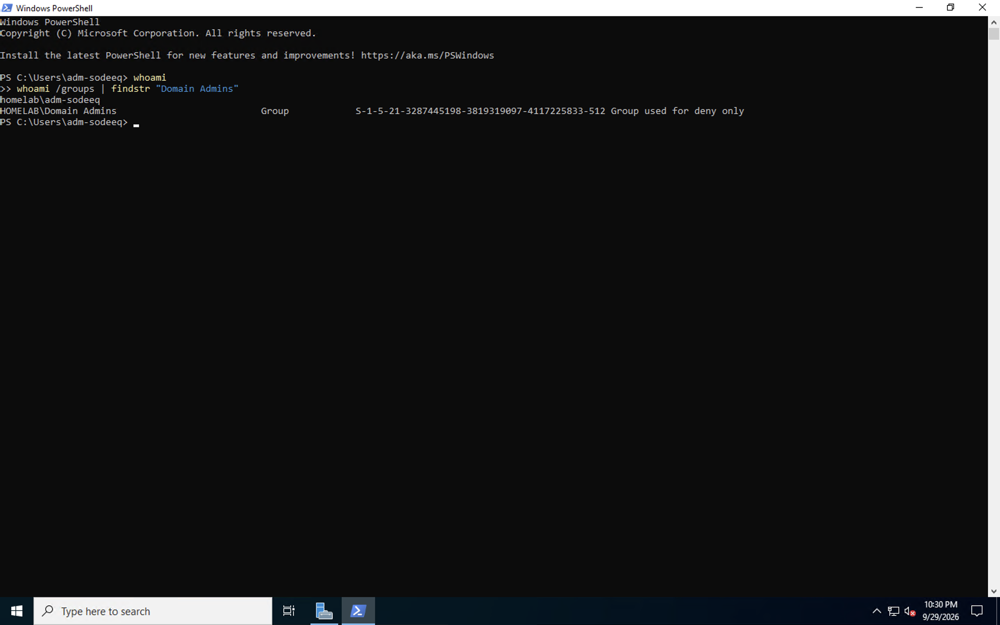

Domain Admins showed as "Group used for deny only." That's User Account Control working as designed: administrators receive a filtered token for everyday programs, with admin groups usable only to deny access, never to grant it. Running PowerShell as administrator triggered a UAC consent prompt:

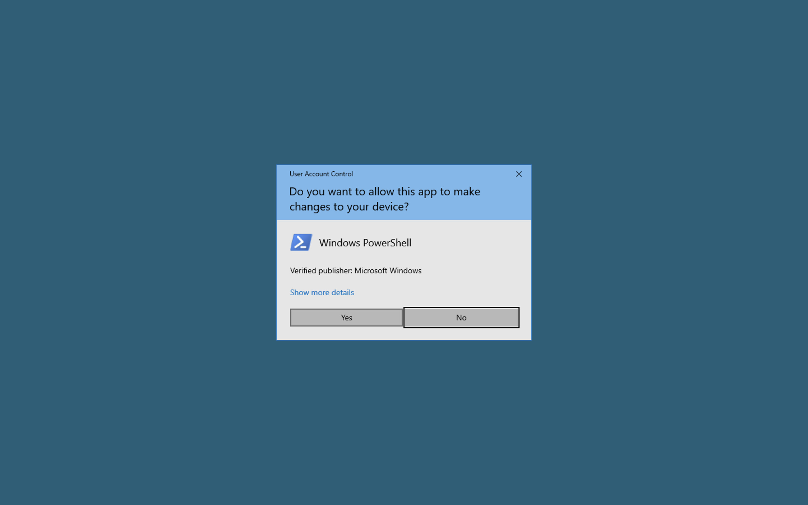

It asked only for consent, not a password, because the account is already an administrator. The "Verified publisher: Microsoft Windows" line is what to check before approving any elevation request. In the elevated window, the same group became fully active:

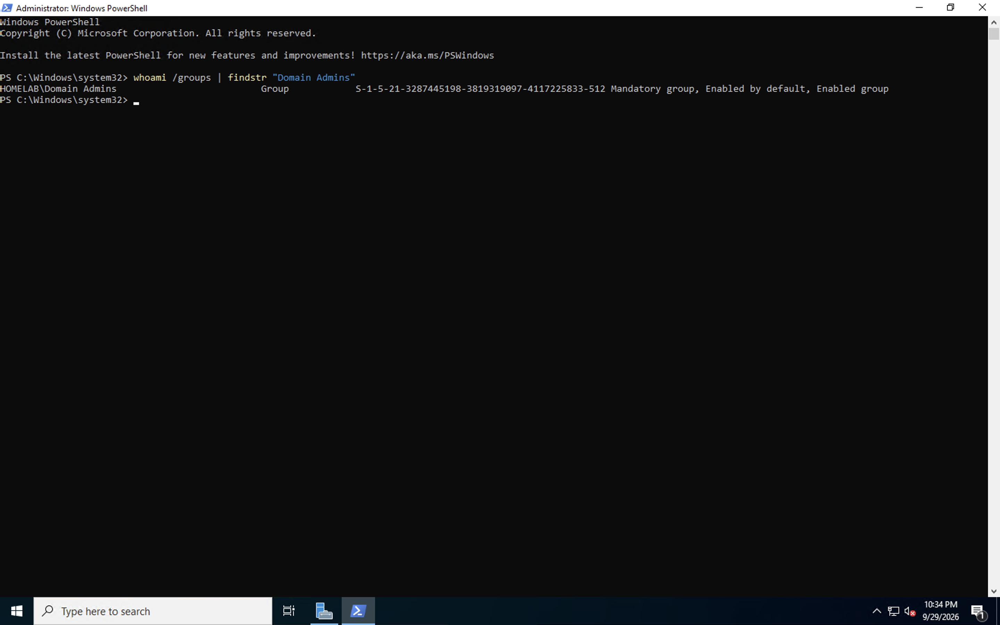

The group now reads "Mandatory group, Enabled by default, Enabled group," and its SID ends in -512, the well-known RID for Domain Admins in every domain. Same account, same group, but admin rights only when explicitly requested. That's least privilege applied even to administrators.

### Lessons Learned

The biggest lesson from this entry is that my own documentation needed auditing too. A password policy I had recorded as working in Entry 17 never applied to a single user, and Group Policy Modeling didn't reveal that because the GPO technically applied; its password settings just don't affect domain accounts from an OU. Verifying effective results, with `Get-ADUserResultantPasswordPolicy` and actual password tests, is what caught it.

I also saw again how often the first explanation is wrong. The labadmin mystery went through two plausible theories before event 4739 gave the answer, and the sign-in failure looked like a typo until testing proved the password was correct and pointed to the keyboard layout.

Finally, the break-glass account justified itself immediately. I needed labadmin to recover access on the very first day of using the new admin account, which is exactly the scenario it exists for.

### Next Steps

In Entry 26, I plan to practice the full help desk user lifecycle with PowerShell: bulk-creating users from a CSV file, resetting passwords and forcing a change at next logon, unlocking accounts, and offboarding a departing employee by disabling the account, removing group memberships, and moving it to a Disabled Users OU.


## Entry 26: The Help Desk User Lifecycle in PowerShell: Onboarding, Resets, Unlocks and Offboarding

### Overview

Most help desk work in a Windows environment revolves around user accounts: new starters need accounts on day one, people forget passwords, accounts get locked, and departing employees need their access removed cleanly. In this entry, I worked through that entire lifecycle in my Active Directory lab using PowerShell, signed in with my named admin account (adm-sodeeq) from Entry 25.

The lab work went smoothly in the end, but not on the first try. My first onboarding script reported success while every account failed, and moving the script into the server exposed a text-handling trap. Both problems taught me more than a clean run would have.

### Step 1: Looking Up the Structure First

Following the lesson from Entry 25 ("look it up, don't guess"), I listed the domain's OUs before creating anything, and created a Disabled Users OU for offboarding.

```powershell
Get-ADOrganizationalUnit -Filter * | Select-Object Name, DistinguishedName | Sort-Object Name
New-ADOrganizationalUnit -Name "Disabled Users" -Path "DC=homelab,DC=local"
```

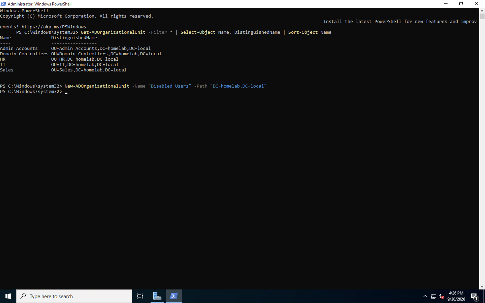

The domain has HR, IT and Sales OUs for employees, plus Admin Accounts for my admin account.

### Step 2: Preparing the New-Hire List

In a real company, HR sends the help desk a list of new starters. I recreated that with a CSV file, making sure the Department column matched the OU names exactly so a script could place each person automatically. I also checked the department groups and found a consistent naming pattern: IT Team, Sales Team and HR Team.

```csv
FirstName,LastName,Department,Title
Amara,Okafor,Sales,Account Executive
Marc,Gagnon,Sales,Sales Representative
Liam,Roberts,IT,Help Desk Technician
Nadia,Patel,HR,HR Coordinator
```

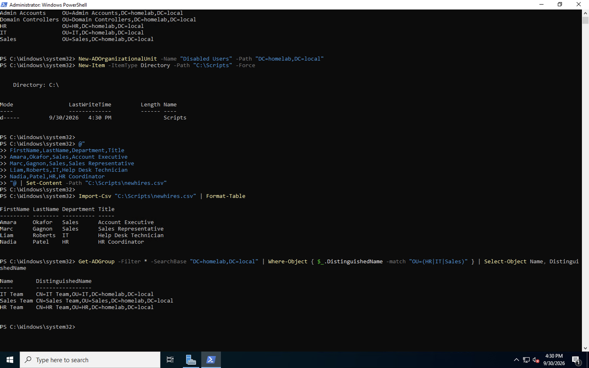

That pattern meant each person's group could be derived from their department ("Department + Team") without a lookup table.

### Step 3: The Script That Lied

My first onboarding script looped through the CSV and created each account. It failed, but that wasn't the real problem:

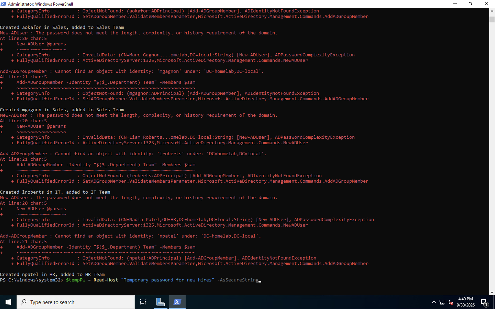

Every `New-ADUser` call failed on password complexity, yet the script still printed "Created aokafor in Sales, added to Sales Team" for every user, because `Write-Host` ran regardless of what happened before it. In real help desk work, a script that reports success when it failed is dangerous: someone would tell HR the accounts were ready.

The password failure itself had a subtle cause. The script began with a `Read-Host` prompt for the temporary password, and when I pasted the whole script at once, PowerShell fed the rest of the pasted text into that hidden prompt. The "password" it stored was a fragment of my own code.

I fixed the reporting problem by wrapping each account's steps in `try`/`catch` with `-ErrorAction Stop`. If any step fails, the script jumps to `catch`, prints the real error in red, and never prints the success message. Before re-running, I confirmed the failed attempt hadn't left any half-created accounts behind.

### Step 4: Saving the Script as a File, and a Backslash Trap

Long multi-line pastes weren't working reliably over my RDP session, so I moved the script into a .ps1 file instead, which is better practice anyway because it's reusable. I pasted it into Azure Run Command in my browser, which wrote it to the server without going through the RDP clipboard.

Printing the saved file back showed a problem:

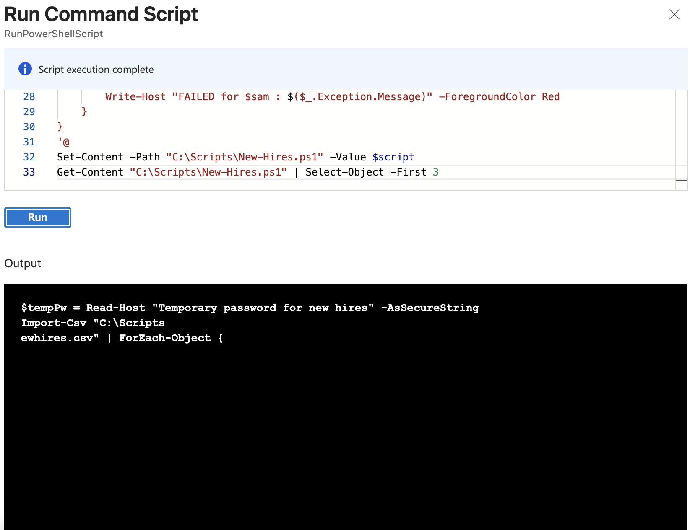

The path `C:\Scripts\newhires.csv` had been split in two. On its way through Run Command, the `\n` in `\newhires` was treated as a newline character, so the saved script would have failed to find its CSV. PowerShell accepts forward slashes in Windows paths, so I switched to `C:/Scripts/newhires.csv` and saved it again:

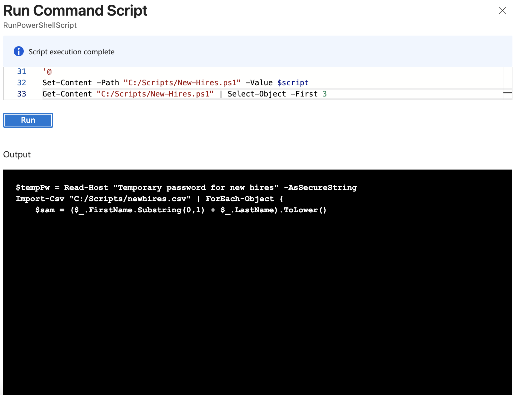

Two habits came out of this: text passed through one tool can be reinterpreted by another, and printing a saved file back is a cheap check that catches it.

### Step 5: Bulk Onboarding

With the script saved as `C:\Scripts\New-Hires.ps1` (included in this repo), onboarding became a single command:

```powershell
& "C:\Scripts\New-Hires.ps1"
```

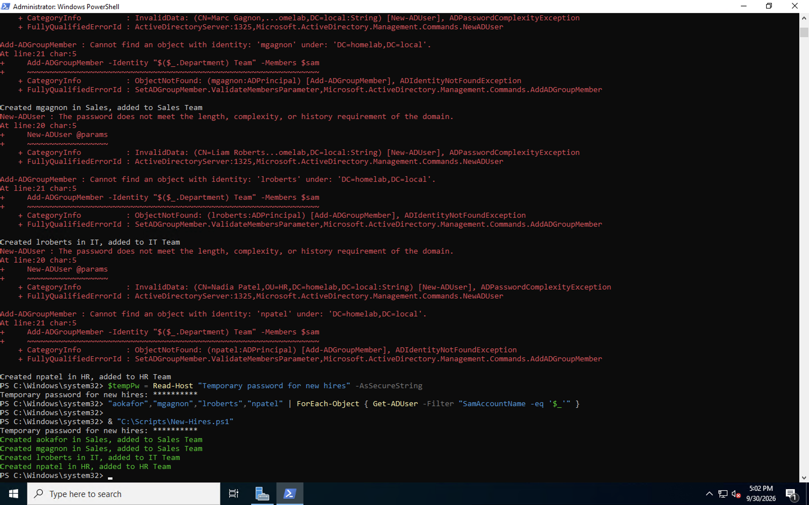

The script builds each username as first initial + last name, skips anyone who already exists, places each person in their department's OU, sets their title and department, adds them to their team group, and forces a password change at first sign-in. It uses splatting (a `@params` hashtable) to pass all the settings to `New-ADUser` cleanly. The same screenshot shows the difference error handling makes: the old version's misleading white messages between red errors above, and the fixed version's clean green results below.

### Step 6: Verifying Onboarding

I didn't rely on the script's own report. I checked each account directly:

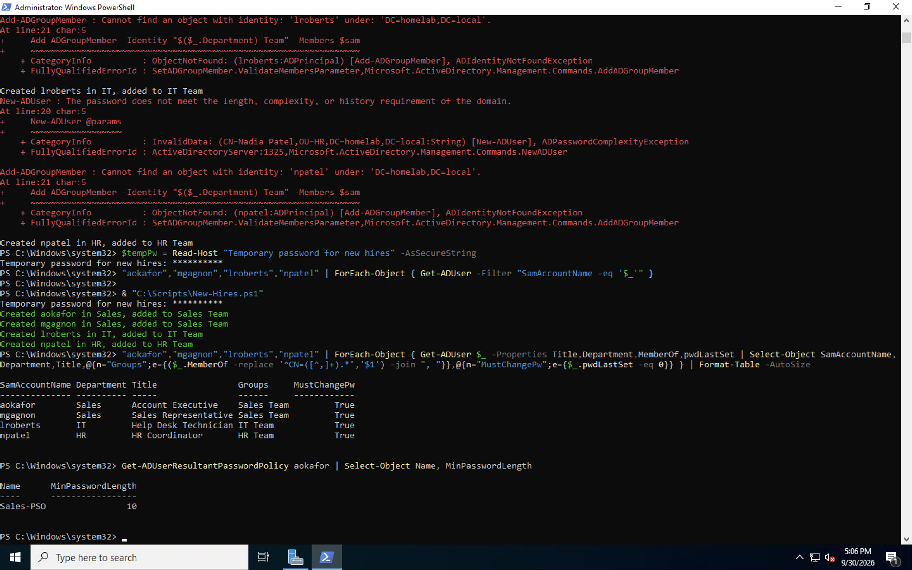

Every user is in the right department with the right title and team group, and every one shows `MustChangePw = True` (a `pwdLastSet` value of 0). The two Sales hires also resolved to Sales-PSO with a 10-character minimum, purely through their Sales Team membership. No one configured their password policy individually; the group did it. That's why group-based policies scale.

### Step 7: Resetting a Forgotten Password

The most common help desk ticket: "Liam forgot his password." I reset it and forced a change at next logon, so the technician never knows the user's real password.

```powershell
$newPw = Read-Host "New temporary password for lroberts" -AsSecureString
Set-ADAccountPassword lroberts -Reset -NewPassword $newPw; Set-ADUser lroberts -ChangePasswordAtLogon $true
```

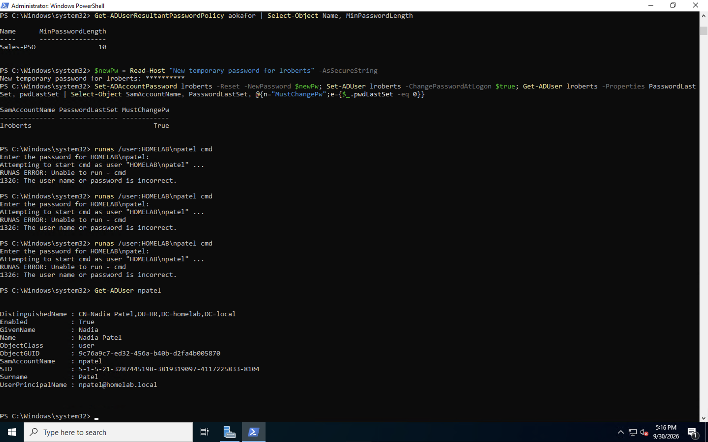

The PasswordLastSet column is blank, which is expected: with "must change at next logon" set, the last-set value is stored as 0, which effectively means "never." A real date appears once Liam chooses his own password.

### Step 8: Investigating and Unlocking a Locked Account

To simulate the second most common ticket, I entered a wrong password for Nadia Patel three times with `runas`, the domain's lockout threshold. Each attempt failed with error 1326, the same bad-password failure I decoded in Entry 25.

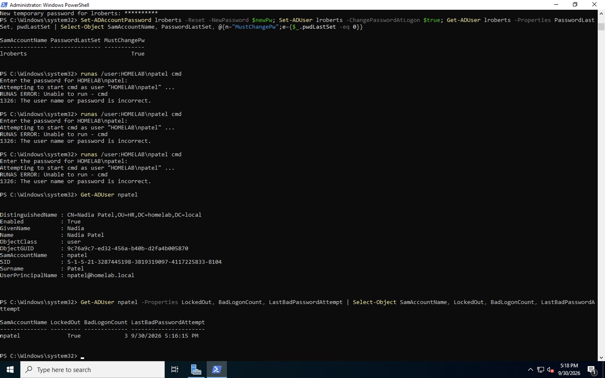

Before unlocking, a help desk technician should check two things. The first is the caller's identity, for example with a callback to a known number, because "I'm locked out, please unlock me" is a common social engineering opener. The second is where the failures came from. The 4740 lockout event records that:

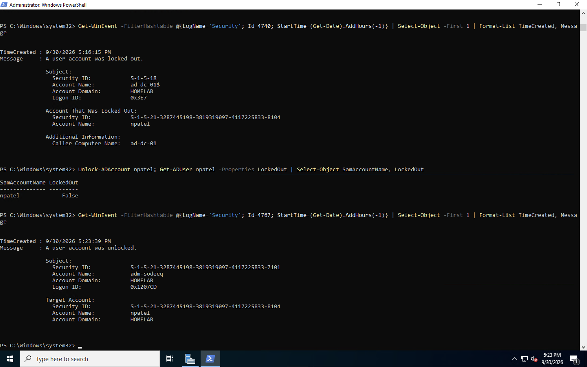

The Caller Computer Name was ad-dc-01, a known machine, so it was safe to unlock. This field was blank in Entry 24; it was populated here because `runas` signs in locally on the domain controller.

The 4767 unlock event is the key comparison with Entry 24. When I unlocked labadmin through Azure Run Command then, the Subject was the DC's own computer account, SYSTEM. This time, the Subject is adm-sodeeq. With a named admin account, the audit trail records exactly who unlocked whom, which is the practical payoff of the account I created in Entry 25.

### Step 9: Offboarding a Departing Employee

The last stage of the lifecycle: Marc Gagnon is leaving. The rule is to disable, not delete. Deleting an account destroys its SID and history, which are needed if files must be reassigned, if there's an investigation, or if the person is rehired.

```powershell
Get-ADPrincipalGroupMembership mgagnon | Select-Object Name
Disable-ADAccount mgagnon; Set-ADUser mgagnon -Description "Offboarded 2026-09-30 by adm-sodeeq - former Sales Representative"
Get-ADPrincipalGroupMembership mgagnon | Where-Object { $_.Name -ne "Domain Users" } | ForEach-Object { Remove-ADGroupMember -Identity $_ -Members mgagnon -Confirm:$false }
Get-ADUser mgagnon | Move-ADObject -TargetPath "OU=Disabled Users,DC=homelab,DC=local"
```

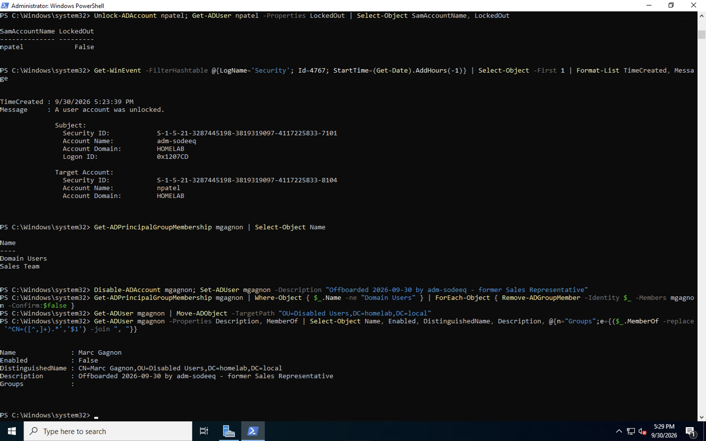

I recorded his groups (Domain Users and Sales Team) before removing anything, for the audit trail. After offboarding, the account is disabled, sits in the Disabled Users OU, carries a description of when, by whom and why, and has no group memberships apart from Domain Users, the primary group Windows requires every account to keep. Leaving Sales Team also removed Sales-PSO from him, so group-based access and policies cleaned themselves up.

### Lessons Learned

The biggest lesson was that a script's own success message isn't evidence. My first version told me four accounts existed when none did. Error handling fixed the script, but the habit that matters is verifying the result independently, which is how every stage of this entry ended.

I also saw how much of help desk work is process around the command itself. The reset and unlock each take one line of PowerShell; the important parts are forcing a password change, verifying the caller, checking where the failures came from, and making sure the audit trail shows who did what.

Finally, moving between tools had its own traps. A pasted block swallowed by a hidden prompt, and a backslash turned into a line break, were both invisible until I printed back what actually arrived.

### Next Steps

I'd like to extend the onboarding script to generate a unique random temporary password per user and write the results to a CSV for handoff, rather than using one shared temporary password, and to turn the offboarding steps into a second reusable script.


## Entry 27: Turning Help Desk Tasks into Reusable Scripts

### Overview

Entry 26 covered the full user lifecycle by hand. This entry turns both ends of it into proper tools: an upgraded onboarding script that gives every new hire their own random temporary password, and an offboarding script that takes a username and ticket number and handles the whole departure in one command. Both scripts are in the [scripts](scripts/) folder of this repo. I also cleaned up a leftover from the SIEM work.

### Step 1: Housekeeping, Disabling the Splunk Forwarder

My Splunk Cloud trial ended after Entry 24, but the Universal Forwarder on ad-dc-01 was still running and trying to send logs to an instance that no longer exists.

```powershell
Stop-Service SplunkForwarder; Set-Service SplunkForwarder -StartupType Disabled
```


I disabled the service rather than uninstalling it, so it can be switched back on with one command if I start a new SIEM trial later. Leaving software running that points at a dead endpoint is the kind of small loose end that adds noise and attack surface over time.

### Step 2: Onboarding v2, Unique Passwords and a Handoff File

The Entry 26 script gave every new hire the same temporary password. That's convenient but risky: if one person's first-day details leak, every new account from that batch is exposed. Version 2 fixes that and adds a few improvements.

Each hire now gets their own random 12-character temporary password with four uppercase letters, four lowercase letters and four digits, shuffled. The generator deliberately leaves out characters that are easy to misread (0/O and 1/l/I) and the letters Y and Z, after the keyboard layout problem in Entry 25. Every password meets the Sales team's 10-character Fine-Grained Password Policy, and every account still has to change its password at first sign-in.

The script also takes a `-CsvPath` parameter, so it can run against any batch of hires without being edited, and it writes the usernames and temporary passwords to a timestamped handoff file for whoever delivers the first-day details.

I saved the script to the server through Azure Run Command, as in Entry 26, using forward slashes in every path to avoid the `\n` problem I hit last time. Printing the first lines back confirmed it saved correctly:

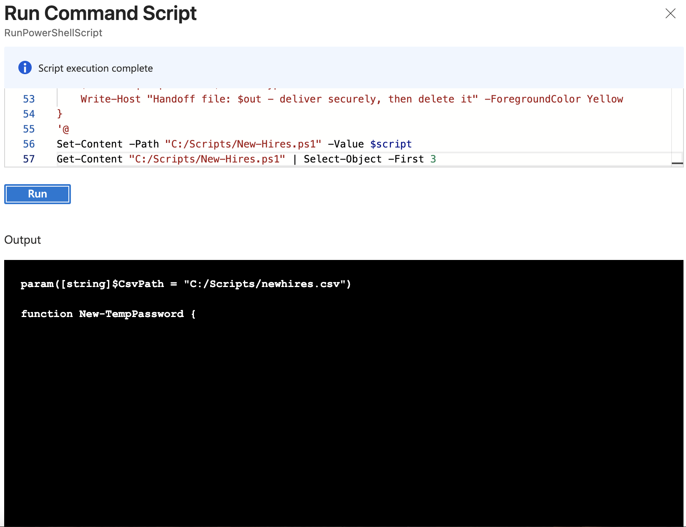

### Step 3: Running a New Batch

The second batch included two new hires and one person who already had an account, to test that existing accounts are skipped safely:

```powershell
& "C:\Scripts\New-Hires.ps1" -CsvPath "C:\Scripts\newhires-batch2.csv"
```

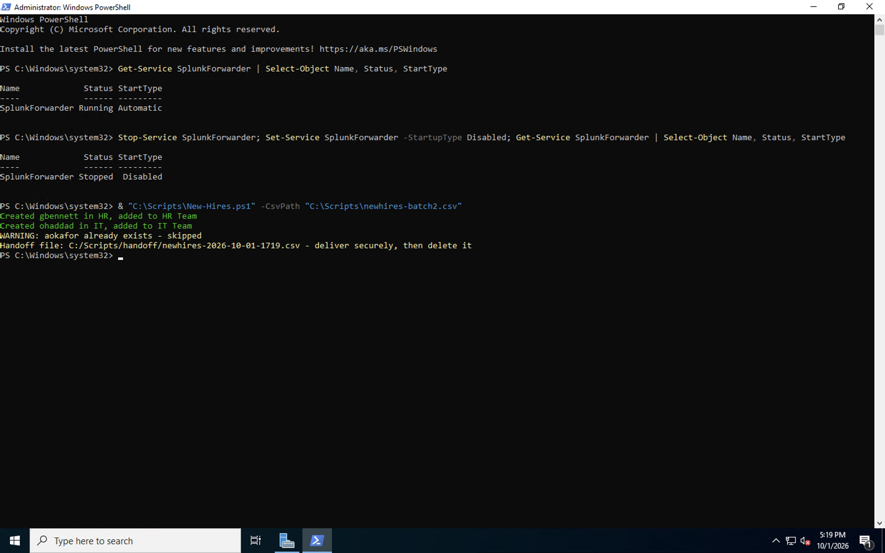

Grace Bennett (HR) and Omar Haddad (IT) were created and added to their team groups. Amara Okafor was skipped with a warning instead of causing an error or a duplicate account. The handoff file's name includes the date and time, so batches never overwrite each other.

### Step 4: Handling the Handoff File

The handoff file is a deliberate trade-off. It holds plaintext temporary passwords, which is exactly what makes it useful, so it has to be treated carefully: delivered through a secure channel, then deleted. The forced password change at first sign-in also limits how long those passwords are any use.

I checked that the two passwords were different, then deleted the file and confirmed it was gone:

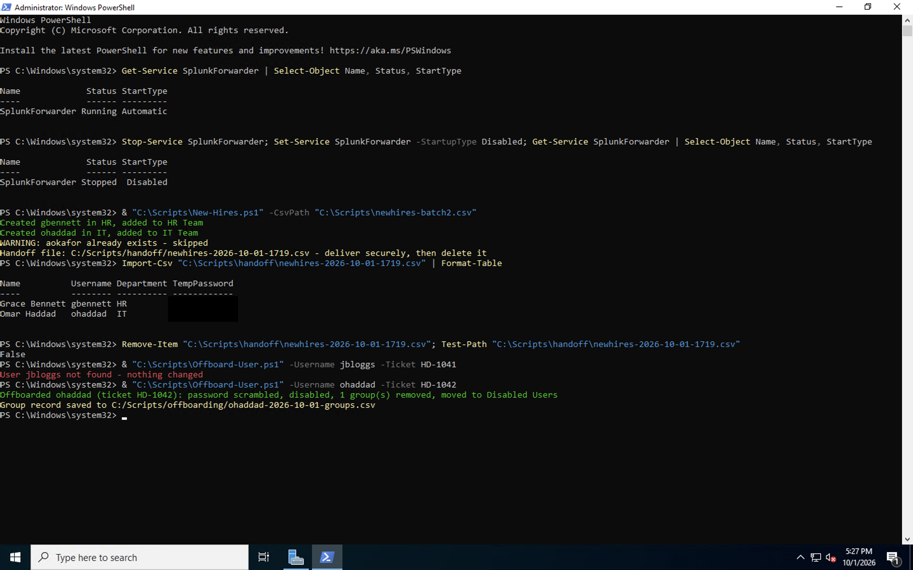

`Test-Path` returned False, so the file no longer exists. The temporary passwords are blacked out in the screenshot. They were short-lived lab passwords, but publishing credentials is a habit worth never starting.

One honest limitation: the passwords come from PowerShell's `Get-Random`, which is fine for short-lived temporary passwords in a lab, but production tools often use a cryptographic random number generator instead.

### Step 5: An Offboarding Script

The offboarding steps from Entry 26 became `Offboard-User.ps1`, which requires a username and a ticket number:

```powershell
& "C:\Scripts\Offboard-User.ps1" -Username ohaddad -Ticket HD-1042
```

In order, it saves the user's group memberships to `C:\Scripts\offboarding\<user>-<date>-groups.csv` before touching anything, scrambles the password with a random 24-character value so any password the person still knows stops working, disables the account, writes the date, the admin's name, the ticket number and the person's former title into the description, removes their group memberships, and moves the account to the Disabled Users OU. The whole sequence is wrapped in error handling, so a failure reports which user and why instead of leaving an account half-offboarded.

I tested the failure path first, with a username that doesn't exist. The script reported "User jbloggs not found - nothing changed" and stopped. Then I offboarded Omar Haddad under ticket HD-1042, and the script confirmed one group removed and the record saved (both runs are in the screenshot above).

Testing how a script fails before trusting it with a real account is the same habit that caught the misleading success messages in Entry 26.

### Step 6: Verifying the Result and the Audit Trail

I verified the account itself, the saved group record, and the Security log:

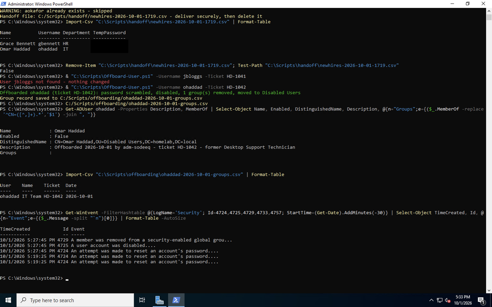

Omar's account is disabled, sits in OU=Disabled Users, and has no group memberships apart from Domain Users. The description, filled in automatically, reads "Offboarded 2026-10-01 by adm-sodeeq - ticket HD-1042 - former Desktop Support Technician." The group record shows IT Team tied to the ticket, so if anyone later asks what access he had, the answer is on file.

The Security log shows all three offboarding actions within the same second: event 4724 (the password scramble), 4725 (account disabled) and 4729 (removed from a security-enabled global group, which tells me IT Team is a global group). There were also two earlier 4724 events from onboarding. To account for every event rather than assume, I pulled the target and the actor for each password event:

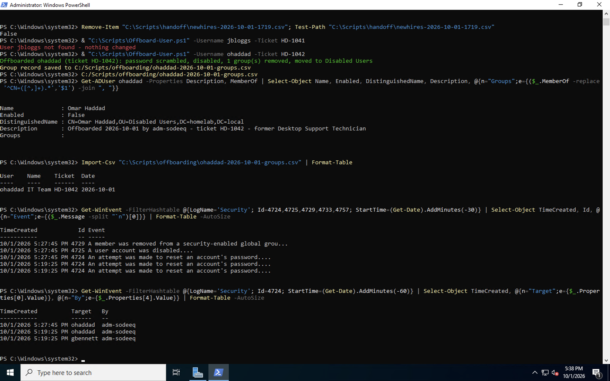

The two onboarding events are the initial passwords for gbennett and ohaddad, set when their accounts were created, and the third is Omar's offboarding scramble. Every event is attributed to adm-sodeeq. An early read of the log suggested three onboarding events; pulling the details showed there were only two, which is exactly why it's worth checking rather than reading a summary.

### Lessons Learned

Scripts make help desk work faster, but the bigger gain is consistency: every new hire gets the same correct setup, and every departure follows the same documented steps with a record left behind. Writing the steps into a script also forced me to decide the right order, such as recording groups before removing them.

Security trade-offs show up even in simple automation. Unique passwords are safer than a shared one, but they create a file of plaintext passwords that needs its own handling. Naming that trade-off and building the deletion step into the process matters as much as the code.

Finally, testing the failure path deserves as much attention as the success path. A script that refuses to act on bad input, and says so clearly, is one I can trust with real accounts.

### Next Steps

Possible next steps include adding a `-WhatIf` mode to the offboarding script so it can preview changes before making them, and building a small monthly audit report of disabled accounts and recent account changes.
