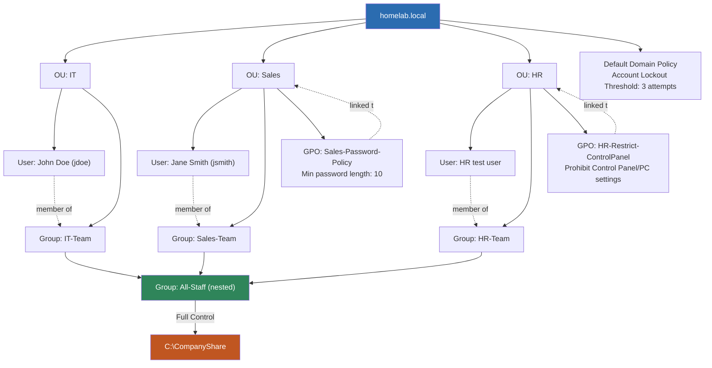

# homelab.local — Active Directory Structure Reference

A single reference for the Active Directory domain built across Entries 16–22, covering the domain controller, organizational structure, security groups, Group Policy, folder permissions, and auditing.

## Domain Overview

- **Domain:** homelab.local
- **Domain Controller:** ad-dc-01 (Windows Server 2022 Datacenter: Azure Edition, Standard_B2s_v2, Canada Central)
- **Forest/Domain functional level:** default (Windows Server 2016)

## Structure Diagram

## Component Summary

### Organizational Units
Three OUs mirror a simple company structure: **IT**, **Sales**, and **HR**. Each contains one test user and one matching security group.

### Users and Groups
| OU | User | Security Group |
|---|---|---|
| IT | John Doe (jdoe) | IT-Team |
| Sales | Jane Smith (jsmith) | Sales-Team |
| HR | HR test user | HR-Team |

All three department groups are nested inside a single umbrella group, **All-Staff**, so any permission or policy applied to All-Staff cascades to every user across all three departments.

### Group Policy Objects
| GPO | Linked to | Setting | Category |
|---|---|---|---|
| Default Domain Policy | Domain root | Account lockout threshold: 3 attempts | Account Policies |
| Sales-Password-Policy | Sales OU | Minimum password length: 10 characters | Account Policies |
| HR-Restrict-ControlPanel | HR OU | Prohibit access to Control Panel and PC settings: Enabled | Administrative Templates |

Each department-scoped GPO was verified two ways: statically, via the Linked Group Policy Objects tab, and dynamically, via the Group Policy Modeling Wizard, confirming no cross-department bleed.

### Folder Permissions and Inheritance
`C:\CompanyShare` grants **Full Control** to the **All-Staff** group only — no user was given permission directly. Using the Effective Access tool, this was verified for one user per department:

| User | Group Path | Effective Access on C:\CompanyShare |
|---|---|---|
| John Doe | IT-Team → All-Staff | Full Control |
| Jane Smith | Sales-Team → All-Staff | Full Control |
| HR test user | HR-Team → All-Staff | Full Control |

### Security Auditing
The Default Domain Policy's account lockout threshold (3 attempts) was tested by deliberately failing John Doe's login multiple times. The resulting Security Event Log entries confirmed the control functioned as configured:

- **Event ID 4625** — failed logon attempt, Task Category: Account Lockout
- **Event ID 4740** — account locked out, Task Category: User Account Management, Audit Success

## Entry Index

| Entry | Topic |
|---|---|
| 15 | Azure provisioning troubleshooting (quota, resource provider) |
| 16 | Domain controller deployment and promotion |
| 17 | OU structure, users, groups, first GPO (Sales password policy) |
| 18 | Second GPO (HR Control Panel restriction) and Group Policy Modeling |
| 19 | Group Policy Results and nested security groups (All-Staff) |
| 20–21 | Verifying nested group permissions via Effective Access (all three departments) |
| 22 | Account lockout policy and Security Event Log auditing |
